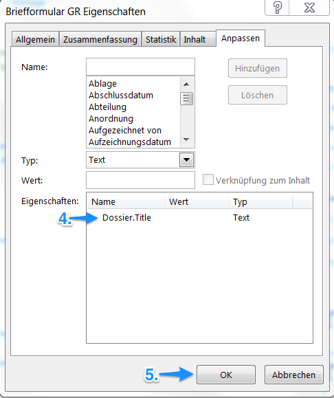
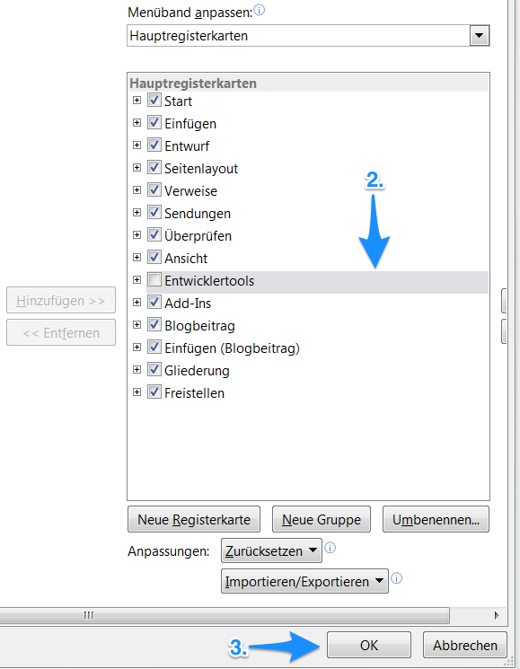
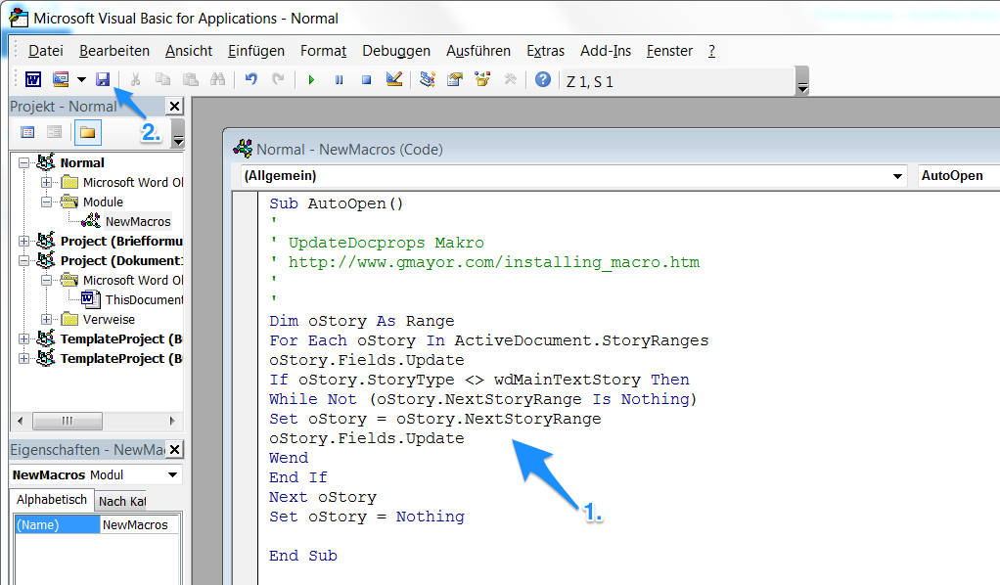

Kurzreferenz OneGov GEVER: Administration
=========================================

Release 3 / Version 1.0 / 23.02.2016

Dokumentvorlagen
================

DocProperties 
-------------

Mit DocProperties können ausgewählte Metadaten aus Dossiers von OneGov GEVER direkt in Worddokumenten übernommen 
werden. Die folgenden Metadaten werden von OneGov GEVER-beim Öffnen von Worddokumenten automatisch weitergegeben:

- *Dossier.ReferenceNumber* – Aktenzeichen des Dossiers, welches das Dokument enthält

- *Document.ReferenceNumber* – Aktenzeichen des Dokuments

-	*Document.SequenceNumber* – Laufnummer des Dokuments

-	*User.FullName* – Vor- und Nachname des angemeldeten Benutzers

-	*Dossier.Title* – Titel des Dossiers, welches das Dokument enthält

-	*User.ID* – Benutzerkennung des angemeldeten Benutzers

DocProperties in Vorlagen verwenden
-----------------------------------

Damit DocProperties in Worddokumenten verwendet werden können, muss in einem ersten Schritt die entsprechende 
Wordvorlage, die in OneGov GEVER über den Menüpunkt Vorlagen abgelegt ist, vorbereitet werden:

1)	Wählen Sie die Wordvorlage im Vorlagenbereich von OneGov GEVER aus, und öffnen Sie das Dokument zur Bearbeitung (Auschecken und bearbeiten).

2)	Begeben Sie sich in Word auf Datei > Eigenschaften > Erweiterte Eigenschaften > Anpassen.

3)	Geben Sie den Namen der gewünschten DocProperty im Feld Name ein.

4)	Als “Wert” kann vorerst ein Leerschlag (Space) eingefügt werden. Dieser wird bei der Erstellung eines neuen Dokuments ab Vorlage automatisch mit dem aktuellen Metadatenwert überschrieben. 

5)	Die so erstellte DocProperty kann nun über das Feld Hinzufügen den Eigenschaften hinzugefügt werden.
 
|docprops-3|
 
6)	Die so erstellten DocProperties sind nun in den Eigenschaften ersichtlich.

7)	Wenn alle gewünschten DocProperties erstellt wurden, mit OK abschliessen. 

|docprops-4|

  Für die Erarbeitung einer neuen Vorlage können auch bestehende Vorlagen überarbeitet werden. So müssen 
  nicht alle DocProperties jedes Mal manuell neu erstellt werden, sondern werden mitkopiert.

Sind alle benötigten DocProperties in der Wordvorlage definiert, können sie nun nach Belieben im Haupttext 
verwendet werden.

Dies geschieht in Word wie folgt:

1)	Die gewünschte Stelle, an der die DocProperty eingefügt werden soll, markieren. 

|docprops-5|

2)	Den Menüpunkt Einfügen auswählen.

3)	Unter Schnellbausteine die Option Feld auswählen.

|docprops-6|

4)	Feldname auswählen = DocProperty. 

5)	Gewünschte Eigenschaft auswählen.

6)	Die Option “Feldfunktionen” auswählen.

|docprops-7|

7)	Ausgewähltes DocProperty in Anführungs - und Schlusszeichen setzen.

8)	Mit “OK” bestätigen.

|docprops-8|

Die DocProperty ist eingefügt und kann in Word mit Doppelklick > Rechtsklick > Feldfunktion ein an 
der gewünschten Position im Dokument angezeigt und überprüft werden.

|docprops-9|

DocProperties in Worddokumenten automatisch aktualisieren
---------------------------------------------------------

Wird über OneGov GEVER ein Worddokument zur Bearbeitung geöffnet, zeigt Word standardmässig 
nicht die von OneGov GEVER mitgegebenen Metadaten an. Dies kann manuell erwirkt werden, indem der 
ganze Word-Inhalt markiert und die Funktion Felder aktualisieren aufgerufen wird.

Damit dies von Word automatisch bei jedem Öffnen gemacht wird, muss ein Makro hinterlegt werden. 
Dies muss einmalig in Word gemacht werden, nicht für jede Wordvorlage!

1)	Begeben Sie sich bitte im Word auf Datei > Optionen > Menüband anpassen.

2)	Aktivieren Sie die “Entwicklertools” durch Setzen eines Häkchens in den Hauptregisterkarten aus.

|docprops-10|

3)	Bestätigen Sie die Änderung mit “OK”.

|docprops-11|

4)	Sind die “Entwicklertools” dem Menüband hinzugefügt, wählen Sie diese Menü bitte aus.

|docprops-12|

5)	Begeben Sie sich auf den Menüpunkt “Makros”

|docprops-13|

6)	Vergeben Sie den Makronamen “AutoOpen”.

|docprops-14|

7)	Erstellen Sie das Makro über Erstellen. Bei der Option Makros in können "Alle aktiven Dokumentvorlagen und Dokumenten" ausgewählt werden. Damit wird sichergestellt, dass das Makro in allen Dokumenten automatisch verfügbar ist.

8)	Den Code (siehe Tabelle) können Sie dem Feld Normal - NewMacros (Code) hinzufügen.

|docprops-15|

9)	Nachdem Sie den Code eingefügt haben, speichern Sie die Einstellungen ab.

.. sourcecode:: vb

  Sub AutoOpen()
  '
  ' UpdateDocprops Makro
  ' http://www.gmayor.com/installing_macro.htm                    
  '                                                 
  '
  Dim oStory As Range
  For Each oStory In ActiveDocument.StoryRanges
    oStory.Fields.Update
    If oStory.StoryType <> wdMainTextStory Then
      While Not (oStory.NextStoryRange Is Nothing)
        Set oStory = oStory.NextStoryRange
        oStory.Fields.Update
      Wend
    End If
  Next oStory
  Set oStory = Nothing

  End Sub

Nun werden in neu geöffneten Worddokumenten automatisch die DocProperties aktualisiert.

.. |docprops-5| image:: ../_static/img/kurzref_adm_docprops_5.png
.. |docprops-6| image:: ../_static/img/kurzref_adm_docprops_6.png

.. |docprops-9| image:: ../_static/img/kurzref_adm_docprops_9.png

Sitzungs- und Protokollverwaltung: Vorlagen
===========================================

Seriendruckfelder
-----------------

Pro Gremium können die folgenden Wordvorlagen hinterlegt werden:

-	Sitzungseinladung / Traktandenliste (geplant)
-	Protokoll
-	Protokollauszug

Diese Vorlagen werden vom Modul „Sitzungs- und Protokollverwaltung“ verwendet, um automatisiert die 
entsprechenden Dokumente zu einer Sitzung zu erzeugen. Damit dies möglich ist, verwenden die Vorlagen 
Seriendruckfelder, um Daten aus der Sitzung direkt in die Wordvorlage zu übertragen und so ein neues 
Worddokument zu erzeugen.

Die folgenden Seriendruckfelder können standardmässig verwendet werden:

Metadaten zur Sitzung:

-	mandant.name
 Titel der OneGov GEVER Installation (String)

-	protocol.type
 Art des Protokolls („Protokoll“, „Protokollauszug“)

-	committee.name
 Name des Gremiums

-	meeting.date
 Datum der Sitzung

-	meeting.start_time
 Beginn der Sitzung (Uhrzeit)

-	meeting.end_time
 Ende der Sitzung (Uhrzeit)

-	meeting.number
 Sitzungsnummer. Beginnt am Anfang einer Sitzungsperiode (üblicherweise ein Kalenderjahr) immer mit 1. Die Sitzungsnummer wird von OneGov GEVER erst vergeben, wenn mindestens 1 Traktandum (oder die ganze Sitzung) abgeschlossen wurde. 

-	participants.presidency
 Vorsitz der Sitzung (String)

-	participants.secretary
 Sekretär der Sitzung (String)

-	participants.members 
 Liste aller Teilnehmenden (Liste von Participant, siehe unten)

-	participants.other
 Liste aller weiteren Teilnehmenden/Gäste (Liste von Strings)

-	participants.members 
 Liste aller Teilnehmenden zur Sitzung (Liste von Participant). Über diese Liste wird typischer-weise iteriert, um die Namen darzustellen (siehe weiter unten).

-	agenda_items 
 Liste von Traktanden (Liste von AgendaItem)

Metadaten zu einem Sitzungsteilnehmer (Participant):

-	member.fullname
 Vollständiger Name eines Teilnehmers (String). Dabei ist member eine Laufvariable, die für die Iteration 
 über alle Elemente von participants.members verwendet wird.

-	member.role
 Definierte Rolle des Teilnehmers innerhalb der Sitzung (String). Dabei ist member eine Laufvari-able, die 
 für die Iteration über alle Elemente von participants.members verwendet wird.

Metadaten zu einem Traktandum (AgendaItem):

-	repository_folder_title
 Titel der Ordnungsposition zum aktuellen Traktandum (String). Je nach definierter Sprache des Antrags wird 
 hier der deutsche oder französische OP-Titel zurückgegeben

-	title
 Titel des Antrags (String).

-	number
 Traktandennummer (startet bei jeder neuen Sitzung wieder bei 1).

-	dossier_reference_number
 Aktenzeichen des Dossiers (String), in der sich der Antrag befindet.

-	decision_number
 Beschlussnummer (String). Diese Nummer wird von der Sitzungs- und Protokollverwaltung auto-matisch vergeben, wobei die Nummerierung jeweils bei Anfang einer neuen Sitzungsperiode (üb-licherweise ein Kalendarjahr) wieder bei 1 beginnt.

-	is_paragraph
 Gibt an, ob es sich um einen Abschnitt handelt oder nicht (Boolean).

-	legal_basis
 Rechtsgrundlage des Antrags (Text).

-	initial_position
 Ausgangslage des Antrags (Text).

-	considerations
 Erwägungen zum Antrag (Text).

-	proposed_action
 Text des Antrags (Text).

-	discussion
 Diskussion während der Sitzung zum Antrag (Text).

-	decision
 Beschluss zum Antrag gemäss Sitzung (Text).

-	disclose_to
 Zu eröffnen an (Text). 

-	copy_for_attention
 Kopie geht an (Text). 

-	publish_in
 Zu veröffentlichen in (Text).

Seriendruckfelder in Sablon-Vorlagen verwenden
----------------------------------------------

Um über eine Liste von Einträge iterieren zu können, muss dies in der Wordvorlage über die 
folgenden Felder (in eckigen Klammern) gesteuert werden:

[<liste>:each(member)]
...
[<liste>:endEach]

wobei <liste> einem Metadatum vom Typ Liste entspricht, also z.B. participants. Der Text 
zwischen den beiden Seriendruckfeldern (angedeutet durch ...) wird dabei bei jedem Schleifendurchlauf 
neu im erzeugten Word eingefügt.
Damit der Inhalt eines Metadatums in einer Vorlage eingefügt wird, muss im Seriendruckfeld dem Namen des 
gewünschten Metadatums ein Gleichheitszeichen (=) vorangestellt werden, z.B. liefert [=meeting.date] 
das Sitzungsdatum, das an der entsprechenden Stelle in der Wordvorlage eingefügt wird.

Zusätzlich können Kommentare in der Wordvorlage hinterlegt werden, die in den generierten 
Worddokumenten (Protokoll, Protokollauszug) nicht mitgegeben werden. Kommentare müssen dazu zwischen 
die Felder comment und endComment befinden.

Eine Dokumentation der DSL findet man unter: https://github.com/senny/sablon#conditionals
Beispiele einer Sablon Datei findet man unter: https://github.com/senny/sablon#examples

Debugging von Sablon-Vorlagen
-----------------------------

Einem Manager stehen die folgenden Plone-Views zum Debugging der Vorlagen zur Verfügung:

-	Inhaltstyp Sablon-Vorlage: fill_meeting_template füllt Beispieldaten einer Sitzung in die Sab-lon-Vorlage ein. Probleme mit der Syntax der Formatierungs-DSL werden so schnell ersicht-lich.

-	Inhaltstyp Sitzung: download_protocol_json, ermöglich es das JSON File herunterzulande, das zum generieren des Dokuments aus der Sablon-Vorlage verwendet wird.

