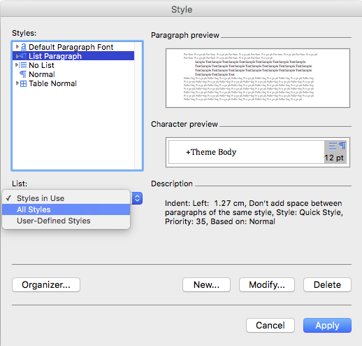
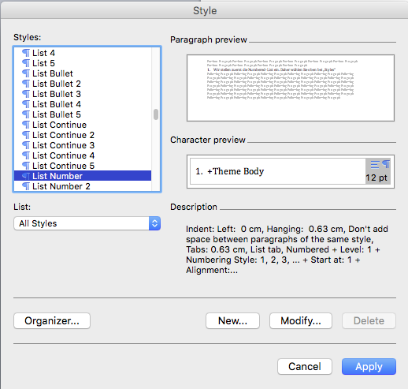
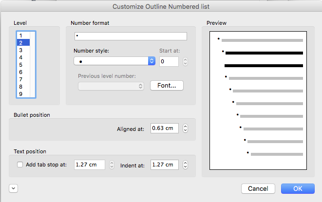

Kurzreferenz OneGov GEVER: Administration
=========================================

Release 3 / Version 1.0 / 23.02.2016

Sitzungs- und Protokollverwaltung: Vorlagen
===========================================

Seriendruckfelder
-----------------

Pro Gremium können die folgenden Wordvorlagen hinterlegt werden:

- Sitzungseinladung / Traktandenliste (geplant)
- Protokoll
- Protokollauszug

Diese Vorlagen werden vom Modul „Sitzungs- und Protokollverwaltung“ verwendet,
um automatisiert die entsprechenden Dokumente zu einer Sitzung zu erzeugen.
Damit dies möglich ist, verwenden die Vorlagen Seriendruckfelder, um Daten aus
der Sitzung direkt in die Wordvorlage zu übertragen und so ein neues
Worddokument zu erzeugen.

Die folgenden Seriendruckfelder können standardmässig verwendet werden:

Metadaten zur Sitzung:

- ``mandant.name``

  Titel der OneGov GEVER Installation (String)

- ``protocol.type``

  Art des Protokolls („Protokoll“, „Protokollauszug“)

- ``committee.name``

  Name des Gremiums

- ``meeting.date``

  Datum der Sitzung

- ``meeting.location``

  Standort der Sitzung

- ``meeting.start_time``

  Beginn der Sitzung (Uhrzeit)

- ``meeting.end_time``

  Ende der Sitzung (Uhrzeit)

- ``meeting.number``

  Sitzungsnummer. Beginnt am Anfang einer Sitzungsperiode (üblicherweise ein
  Kalenderjahr) immer mit 1. Die Sitzungsnummer wird von OneGov GEVER erst
  vergeben, wenn mindestens 1 Traktandum (oder die ganze Sitzung)
  abgeschlossen wurde.

- ``participants.presidency``

  Vorsitz der Sitzung (Participant)

- ``participants.secretary``

  Sekretär der Sitzung (Participant)

- ``participants.members``

  Liste aller Teilnehmenden (Liste von Participant, siehe unten)

- ``participants.other``

  Liste aller weiteren Teilnehmenden/Gäste (Liste von Strings)

- ``participants.members``

  Liste aller Teilnehmenden zur Sitzung (Liste von Participant). Über diese
  Liste wird typischer-weise iteriert, um die Namen darzustellen (siehe weiter
  unten).

- ``agenda_items``

  Liste von Traktanden (Liste von AgendaItem)

Metadaten zu einem Sitzungsteilnehmer (Participant):

- ``member.fullname``

  Vollständiger Name eines Teilnehmers (String). Dabei ist member eine
  Laufvariable, die für die Iteration über alle Elemente von
  ``participants.members`` verwendet wird.

- ``member.role``

  Definierte Rolle des Teilnehmers innerhalb der Sitzung (String). Dabei ist
  member eine Laufvari-able, die für die Iteration über alle Elemente von
  ``participants.members`` verwendet wird.

- ``member.email``

  Die E-Mail Adresse eines Teilnehmers (String).

Metadaten zu einem Traktandum (AgendaItem):

- ``repository_folder_title``

  Titel der Ordnungsposition zum aktuellen Traktandum (String). Je nach
  definierter Sprache des Antrags wird hier der deutsche oder französische
  OP-Titel zurückgegeben

- ``title``

  Titel des Antrags (String).

- ``number``

  Traktandennummer (startet bei jeder neuen Sitzung wieder bei 1).

- ``dossier_reference_number``

  Aktenzeichen des Dossiers (String), in der sich der Antrag befindet.

- ``decision_number``

  Beschlussnummer (String). Diese Nummer wird von der Sitzungs- und
  Protokollverwaltung auto-matisch vergeben, wobei die Nummerierung jeweils
  bei Anfang einer neuen Sitzungsperiode (üb-licherweise ein Kalendarjahr)
  wieder bei 1 beginnt.

- ``is_paragraph``

  Gibt an, ob es sich um einen Abschnitt handelt oder nicht (Boolean).

- ``legal_basis``

  Rechtsgrundlage des Antrags (Text).

- ``initial_position``

  Ausgangslage des Antrags (Text).

- ``considerations``

  Erwägungen zum Antrag (Text).

- ``proposed_action``

  Text des Antrags (Text).

- ``discussion``

  Diskussion während der Sitzung zum Antrag (Text).

- ``decision``

  Beschluss zum Antrag gemäss Sitzung (Text).

- ``disclose_to``

  Zu eröffnen an (Text).

- ``copy_for_attention``

  Kopie geht an (Text).

- ``publish_in``

  Zu veröffentlichen in (Text).

Seriendruckfelder in Sablon-Vorlagen verwenden
----------------------------------------------

Um über eine Liste von Einträge iterieren zu können, muss dies in der
Wordvorlage über die folgenden Felder (in eckigen Klammern) gesteuert werden:

.. code-block:: none

    [<liste>:each(member)]
    ...
    [<liste>:endEach]

wobei ``<liste>`` einem Metadatum vom Typ Liste entspricht, also z.B.
``participants``.
Der Text zwischen den beiden Seriendruckfeldern (angedeutet durch ...) wird
dabei bei jedem Schleifendurchlauf neu im erzeugten Word eingefügt.
Damit der Inhalt eines Metadatums in einer Vorlage eingefügt wird, muss im
Seriendruckfeld dem Namen des gewünschten Metadatums ein Gleichheitszeichen
(``=``) vorangestellt werden, z.B. liefert ``[=meeting.date]`` das
Sitzungsdatum, das an der entsprechenden Stelle in der Wordvorlage eingefügt
wird.

Zusätzlich können Kommentare in der Wordvorlage hinterlegt werden, die in den
generierten Worddokumenten (Protokoll, Protokollauszug) nicht mitgegeben
werden. Kommentare müssen dazu zwischen die Felder ``comment`` und
``endComment`` befinden.

Eine Dokumentation der DSL findet man unter: https://github.com/senny/sablon#conditionals
Beispiele einer Sablon Datei findet man unter: https://github.com/senny/sablon#examples

Debugging von Sablon-Vorlagen
-----------------------------

Einem Manager stehen die folgenden Plone-Views zum Debugging der Vorlagen zur
Verfügung:

- Inhaltstyp Sablon-Vorlage: ``fill_meeting_template`` füllt Beispieldaten einer
  Sitzung in die Sablon-Vorlage ein. Probleme mit der Syntax der
  Formatierungs-DSL werden so schnell ersichtlich.

- Inhaltstyp Sitzung: ``download_protocol_json`` ermöglicht es, das JSON File
  herunterzuladen, das zum Generieren des Dokuments aus der Sablon-Vorlage
  verwendet wird.

- Inhaltstyp Sitzung: ``download_generated_protocol`` ermöglicht es, ein
  Protokoll einer Sitzung zu generieren und herunterzuladen, ohne dass das
  bestehende Protokoll (das im GEVER abgelegte Dokument) verändert wird.

Einstellung Listen in Word-Styles
---------------------------------

In den Sitzungs- und Protokollverwaltungs-Dokumenten können Bullet-Lists (unordered) sowie Numbered-Lists (ordered) erstellt werden. Diese müssen vorgängig in den Word-Styles definiert werden, damit diese dann in den automatisch generierten Protokollen aus OneGov GEVER korrekt angezeigt werden. Diese kann
folgendermassen eingestellt werden:

- Gehen Sie auf Format / Style...

- Klicken Sie bei „List“ auf „All Styles“

|lists-1|

- Wir stellen zuerst die Number-List ein. Daher wählen Sie oben bei „Styles“ in der Liste „List Number“ an und klicken Sie anschliessend auf Bearbeiten/Modify.

|lists-2|

- Es öffnet sich eine neue Maske. Zuunterst finden Sie das Dropdown „Format“. Wählen Sie dort Numbering an, um die weiteren Einstellungen vorzunehmen.

|lists-3|

- In der neuen Maske wählen Sie unter „Outlined Numbered“ die unten blau umrandete Aufzählungs-Liste aus. Bestätigen Sie zweimal mit „OK“ (Bei der Maske „Bullets and Numbering“ sowie bei „Modify Style.)

|lists-4|

- Nun stellen wir die Bullet-List ein. Unter „List“ wählen Sie wieder „All Styles“ an, oben können Sie „List Bullet“ anwählen und klicken anschliessend wieder auf Modify/Bearbeiten.

- Unter „Outline Numbered“ wählen Sie die unten im Printscreen blau umrandete Liste. Klicken Sie anschliessend auf Customize/Anpassen.

|lists-5|

- Wie Sie sehen können, wird per Default pro Level ein anderes Sonderzeichen eingesetzt. Zur Vereinheitlichung können Sie nun auf jedem Level jeweils unter „Number style“ den kleinen Bullet-Point anwählen. Bestätigen Sie wieder zweimal mit „OK“. (Bei „Customize und Bullets and Numbering“, bei „Bullets and Numbering“ sowie bei „Modify Style“.)

|lists-6|

- Wenn Sie wieder auf der Übersicht sind, sehen Sie, dass die „List Number“ sowie die „List Bullet“ nun in den „Styles in Use“-Liste sind. Zum Abschluss können Sie die beiden neuen Listen-Einstellungen noch mit „Apply/Anwenden“ bestätigen.

