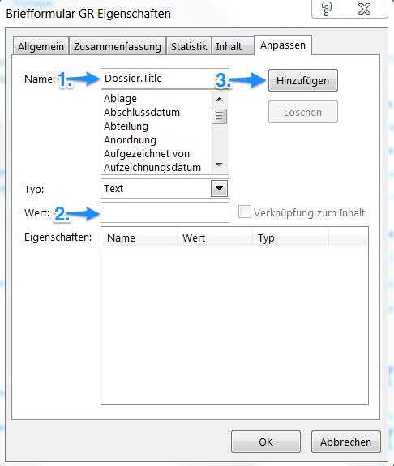
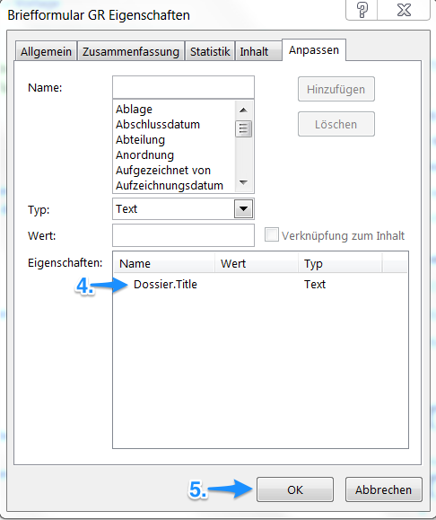
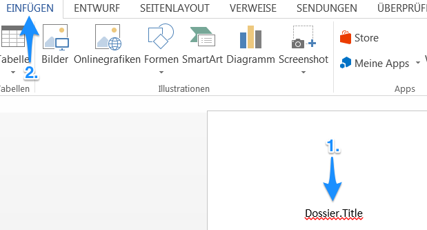
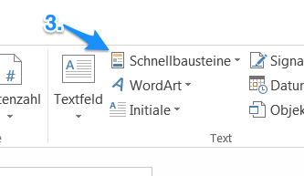
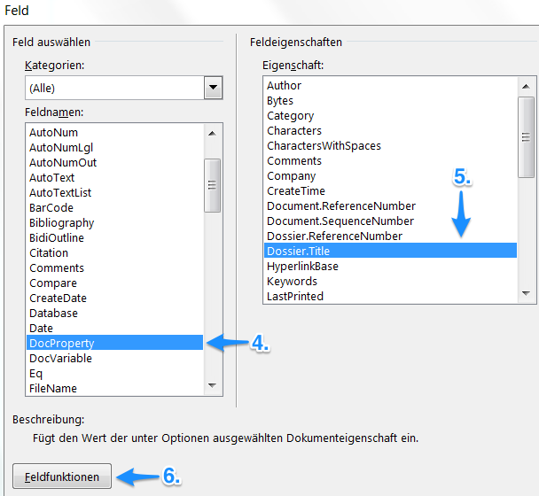
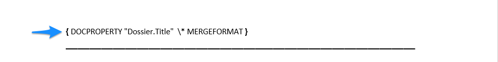

DocProperties in Vorlagen verwenden
-----------------------------------

Pour pouvoir utiliser les ProriétéDocs dans un document Word, le modèle en question enregistré dans OneGov GEVER doit être préparé.

Ajout dans les propriétés
~~~~~~~~~~~~~~~~~~~~~~~~~

1.	Choisissez le modèle Word dans la section «modèles» de OneGov GEVER et ouvrez le document à être modifié (Check-out et éditer).

2.	Dans le fichier Word allez dans «Fichier > Propriétés > Propriétés étendues > Personnalisation».
3.	Entrez le nom de la ProriétéDoc souhaitée dans le champ «nom».

4.	Comme “value” une espace peut être insérée d’abord. Celle-là sera automatiquement écrasée par la value de métadonnée actuelle lors de l’établissement d’un nouveau document.

5.	La ProriétéDoc établie de cette manière peut ensuite être rajoutée aux propriétés à travers le champ «Ajouter».

   |docprops-3|

6. 6.	Les ProriétéDocs établies comme ci-dessus sont désormais visibles dans les propriétés du fichier Word respectif.

7.	Une fois toutes les ProriétéDocs souhaitées ajoutées, cliquez sur le bouton «OK» pour fermer la fenêtre. de saisie.

   |docprops-4|

.. admonition:: Copier des modèles

   Pour l’élaboration d’un nouveau modèle de document, il est souvent plus simple de remanier un modèle préexistant afin de limiter l’effort nécessaire pour l’ajout des ProriétéDocs requises.

Insertion dans le corps du texte
~~~~~~~~~~~~~~~~~~~~~~~~~~~~~~~~

Une fois que toutes les ProriétéDocs nécessaires ont été définies dans un modèle Word, vous pouvez les utiliser à volonté dans le corps du texte.
Leur mode d’utilisation est le suivant:

1.	Marquez la position à laquelle la ProriétéDoc doit être insérée.

   |docprops-5|

2.	Allez dans l’onglet «Insérer».

3.	Sous «Explorer les composants QuickPart»  choisissez l’option «Champ…».

   |docprops-6|

4.	Dans la catégorie «Noms de champs» sélectionnez «ProriétéDoc».

   |docprops-7|

5.	5.	Sélectionnez ensuite la propriété à insérer et validez votre choix avec «OK».

Modifier le format de date
~~~~~~~~~~~~~~~~~~~~~~~~~~

Au cas où une ProriétéDoc concerne une date (p. ex. ogg.document.document_date), son format peut être adapté ultérieurement. Pour ce faire, double-cliquez le champ en question pour le sélectionner, puis effectuez un clic droit > basculer les codes de champs, puis adaptez le format de date selon la capture d’écran ci-dessous.

|docprops-9|

.. note::
    Avec l’action OneGov GEVER Ajout d’un élément > Document à partir du modèle, techniquement, le document modèle est simplement copié. C’est la raison pour laquelle le format «.docx» et non pas «.dots» (le format identifiant usuellement le type modèle) est utilisé.

.. disqus::
