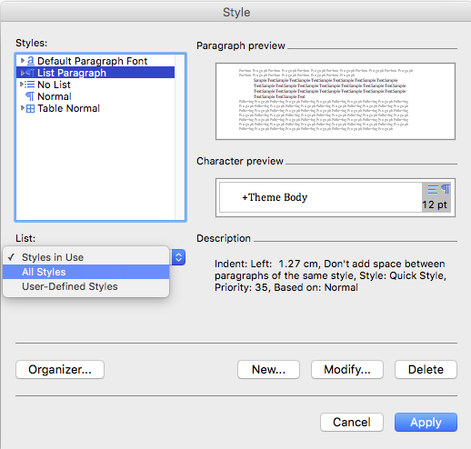
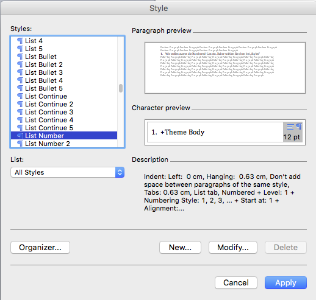
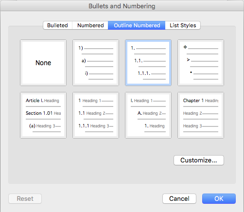
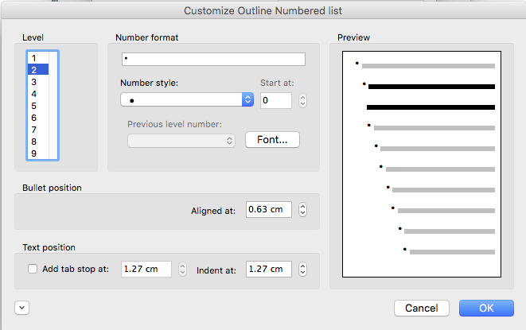

Formatage de listes avec les styles Word
----------------------------------------

Dans les documents de la gestion de séances et procès-verbaux, pour prédéfinir le formatage des listes à puces et numérotées, des styles Word respectifs doivent être définis auparavant pour être correctement appliquées dans les documents de séances générés par OneGov GEVER. La configuration se passe comme suit:

- Dans l’onglet „Format / Style...“, Cliquez dans le champ „List“ sur „All Styles“

|lists-1|

- Paramétrez en premier la number-list; Pour cela vous choisissez la valeur „styles“ dans la liste „list number“ et cliquez ensuite sur „Editer / Modifier“.

|lists-2|

- Au bas de la nouvelle fenêtre en bas vous cliquez sur le menu déroulant „Format“ et sélectionnez-y la valeur „Numbering“ pour effectuer les modifications suivantes.

|lists-3|

- Dans la fenêtre suivante, choisissez, sous «Outlined Numbered», le modèle encadré en bleu. Confirmez deux fois avec „OK“ (dans les fenêtres „Bullets and Numbering“ et „Modify Style“).

|lists-4|

- De retour dans la fenêtre „Style“ passet à la configuration de la liste à puces. Pour cela choisissez dans le champ „List“ la valeur „All Styles“, et dans le champ supérieur, la valeur „List Bullet“. Validez l’opération avec „Modify “.

- Dans la nouvelle fenêtre „Bullets and Numbering“ ,  séléctionnez dans le champ „Outline Numbered“ la liste encadrée en bleu et cliquez sur „Customize“.

|lists-5|

- Cette fenêtre propose, par défaut, caractère spécial différent pour chaque niveau de profondeur. Pour une représentation plus uniforme, choisissez à chaque niveau le style adapté. Confirmez ensuite trois fois (dans „Customize Outline Numbered list“, „Bullets and Numbering“ et „Modify Style“.) avec „OK“.

|lists-6|

- De retour au sommaire, „List Number“ et „List Bullet“ devraient maintenant se trouver dans la liste „Styles in use“. Pour compléter cette modification veuillez confirmer avec „Apply/Appliquer“.

.. |lists-3| image:: ../../../public/_static/img/kurzref_adm_lists_3.png

.. |lists-5| image:: ../../../public/_static/img/kurzref_adm_lists_5.png

.. disqus::
