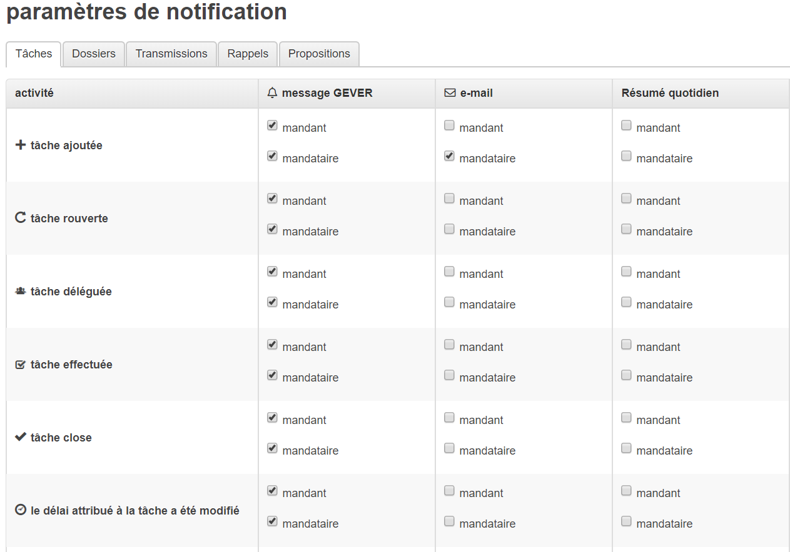
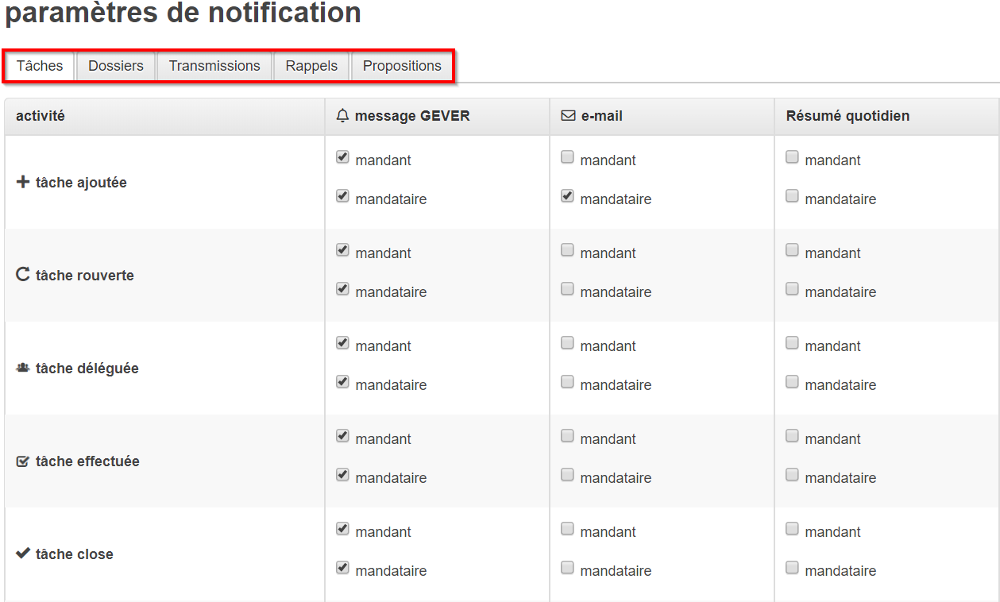

.. _label-notification:

Paramètres de notification
==========================

Dans les paramètres de notification, il est possible d’ajuster manuellement de quels évènements OneGov GEVER notifie son utilisateur respectif. Pour faire cela, cliquez sur le nom d’utilisateur en haut à droite et sélectionnez « Préférences » dans le menu déroulant.

|img-notification1|

Une vue similaire à celle ci-dessous s’ouvre ensuite, présentant les réglages actuels des activités pour lesquelles OneGov GEVER vous notifie. Vous pouvez ainsi modifier, pour chaque activité, la (ou les) manière(s) dont vous serez notifié. Actuellement, les notifications proposées sont : la notification GEVER (via le symbole « cloche ») ou l’email. De plus, il est possible de souscrire à un résumé quotidien (daily digest) également envoyé par email.

|img-notification2|

Si vous désirez modifier les réglages par défaut, cliquez simplement sur la case à cocher pertinente pour cocher ou décocher celle-ci. Lorsqu’un réglage a été modifié, il vous est possible de sauvegarder ou d’annuler ce changement via le message de confirmation apparaissant sur la droite.

|img-notification3|

Les personnalisations peuvent être réinitialisées aux valeurs par défaut GEVER par l’intermédiaire de l’action « rétablir les valeurs par défaut »

|img-notification4|

Notifications pour les transmissions, rappels et tâches.
--------------------------------------------------------

Comme pour les notifications concernant les tâches, il est possible d’ajuster les notifications concernant les transmissions et rappels dans les onglet « Transmissions » et « Rappels » respectivement.

|img-notification5|

Notifications concernant les dossiers
-------------------------------------

Pour créer une notification pour un dossier en souffrance, 2 étapes doivent être prises en compte :

1.	Définir une date de fin pour un dossier

|img-notification6|

2.	S’assurer que la notification a été activée dans l’onglet “Dossiers”

|img-notification7|

Paramètres généraux de notifications
------------------------------------
Sous l'onglet "Général" se trouvent les paramètres de notifications globaux.
Vous pourrez y configurer si vous voulez recevoir des notifications pour vos propres actions. Vous pourrez également y configurer si, en tant que membre d'un groupe de boîte de réception, vous voulez recevoir les notifications qui sont envoyées a tous les membres d'une boîte de réception.

.. |img-notification1| image:: _static/img/img-notification1.png

.. |img-notification3| image:: _static/img/img-notification3.png
.. |img-notification4| image:: _static/img/img-notification4.png

.. |img-notification6| image:: _static/img/img-notification6.png
.. |img-notification7| image:: _static/img/img-notification7.png
