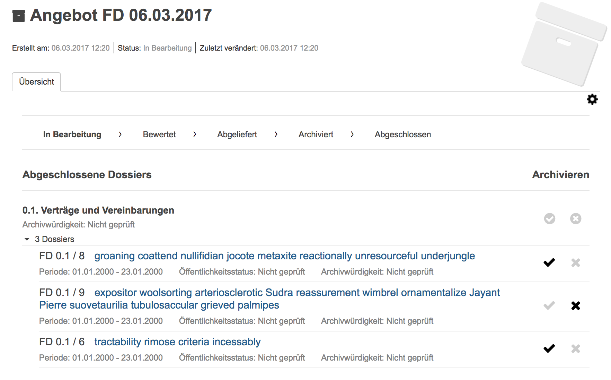
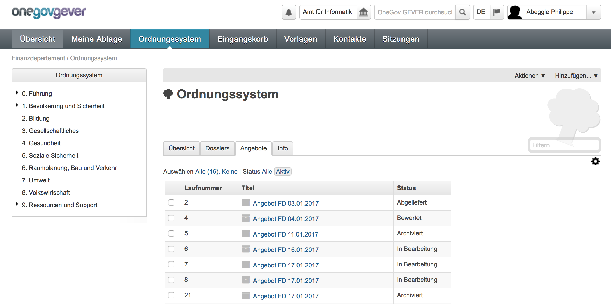
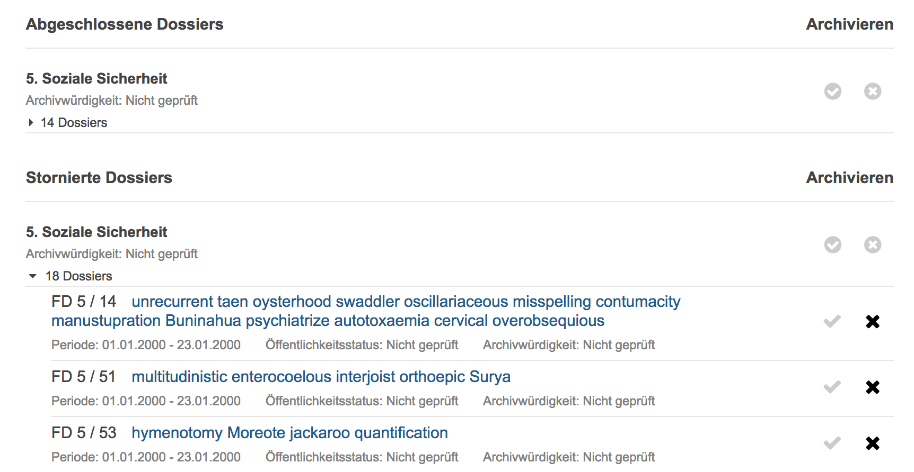

Aussonderung
============

.. contents::
   :local:
   :backlinks: none

Abgelaufene Dossiers
--------------------
Das Aussondern von Inhalten im OneGov GEVER wird ausschliesslich auf Stufe
Dossier angeboten. Dabei können nur stornierte oder abgeschlossen Dossier,
bei welchen die Aufbewahrungsfrist abgelaufen ist, ausgesondert werden.

Die Berechnung der Aufbewahrungsdauer erfolgt nach Geschäftsjahr. Ein Beispiel:

   - Dossierabschluss: 03.01.2013

   - Aufbewahrungsdauer: 10 Jahre

   - Aussonderung möglich ab: 1.1.2024

Eine Übersicht über Abgelaufene Dossiers, also Dossiers, welche für eine
Aussonderung in Frage kommen, bietet der Status-Filter angeboten, welcher auf
allen Dossierauflistungen zur Verfügung steht.

Angebot erstellen und archivieren
---------------------------------
Beim Angebot handelt es sich um einen separaten Inhaltstypen, der neben
zusätzlichen Metadaten vor allem die Referenzen auf die entsprechenden Dossiers
führt. Das Angebot-Objekt stellt zudem den kompletten Aussonderungs-Workflow
zur Verfügung. Dieser setzt sich aus den folgenden Übergängen zusammen:

 1. Angebot erstellen
 2. Bewertung finalisieren
 3. Angebot abliefern
 4. Archivierung bestätigen
 5. Dossiers vernichten

|img-aussonderung-5|

Angebot erstellen und bewerten
~~~~~~~~~~~~~~~~~~~~~~~~~~~~~~
Aussonderungsangebote können auf Stufe Ordnungssystem bzw. Ordnungsposition
erstellt werden. Für die direkte Erstellung eines Angebots aus einer
Dossierauflistung inkl. Auswahl der Dossiers, steht die Tabbedview-Action
`Aussonderungsangebot erstellen` zur Verfügung.

|img-aussonderung-1|

Wurde ein Angebot erstellt, befindet es sich im Status ``In Arbeit``
(``disposition-state-in-progress``). In diesem Status können die Metadaten des
Angebots, wie auch die enthaltenen Dossiers, noch bearbeitet werden.

Zudem kann die Bewertung des Angebots vorgenommen werden, dabei handelt es sich
um den Entscheid, ob ein Dossier archiviert werden soll oder nicht. GEVER macht
dabei automatisch eine Vorbewertung anhand des
Dossier-Metadatums ``Archivwürdigkeit``.

Anschliessend kann die Bewertung von den Records Managern über die
Angebotsansicht angepasst und vorbereitet werden. Die Bewertung kann sowohl auf Stufe Ordnungsposition für alle enthaltenen Dossiers oder einzeln pro Dossier angepasst werden.

|img-aussonderung-2|

Stornierte Dossiers werden in einer separaten Liste aufgeführt. Auch die
automatische Vorbewertung anhand des Dossier-Metadatums ``Archivwürdigkeit``
entfällt. Stornierte Dossiers sind immer als nicht archivwürdig vorbewertet.

|img-aussonderung-6|

Je nach Arbeitsweise kann für die endgültige Bewertung dem GEVER-Mandanten eine
Berechtigung erteilt werden, damit er die Bewertung gleich im GEVER vornehmen
kann, oder es kann eine Bewertungsliste (Excel) generiert und dem Archiv
übermittelt werden. Ein automatischer Import der Bewertungsliste steht aktuell
nicht zur Verfügung.

Bewertung finalisieren
~~~~~~~~~~~~~~~~~~~~~~
Wurde die Bewertung durch das Archiv vorgenommen, kann die Bewertung
finalisiert werden. Dabei wird das Angebot in den Status ``Bewertet``
(``disposition-state-appraised``) versetzt und kann nicht mehr bearbeitet bzw.
angepasst werden.

Angebot abliefern
~~~~~~~~~~~~~~~~~
Anschliessend kann das Angebot abgeliefert werden. Danach steht auch die
Aktion ``Ablieferungspaket herunterladen`` zur Verfügung, welches den eCH-0160
Export für die enthaltenen Dossiers mit einer positiven Bewertung zum Download
anbietet.

Enthält ein Angebot nur Dossiers, die nicht ans Archiv abgeliefert werden müssen,
so können die Schritte 3 und 4 übersprungen werden, d.h. die Dossiers direkt
ausgesondert und das Angebot abgeschlossen werden.

Archivierung bestätigen
~~~~~~~~~~~~~~~~~~~~~~~
War der Ingest des SIP-Pakets ins Langzeitarchiv erfolgreich, so kann die
Archivierung bestätigt werden; im Idealfall wird dies natürlich gleich von der
verantwortlichen Person im Archiv gemacht.

Dossiers vernichten
~~~~~~~~~~~~~~~~~~~
Der Prozess der Aussonderung wird mit der Vernichtung der Dossiers
abgeschlossen. Dabei werden alle im Angebot enthaltenen Dossiers (auch nicht
archivwürdige) vernichtet, also effektiv aus dem GEVER gelöscht.

Nach Abschluss des Angebots, also nach der Vernichtung der Dossiers, besteht
zudem die Möglichkeit ein automatisch generiertes Löschprotokoll
herunterzuladen.

Zusätzliche Vernichtungs-Varianten (Nur löschen der Primärdaten, Entzug der
Leseberechtigung etc.) sind aktuell nicht umgesetzt und auch nicht geplant.

Angebot ablehnen
~~~~~~~~~~~~~~~~
Ein Angebot im Status `In Bearbeitung` oder `Abgeliefert` kann zudem von einem
Archivar abgelehnt werden; dabei wird das Angebot wieder in den Status
`In Bearbeitung` versetzt.

Verlauf
-------
Für jedes Angebot wird ein Verlauf geführt und ähnlich wie bei Aufgaben oder
Anträgen dargestellt.

|img-aussonderung-3|

Auflistung
----------
Auf Stufe Ordnungssystem steht für Benutzer mit den Rollen `Records Manager`
oder `Archivist` ein zusätzlicher Reiter `Angebote` zur Verfügung, welcher alle
Angebote dieses Ordnungssystems auflistet. Dabei werden standardmässig nur
aktive Angebote aufgelistet; mittels dem Statusfilter `Alle` können aber auch
abgeschlossene Angebote angezeigt werden.

|img-aussonderung-4|

Berechtigung
------------
Sowohl das Erstellen wie auch das Betrachten eines Angebots ist durch eine
separate Permission geschützt. Diese steht nur den Rollen `Manager`,
`Records Manager` und `Archivist` zur Verfügung.

Die neue Rolle Records Manager wird global vergeben und wird dem relativ kleinen
Benutzerkreis von Benutzern, welche für die Aussonderung des entsprechenden
Mandants zuständig sind, vergeben.

Die neue Rolle `Archivist` wird global den Archiv-Mitarbeitenden vergeben,
welche dazu berechtigt sind, Angebote zu bewerten und ins Langzeitarchiv zu
überführen. Benutzer mit der Rolle Archivist können alle angebotenen und
archivierten Dossiers sehen, auch wenn Sie nicht dem entsprechenden Mandanten
zugewiesen sind. Dies ermöglicht eine Prüfung der Dossiers durch die
Mitarbeitenden während der Bewertungsphase.

Konfigurationsmöglichkeiten
---------------------------

Dossierabschluss
~~~~~~~~~~~~~~~~
Die folgenden Optionen stehen für den Dossierabschluss zur Verfügung und können pro Mandant aktiviert bzw. deaktiviert werden.

- ``Automatische PDF-Generierung``: Bei Dossierabschluss wird jedes Dokument im Dossier in ein Archivformat konvertiert und als separate Datei im Feld ``Archivdatei`` abgelegt. Die Konvertierung geschieht asynchron.
- ``Journal PDF``: •	Bei Dossierabschluss wird ein PDF mit dem kompletten Dossier-Journal generiert und als separates Dokument ins Dossier abgelegt.
- ``Papierkorb entleeren``: Alle Dokumente weche bei Abschluss des Dossiers im Papierkorb enthalten sind, werden gelöscht.

Rollen und Berechtigungen
~~~~~~~~~~~~~~~~~~~~~~~~~
Mit dem Aussonderungsprozess wurden die zwei neuen Rollen ``Records Manager`` und ``Archivist`` eingeführt. Die Rollen werden global pro Mandant vergeben und sind mit den folgenden Berechtigungen verknüpft.

``Records Manager``:

- Erstellung und Bearbeitung von Angeboten
- Einsicht in Angebote
- Angebotsablieferung
- Angebotsabschluss inkl. Dossiervernichtung

``Archivist``:

- Finalisierung der Angebotsbewertung
- Einsicht in Angebote (auch auf fremden Mandanten)
- Bestätigung der Archivierung.

Feature Flag
~~~~~~~~~~~~
Die zusätzlichen Features sind nicht mit einem separaten Feature Flag, sondern durch die neuen Rollen ``Records Manager`` bzw. ``Archivist`` geschützt, welche standarmässig keiner Gruppe zugewiesen sind.

.. |img-aussonderung-1| image:: img/media/img-aussonderung-1.png

.. |img-aussonderung-3| image:: img/media/img-aussonderung-3.png

.. |img-aussonderung-5| image:: img/media/img-aussonderung-5.png

.. disqus::
