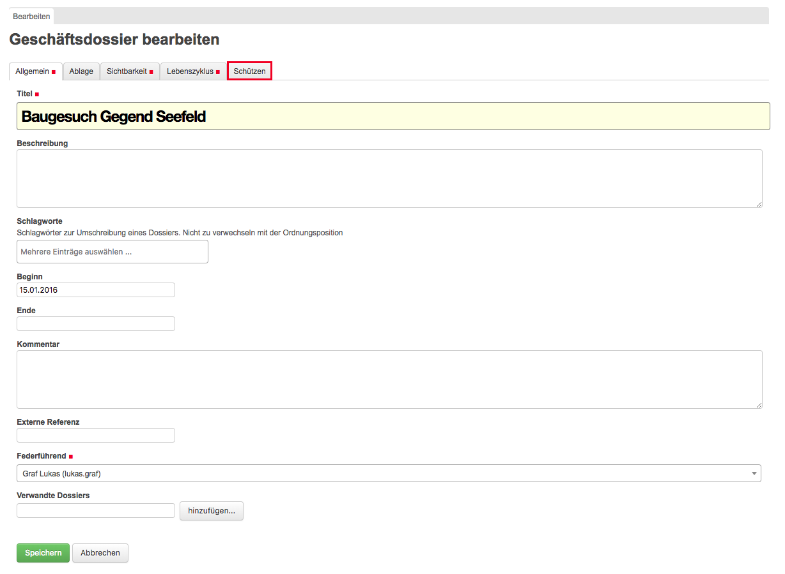
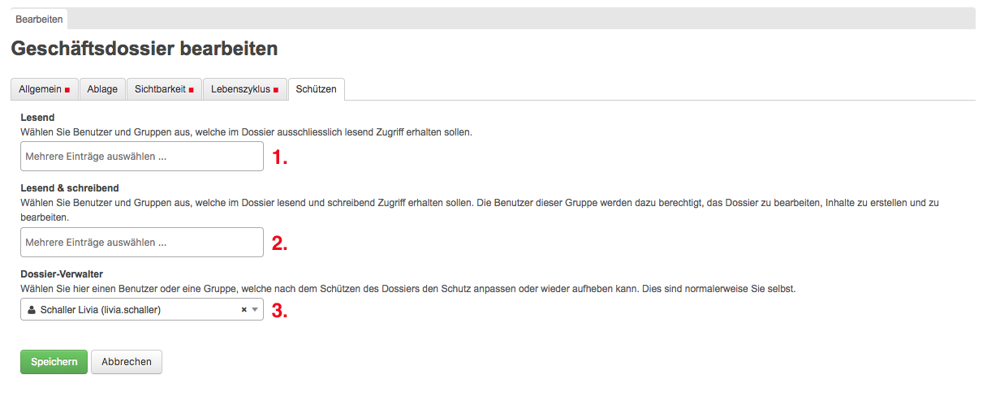
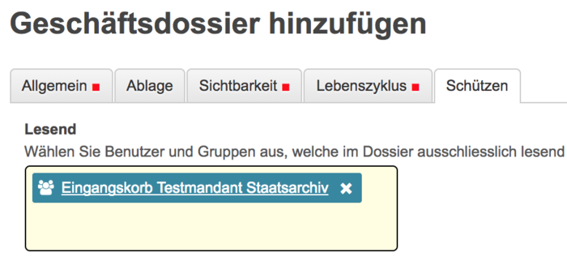

Dossier schützen
=================

Einleitung
----------
In diesem Kapitel wird beschrieben, wie die übergeordnet definierten
Berechtigungen eines Dossiers übersteuert werden können.

Im Tab „Info“ ist in der Spalte "Dossier verwalten" ersichtlich, welche Personen
und Gruppen dazu berechtigt sind Dossier zu schützen resp. die Berechtigungen
eines Dossiers übersteuern zu können. Das Tab steht sowohl auf Stufe
Ordnungsposition sowie Dossier zur Verfügung.

|img-berechtigungoe-2|

Die Berechtigung zum Schützen eines Dossiers wird auf Stufe Ordnungsposition
unter Aktionen/Freigabe gegeben.

Berechtigungs-Vorgang
---------------------
Um die Berechtigung zu überschreiben, kann im entsprechenden Dossier auf
bearbeiten geklickt werden.

|img-berechtigungoe-3|

Im Reiter „Schützen“ kann dann die entsprechende Anpassung gemacht werden.

|img-berechtigungoe-4|

Auf der Maske unter „Schützen“ können folgende Anpassungen gemacht werden.

|img-berechtigungoe-5|

1.	Lesend: Benutzer oder Gruppen auswählen, die ausschliesslich lesend Zugriff erhalten sollen.

2.	Lesend & schreibend: Benutzer oder Gruppen auswählen, die im Dossier lesend und schreibend Zugriff erhalten sollen. Die Benutzer dieser Gruppe werden dazu berechtigt, das Dossier zu bearbeiten, Inhalte zu erstellen und zu bearbeiten.

3.	Dossier-Verwalter: Benutzer oder Gruppen auswählen, die nach dem Schützen des Dossiers den Schutz anpassen oder wieder aufheben kann. Dies sind normalerweise Sie selbst.

Werden keine Namen in den Feldern eingetragen, bleibt die Berechtigung wie bis
anhin. Ansonsten gilt nach dem Speichern die neu gesetzte Berechtigung.

Es stehen die gleiche Auswahl wie unter Aktionen -> Freigabe zur Verfügung.

Tipp
----
Beim Berechtigungs-Vorgang können auch ganze Gruppen ausgewählt werden. Wird
dann auf den Gruppennamen geklickt, erscheint eine Auflistung, welche Benutzer
in dieser Gruppe enthalten sind.

|img-berechtigungoe-7|

Hinweise
--------
Sobald die bestehenden Berechtigungen mit der in diesem Kapitel beschriebenen
Methode überschrieben werden, fallen die bisherigen Rechte komplett weg. Es
empfiehlt sich daher, bevor eine Anpassung der Rechte gemacht wird, unter
Aktionen/Freigabe die aktuelle Berechtigung zu überprüfen.

Denn nicht nur die übergeordnete Berechtigung fällt weg, sondern auch wenn z.B.
jemandem eine Aufgabe zu diesem Dossier gegeben wurde, wird diese temporäre
Berechtigung sofort wieder genommen und der Sachbearbeiter kann seine Aufgabe
nicht mehr weiter bearbeiten/abschliessen. Wird nach der Übersteuerung der
Rechte eine Aufgabe einer bis jetzt noch nicht in diesem Dossier berechtigten
Person zugewiesen, wird ihr wie gewohnt die Berechtigung automatisch gegeben.

.. |img-berechtigungoe-1| image:: img/media/img-berechtigungoe-1.png
.. |img-berechtigungoe-2| image:: img/media/img-berechtigungoe-2.png
.. |img-berechtigungoe-3| image:: img/media/img-berechtigungoe-3.png

.. |img-berechtigungoe-7| image:: img/media/img-berechtigungoe-7.png

.. disqus::
