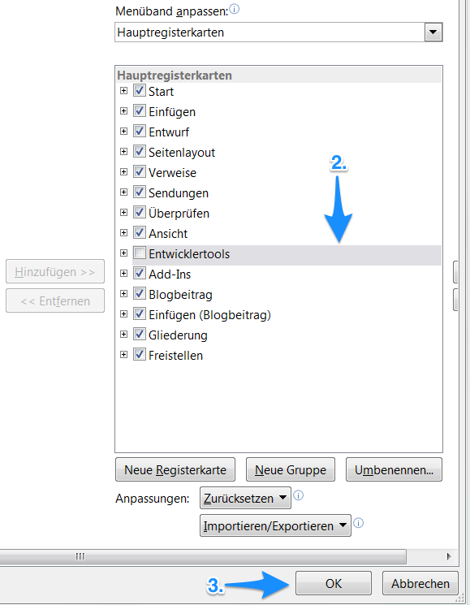
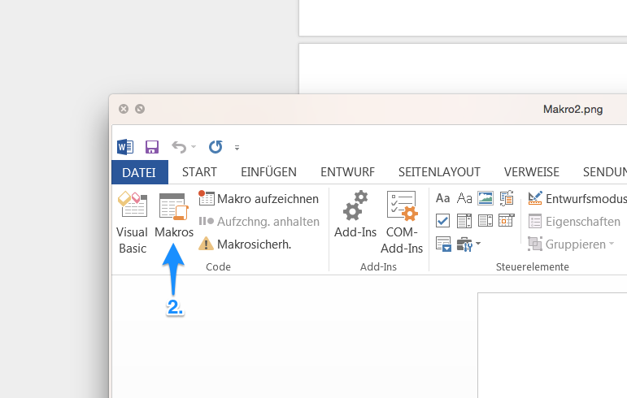
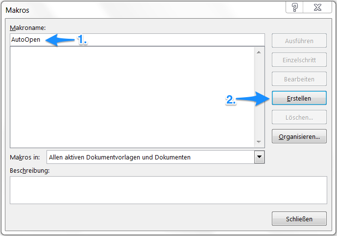
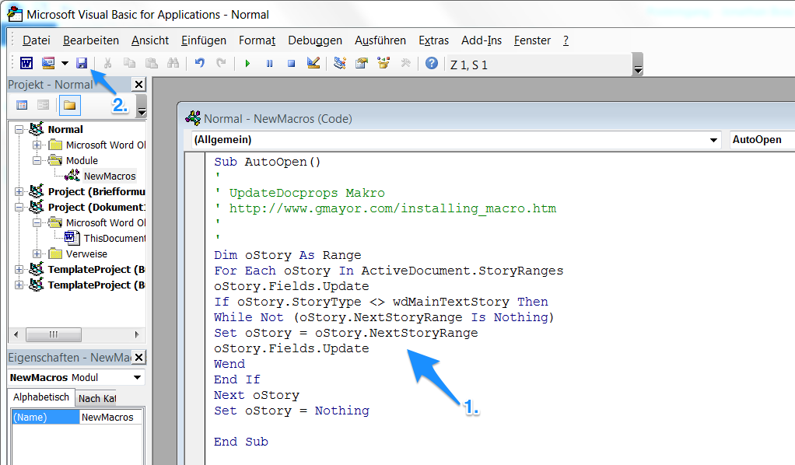

DocProperties in Worddokumenten automatisch aktualisieren
---------------------------------------------------------

Wird über OneGov GEVER ein Worddokument zur Bearbeitung geöffnet, zeigt Word
standardmässig nicht die von OneGov GEVER mitgegebenen Metadaten an. Dies kann
manuell erwirkt werden, indem der ganze Word-Inhalt markiert und die Funktion
Felder aktualisieren aufgerufen wird.

Damit dies von Word automatisch bei jedem Öffnen gemacht wird, muss ein Makro
hinterlegt werden. Dies muss einmalig in Word gemacht werden, nicht für jede
Wordvorlage!

1. Begeben Sie sich bitte im Word auf Datei > Optionen > Menüband anpassen.

2. Aktivieren Sie die “Entwicklertools” durch Setzen eines Häkchens in den
   Hauptregisterkarten aus.

   |docprops-10|

3. Bestätigen Sie die Änderung mit “OK”.

   |docprops-11|

4. Sind die “Entwicklertools” dem Menüband hinzugefügt, wählen Sie diese Menü
   bitte aus.

   |docprops-12|

5. Begeben Sie sich auf den Menüpunkt “Makros”

   |docprops-13|

6. Vergeben Sie den Makronamen ``AutoOpen``.

   |docprops-14|

7. Erstellen Sie das Makro über Erstellen. Bei der Option Makros in können
   "Alle aktiven Dokumentvorlagen und Dokumenten" ausgewählt werden. Damit
   wird sichergestellt, dass das Makro in allen Dokumenten automatisch
   verfügbar ist.

8. Den Code (siehe Tabelle) können Sie dem Feld Normal - NewMacros (Code)
   hinzufügen.

   |docprops-15|

9. Nachdem Sie den Code eingefügt haben, speichern Sie die Einstellungen ab.

.. sourcecode:: vb.net

  Sub AutoOpen()
  '
  ' UpdateDocprops Makro
  ' http://www.gmayor.com/installing_macro.htm
  '
  '
  Dim oStory As Range
  For Each oStory In ActiveDocument.StoryRanges
    oStory.Fields.Update
    If oStory.StoryType <> wdMainTextStory Then
      While Not (oStory.NextStoryRange Is Nothing)
        Set oStory = oStory.NextStoryRange
        oStory.Fields.Update
      Wend
    End If
  Next oStory
  Set oStory = Nothing

  End Sub

Nun werden in neu geöffneten Worddokumenten automatisch die DocProperties
aktualisiert.

Unter Umständen kann beim Download eines Dokumentes aus OneGov GEVER dieses
nicht zur Bearbeitung geöffnet werden. In diesem Fall kann das Makro mit
folgender Anpassung korrigiert werden:

.. sourcecode:: vb.net

  Sub AutoOpen()
  '
  ' UpdateDocprops Makro
  ' http://www.gmayor.com/installing_macro.htm
  '
  '
  On Error GoTo ErrHandler
  Dim oStory As Range
  For Each oStory In ActiveDocument.StoryRanges
    oStory.Fields.Update
    If oStory.StoryType <> wdMainTextStory Then
      While Not (oStory.NextStoryRange Is Nothing)
        Set oStory = oStory.NextStoryRange
        oStory.Fields.Update
      Wend
    End If
  Next oStory
  Set oStory = Nothing

  Exit Sub

  ErrHandler:
  Exit Sub

  End Sub

.. |docprops-10| image:: ../_static/img/kurzref_adm_docprops_10.png

.. |docprops-12| image:: ../_static/img/kurzref_adm_docprops_12.png

.. disqus::
