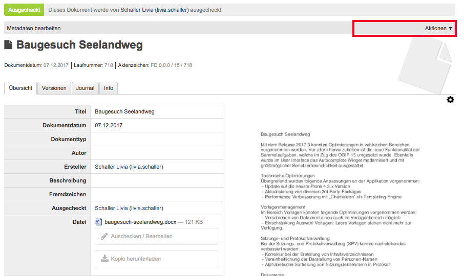

.. _label-force-checkin:

Force Check-In
===============

Der Administrator-Rolle ist es vorbehalten, ausgecheckte oder gesperrte
Dokumente via Force Check-In wieder in OneGov GEVER einzuchecken.
Administratoren haben automatisch auch bei von anderen Benutzern ausgecheckten
Dokumenten oben rechts oder unten bei "Datei" die Aktion „Einchecken“ zur
Verfügung, was einem normalen Benutzer verwehrt bleibt.

.. note::
    Force Check-In kann bei der Person, welche das Dokument
    geöffnet hat, zu Konflikten führen.

Benutzer 1 checkt ein Dokument aus:

|img-forcecheckin-1|

Benutzer 2 kann keine Aktion auslösen, wenn das Dokument von einem anderen
Benutzer ausgecheckt ist:

|img-forcecheckin-2|

Administrator kann Dokument übersteuern und somit via Force Check-In wieder
einchecken:

|img-forcecheckin-3|

.. |img-forcecheckin-1| image:: img/media/img-forcecheckin-1.png

.. |img-forcecheckin-3| image:: img/media/img-forcecheckin-3.png
