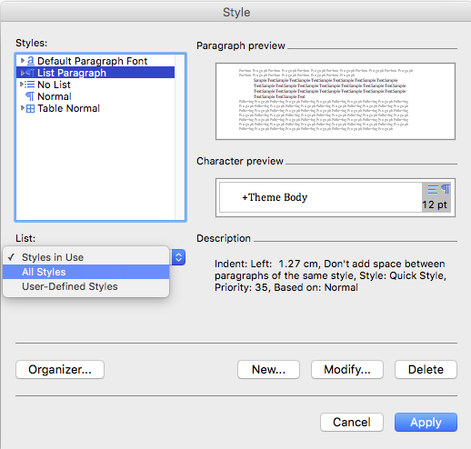
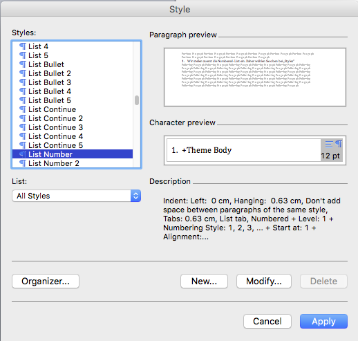
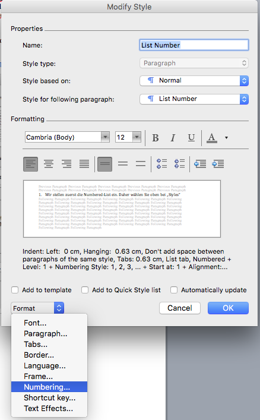
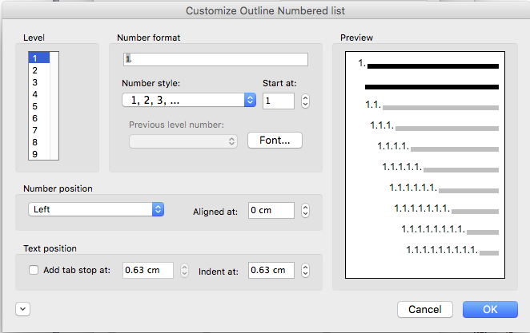
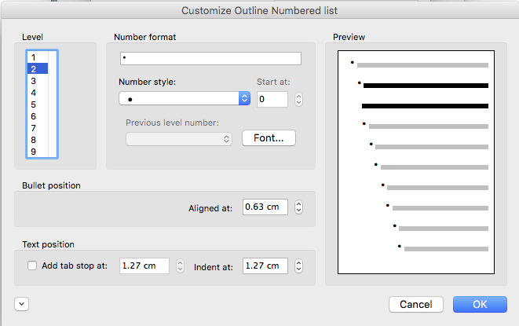

Einstellung Listen in Word-Styles
---------------------------------

In den Sitzungs- und Protokollverwaltungs-Dokumenten können Bullet-Lists (unordered) sowie Numbered-Lists (ordered) erstellt werden. Diese müssen vorgängig in den Word-Styles definiert werden, damit diese dann in den automatisch generierten Protokollen aus OneGov GEVER korrekt angezeigt werden. Diese kann
folgendermassen eingestellt werden:

- Gehen Sie auf Format / Style...

- Klicken Sie bei „List“ auf „All Styles“

|lists-1|

- Wir stellen zuerst die Number-List ein. Daher wählen Sie oben bei „Styles“ in der Liste „List Number“ an und klicken Sie anschliessend auf Bearbeiten/Modify.

|lists-2|

- Es öffnet sich eine neue Maske. Zuunterst finden Sie das Dropdown „Format“. Wählen Sie dort Numbering an, um die weiteren Einstellungen vorzunehmen.

|lists-3|

- In der neuen Maske wählen Sie unter „Outlined Numbered“ die unten blau umrandete Aufzählungs-Liste aus. Bestätigen Sie zweimal mit „OK“ (Bei der Maske „Bullets and Numbering“ sowie bei „Modify Style.)

|lists-4|

- Nun stellen wir die Bullet-List ein. Unter „List“ wählen Sie wieder „All Styles“ an, oben können Sie „List Bullet“ anwählen und klicken anschliessend wieder auf Modify/Bearbeiten.

- Unter „Outline Numbered“ wählen Sie die unten im Printscreen blau umrandete Liste. Klicken Sie anschliessend auf Customize/Anpassen.

|lists-5|

- Wie Sie sehen können, wird per Default pro Level ein anderes Sonderzeichen eingesetzt. Zur Vereinheitlichung können Sie nun auf jedem Level jeweils unter „Number style“ den kleinen Bullet-Point anwählen. Bestätigen Sie wieder zweimal mit „OK“. (Bei „Customize und Bullets and Numbering“, bei „Bullets and Numbering“ sowie bei „Modify Style“.)

|lists-6|

- Wenn Sie wieder auf der Übersicht sind, sehen Sie, dass die „List Number“ sowie die „List Bullet“ nun in den „Styles in Use“-Liste sind. Zum Abschluss können Sie die beiden neuen Listen-Einstellungen noch mit „Apply/Anwenden“ bestätigen.

.. |lists-4| image:: ../_static/img/kurzref_adm_lists_4.png

