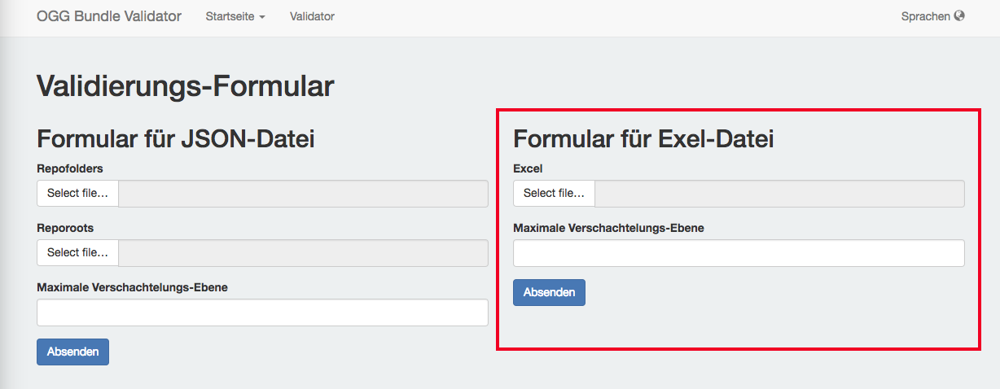
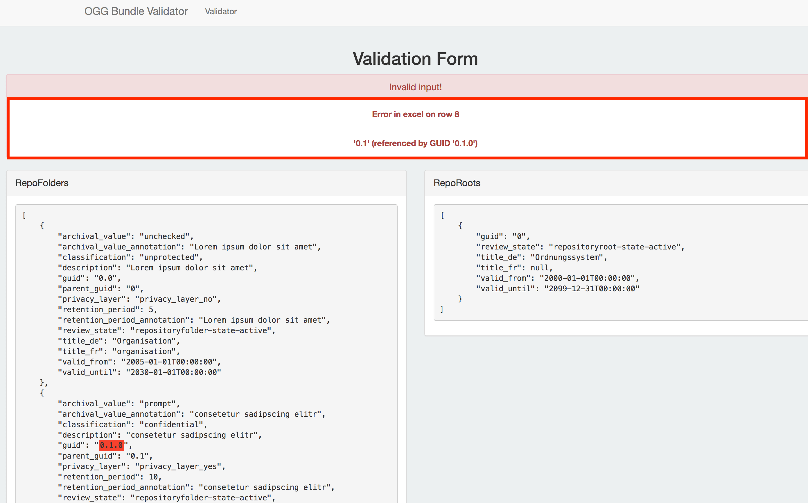

OneGov GEVER Bundle Validator
=============================

Zweck
------
Mittels dem OneGov GEVER Bundle Validator kann ein im Excel vorbereitetes
Ordnungssystem überprüft werden, ob es den OneGov GEVER Vorgaben entspricht und
somit verwendet werden kann.

|img-oggbundle-1|

Vorgehen
--------
Das Excel kann ganz einfach auf `ogg.4teamwork.ch <https://ogg.4teamwork.ch/validator>`_ heraufgeladen
werden. Es muss nur zusätzlich noch die maximale Verschachtelungs-Ebene (Wie
viele Stufen Ihr Ordnungssystem hat) angegeben werden. Dann kann die Validierung
mittels „Absenden“ durchgeführt werden.

|img-oggbundle-2|

Fehlermeldungen
----------------
Wenn Ihr Ordnungssystem noch nicht den OneGov GEVER Vorgaben entspricht, werden
die fehlerhaften Positionen markiert und entsprechende Fehlermeldungen
angezeigt, die Ihnen Inputs liefert, wie Sie ihr Excel anpassen können, um die
Validierung zu bestehen. Wenn es bereits den Richtlinien entspricht wird eine
Success-Meldung angezeigt, dass die Validierung erfolgreich war.

|img-oggbundle-3|

.. |img-oggbundle-1| image:: img/media/img-oggbundle-1.png

