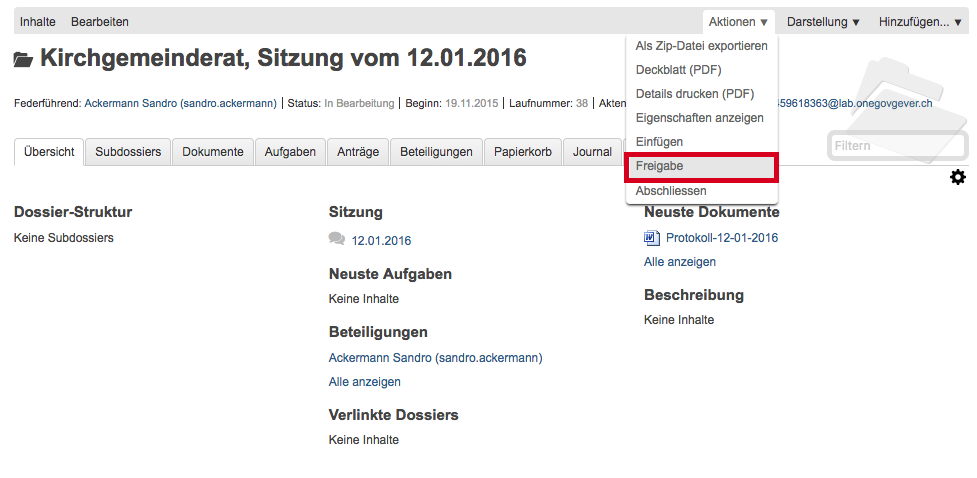
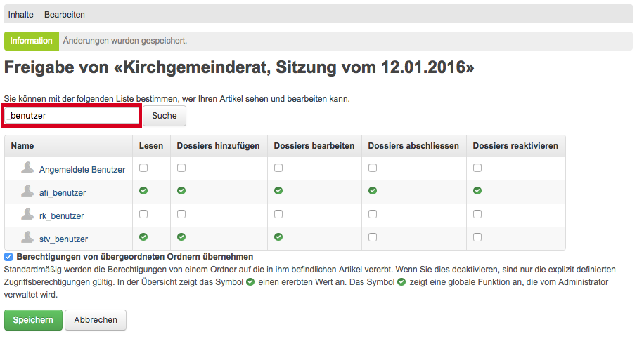

Der Rollenmanager
=================

Wozu dient der Rollenmanager?
-----------------------------

Die Zugriffsberechtigungen eines Mandanten sind auf Stufe
Ordnungsposition hinterlegt und werden auf die darunter liegenden
Dossiers vererbt.

Der Rollenmanager ist eine zusätzliche Rolle, die ausgewählten Benutzern
zugeteilt werden kann; es ist dazu kein separates Login notwendig.
Benutzern, die diese Rolle besitzen, ist es erlaubt, auf
Ordnungspositionen und Dossiers die Berechtigungen anzupassen, d.h.
einzuschränken oder zu erweitern. Auf Stufe Dokument gelten die
Berechtigungen, wie sie auf dem Dossier vergeben sind.

Beispiele:

1. Auf eine Ordnungsposition soll nebst der Leitung auch die Gruppe
   Sekretariat Einsicht nehmen können. Mit der Berechtigung
   Rollenmanager kann diese Erweiterung auf Stufe Ordnungsposition
   vorgenommen werden.

2. Unter einer Ordnungsposition befindet sich ein Dossier, das in
   Abweichung zur Regel nicht von allen Gruppen, die auf die übrigen
   Dossiers dieser Position Zugriff haben, eingesehen werden soll.
   Personen mit der Berechtigung Rollenmanager können die Zugriffsrechte
   für dieses Dossier einschränken.

.. note::
   Änderungen, die der Rollenmanager an den Berechtigungen vornimmt, werden
   im Journal protokolliert.

   Die Rolle "Rollenmanager" sollte nur Personen zugeteilt werden, die alle
   Dossiers eines Mandanten sehen dürfen. Der Grund ist, dass Personen mit
   dieser Rolle automatisch auf jene Dossiers oder Ordnungspositionen
   Zugriff erhalten, bei denen sie eine Änderung vornehmen.

   Es sollten immer Gruppen, nicht einzelne Personen auf Dossiers oder
   Ordnungspositionen berechtigt werden. Auf diese Weise ist bei einer
   personelle Mutation die Kontinuität gewährleistet.

Bedienung
---------

Änderung der Berechtigungen bei einem Dossier
~~~~~~~~~~~~~~~~~~~~~~~~~~~~~~~~~~~~~~~~~~~~~

-  Öffnen Sie das gewünschte Dossier und klicken Sie auf *Aktionen →
   Freigabe*. Die Aktion *Freigabe* erscheint nur bei Personen mit der
   Berechtigung Rollenmanager.

   |img-rollenmanager-1|

-  Hierauf öffnet sich folgende Maske, aus der ersichtlich, ist, welche
   Gruppen in welcher Weise auf diesem Dossier berechtigt
   sind:

   |img-rollenmanager-2|

Berechtigungen einschränken
~~~~~~~~~~~~~~~~~~~~~~~~~~~

-  Soll bei einem Dossier die Berechtigung eingeschränkt werden,
   entfernen Sie das Häklein *Berechtigungen von übergeordneten Ordnern
   übernehmen* und speichern Sie. Dies hat zur Folge, dass die
   Berechtigungen für dieses Dossier nicht mehr von der übergeordneten
   Ordnungsposition geerbt werden, sondern spezifisch für dieses Dossier
   vergeben werden können.

   |img-rollenmanager-3|

-  Es wird nun nur noch diejenige Person angezeigt, die mithilfe des
   Rollenmanagers die Zugriffsberechtigungen bearbeitet (evtl.
   zusätzlich der Eingangskorb).

-  Geben Sie im Suchfeld das Kürzel Ihres Mandanten ein (im untenstehenden
   Beispiel generell gehalten mit "_benutzer"). Klicken Sie anschliessend auf
   "Suche". Es werden nun alle Gruppen ohne Berechtigungen angezeigt.

   |img-rollenmanager-4|

-  Klicken Sie bei den gewünschten Gruppen auf die Berechtigungen, die
   vergeben werden sollen. Mit dem Speichern werden die Änderungen
   übernommen. Die Person mit der Berechtigung Rollenmanager, welche die
   Änderungen vorgenommen hat, bleibt automatisch ebenfalls auf dem
   Dossier berechtigt. Zusätzlich werden die Änderungen im Dossier-Journal
   dokumentiert.

Berechtigungen erweitern
~~~~~~~~~~~~~~~~~~~~~~~~

-  Soll bei einem Dossier die Berechtigung erweitert werden,
   entfernen Sie das Häklein *Berechtigungen von übergeordneten Ordnern
   übernehmen* und speichern Sie. Dies hat zur Folge, dass die
   Berechtigungen für dieses Dossier nicht mehr von der übergeordneten
   Ordnungsposition geerbt werden, sondern spezifisch für dieses Dossier
   vergeben werden können.

   |img-rollenmanager-3|

-  Fügen Sie die gewünschten Berechtigungen hinzu und speichern Sie. Mit
   dem Speichern wird die Änderung der Zugriffsberechtigung übernommen.
   Die Person, welche die Änderung vorgenommen hat, bleibt automatisch
   ebenfalls auf dem Dossier berechtigt. Zusätzlich werden die Änderungen im
   Dossier-Journal dokumentiert.

Wiederherstellen von Berechtigungen auf Stufe Dossier
~~~~~~~~~~~~~~~~~~~~~~~~~~~~~~~~~~~~~~~~~~~~~~~~~~~~~

Fügt man bei einem Dossier, bei dem man die Berechtigungen erweitert
oder eingeschränkt hat, das Häklein *Berechtigungen von übergeordneten
Ordnern übernehmen* wieder hinzu, werden wieder die Berechtigungen von
der übergeordneten Ordnungsposition geerbt. Die Person mit der
Berechtigung Rollenmanager wird dennoch angezeigt, da sie die Änderung
vorgenommen hat. Auch die Wiederherstellung der Vererbung wird im
Journal aufgezeichnet.

Änderung der Berechtigungen bei einer Ordnungsposition
~~~~~~~~~~~~~~~~~~~~~~~~~~~~~~~~~~~~~~~~~~~~~~~~~~~~~~

Die Erweiterung und die Einschränkung der Berechtigungen bei einer
Ordnungsposition erfolgen gleich wie bei den Dossiers.

-  Klicken Sie auf der gewünschten Position auf *Aktionen → Freigabe*.

|img-rollenmanager-3|

-  Nun werden die Gruppen angezeigt, die auf dieser Position berechtigt
   sind. Das Häklein *Berechtigungen von übergeordneten Ordnern
   übernehmen* bezieht sich auf die übergeordnete Position.

|img-rollenmanager-4|

-  Um eine Einschränkung vorzunehmen, entfernen Sie das Häklein
   *Berechtigungen von übergeordneten Ordnern übernehmen*. Bei einer
   Erweiterung muss das Häklein nicht entfernt werden. Das weitere
   Vorgehen entspricht demjenigen bei der Bearbeitung von Berechtigungen
   bei Dossiers.

.. |img-rollenmanager-2| image:: img/media/img-rollenmanager-2.png
.. |img-rollenmanager-3| image:: img/media/img-rollenmanager-3.png

