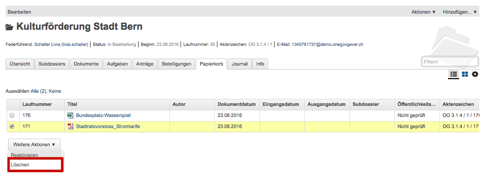

.. _label-soft-delete:

Soft-Delete
===========

Der Administrator-Rolle ist es vorbehalten, bei Dokumenten, welche in den
Papierkorb verschoben worden sind, einen Soft-Delete vorzunehmen. Das bedeutet,
dass das Dokument für alle OneGov GEVER Benutzenden nicht mehr sichtbar ist,
aber technisch durch 4teamwork wieder hergestellt werden könnte.

Nachdem beispielsweise ein Sachbearbeiter ein Dokument in den Papierkorb
verschoben hat, hat dieser nur die Möglichkeit dieses wieder zu reaktivieren,
also zurück ins Dossier zu legen. Der Administrator hat bei dieser Übersicht
zudem die Möglichkeit, den Soft-Delete vorzunehmen.

|img-soft-delete-1|

