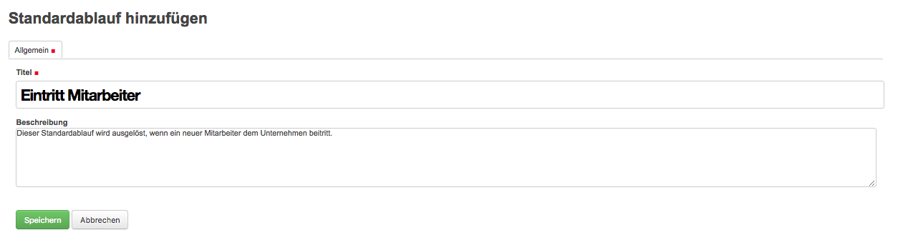
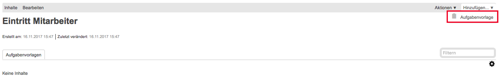
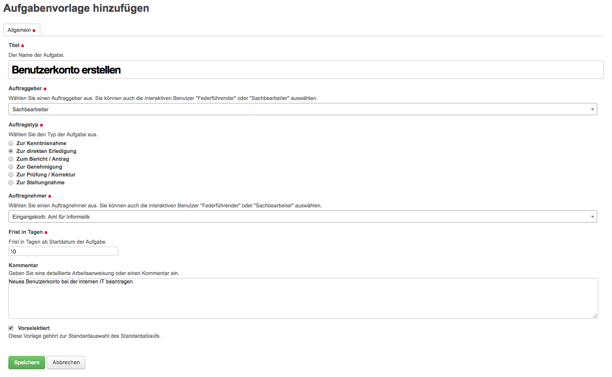
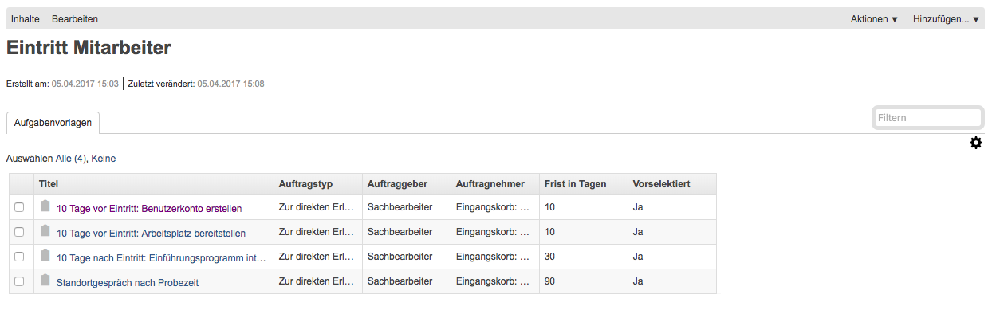

Einen Standardablauf erstellen
==============================

Standardablauf generell
-----------------------
Wiederkehrende Aufgabenketten können unter Vorlagen hinterlegt werden. Diese
vordefinierten Aufgabenfolgen werden Standardabläufe genannt. Diese können nur
durch Benutzer welche im Vorlagenbereich schreibberechtigt sind, erstellt oder
bearbeitet werden. Sie können aber durch alle Benutzer in den jeweiligen
Dossiers ausgelöst werden. Details zum Auslösen finden Sie daher in der `Benutzerdokumentation <https://docs.onegovgever.ch/user-manual/standardablaeufe/>`_.

Standardablauf erstellen
------------------------
Dazu kann wie gewohnt unter Vorlagen/Hinzufügen ein neuer Standardablauf
erstellt werden.

|img-standardablauf-20|

In der allgemeinen Maske wird dem Standardablauf einen Titel gegeben sowie ein
kurzer, optionaler Beschrieb hinzugefügt.

|img-standardablauf-21|

Danach können beliebig viele Aufgabenvorlagen hinzugefügt werden. Dies wird
wieder via Hinzufügen/Aufgabenvorlage gemacht.

|img-standardablauf-22|

Eine Aufgabenvorlage ist gleich aufgebaut wie eine normale Aufgabe und wird auch
gleich ausgefüllt. Beim Auftraggeber sowie –nehmer macht es allenfalls Sinn,
sich nicht unbedingt auf eine Person einzuschränken, sondern eher interaktive
Benutzer wie „Sachbearbeiter“ oder „Federführend“ zu verwenden.

|img-standardablauf-23|

Nachdem die Aufgabenvorlage gespeichert wurde, erscheint diese automatisch im
Standardablauf. Danach können beliebg viele weitere Aufgabenvorlagen erstellt
werden.

|img-standardablauf-24|
|img-standardablauf-25|

.. |img-standardablauf-20| image:: img/media/img-standardablauf-20.png

.. |img-standardablauf-24| image:: img/media/img-standardablauf-24.png

.. disqus::
