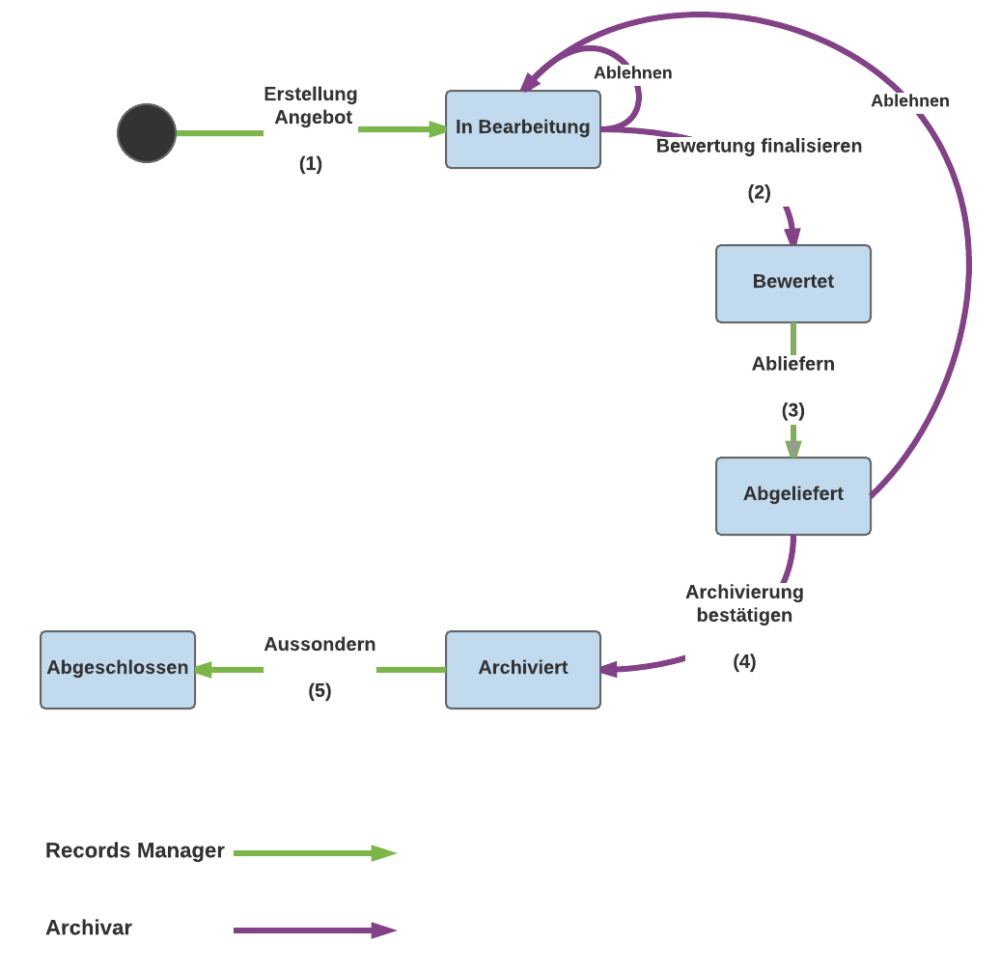

Aussonderung
============

.. contents::
   :local:
   :backlinks: none

Abgelaufene Dossiers
--------------------
Das Aussondern von Inhalten im OneGov GEVER wird ausschliesslich auf Stufe Dossier angeboten. Dabei können nur stornierte oder abgeschlossen Dossier, bei welchen die Aufbewahrungsfrist abgelaufen ist, ausgesondert werden.

Eine Übersicht über Abgelaufene Dossiers, also Dossiers welche für eine Aussonderung in Frage kommen, bietet der Status-Filter `angeboten` welcher auf allen Dossierauflistungen zur Verfügung steht.

Angebot erstellen und archivieren
---------------------------------
Beim Angebot handelt es sich um einen separaten Inhaltstypen, der neben zusätzlichen Metadaten vor allem die Referenzen auf die entsprechenden Dossiers führt. Das Angebot-Objekt stellt zudem den kompletten Aussonderungs-Workflow zur Verfügung. Dieser setzt sich aus den folgenden Übergängen zusammen:

 1. Angebot erstellen
 2. Bewertung finalisieren
 3. Angebot abliefern
 4. Archivierung bestätigen
 5. Dossiers vernichten

|aussonderungs-prozess|

Angebot erstellen und bewerten
~~~~~~~~~~~~~~~~~~~~~~~~~~~~~~
Aussonderungsangebote können auf Stufe Ordnungssystem bzw. Ordnungsposition erstellt werden. Für die direkte Erstellung eines Angebots aus einer Dossierauflistung inkl. Auswahl der Dossiers, steht die Tabbedview-Action `Aussonderungsangebot erstellen` zur Verfügung.

|aussonderung-1|

Wurde eine Angebot erstellt, befindet es sich im Status ``In Arbeit`` (``disposition-state-in-progress``). In diesem Status können die Metadaten des Angebots, wie auch die enthaltenen Dossiers, noch bearbeitet werden.

Zudem kann die Bewertung des Angebots vorgenommen werden, dabei handelt es sich um den Entscheid, ob ein Dossier archiviert werden soll oder nicht. GEVER macht dabei automatisch ein Vorbewertung anhand des Dossier-Metadatums ``Archivwürdigkeit``.

Anschliessend kann die Bewertung von den Records Managern über die Angebotsansicht angepasst und vorbereitet werden.

|aussonderung-2|

Je nach Arbeitsweise kann für die endgültige Bewertung das Archiv auf dem GEVER Mandanten berechtigt werden um die Bewertung gleich im GEVER vornehmen zu können oder es kann ein Bewertungsliste (Excel) generiert und dem Archiv übermittelt werden. Eine automatischer Import der Bewertungsliste steht aktuell nicht zur Verfügung.

Alle Angebot sind im neuen Tab `Angebote` ersichtlich. Es steht nur Benutzern mit der Berechtigung Angebote zu Erstellen zur Verfügung.

Bewertung finalisieren
~~~~~~~~~~~~~~~~~~~~~~
Wurde die Bewertung durch das Archiv vorgenommen, kann die Bewertung finalisiert werden. Dabei wird das Angebot in den Status ``Bewertet`` (``disposition-state-appraised``) versetzt und kann nicht mehr bearbeitet bzw. angepasst werden.

Angebot abliefern
~~~~~~~~~~~~~~~~~
Anschliessend kann das Angebot abgeliefert werden. Danach steht auch die Aktion ``Ablieferungspaket herunterladen`` zur Verfügung, welches den eCH-160 Export für die enthaltenen Dossiers mit einer positiven Bewertung zum Download anbietet.

Archivierung bestätigen
~~~~~~~~~~~~~~~~~~~~~~~
War der Ingest des SIP-Pakets ins Langzeitarchiv erfolgreich, so kann die Archivierung bestätigt werden, im Idealfall wird dies natürlich gleich von der verantwortlichen Person im Archiv gemacht.

Dossiers vernichten
~~~~~~~~~~~~~~~~~~~
Der Prozess der Aussonderung wird mit der Vernichtung der Dossiers abgeschlossen. Dabei werden alle im Angebot enthaltenen Dossiers (auch nicht archivwürdige) vernichtet, also effektiv aus dem GEVER gelöscht.

Nach Abschluss des Angebots, also nach der Vernichtung der Dossiers, besteht zudem die Möglichkeit ein automatisch generiertes Löschprotokoll herunterzuladen.

Zusätzliche Vernichtungs-Varianten (Nur löschen der Primärdaten, Entzug der Leseberechtigung etc.) sind aktuell nicht umgesetzt und auch nicht geplant.

Angebot ablehnen
~~~~~~~~~~~~~~~~
Ein Angebot im Status `In Bearbeitung` oder `Abgeliefert` kann zudem von einem Archivar abgelehnt werden, dabei wird das Angebot wieder in den Status `In Bearbeitung` versetzt.

Verlauf
-------
Für jedes Angebot wird ein Verlauf geführt und ähnlich wie bei Aufgaben oder Anträgen dargestellt.

|aussonderung-3|

Auflistung
----------
Auf Stufe Ordnungssytem steht für Benutzer mit den Rollen `Records Manager` oder `Archivist` ein zusätzlicher Reiter `Angebote` zur Verfügung, welcher alle Angebote dieses Ordnungssystems auflistet.

|aussonderung-4|

Berechtigung
------------
Sowohl das Erstellen wie auch das Betrachten eines Angebots ist durch eine separate Permission geschützt. Diese steht nur den Rollen `Manager`, `Records Manager` und `Archivist` zur Verfügung.

Die neue Rolle `Records Manager` wird global vergeben und wird dem relativ kleinen Benutzerkreis von Benutzern welche für die Aussonderung des entsprechenden Mandants zuständig sind, vergeben.

Die neue Rolle `Archivist` wird global den Archiv-Mitarbeitenden vergeben, welche dazu berechtigt sind Angebote zu bewerten und ins Langzeitarchiv zu überführen. Benutzer mit der Rolle Archivist können alle angebotenen und archivierten Dossiers sehen, auch wenn Sie nicht dem entsprechenden Mandanten zugewiesen sind. Dies ermöglicht eine Prüfung der Dossiers durch die Archiv Mitarbeitenden während der Bewertungsphase.

Feature Flag
------------
Die zusätzichen Features sind mit einem Feature-Flag geschützt, und stehen nur der neuen Rolle `Records Manager` zur Verfügung.

