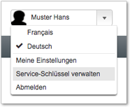
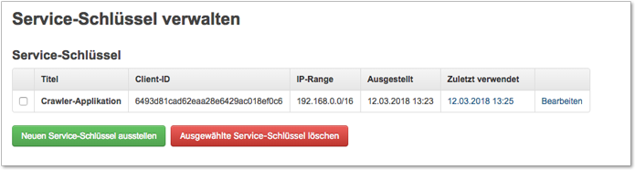
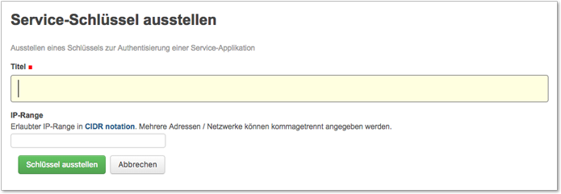
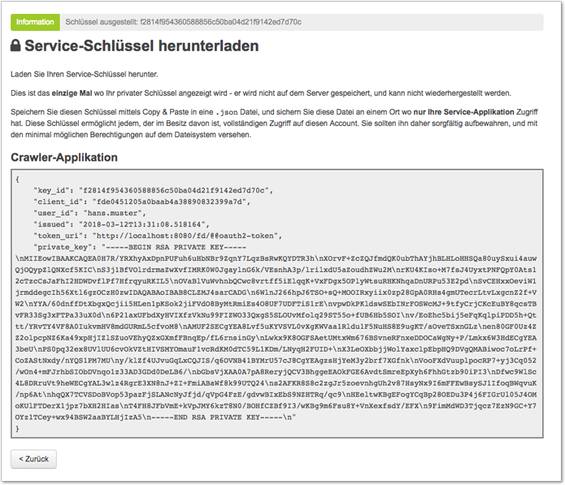
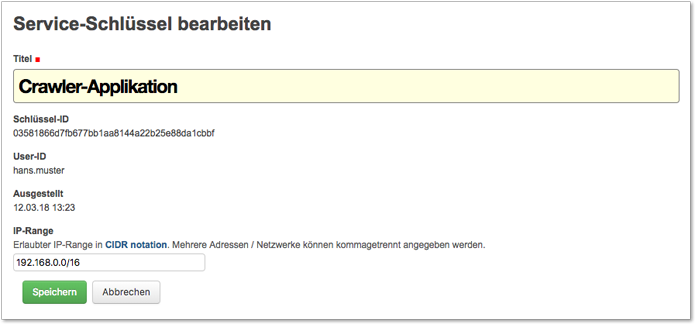
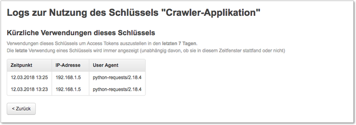
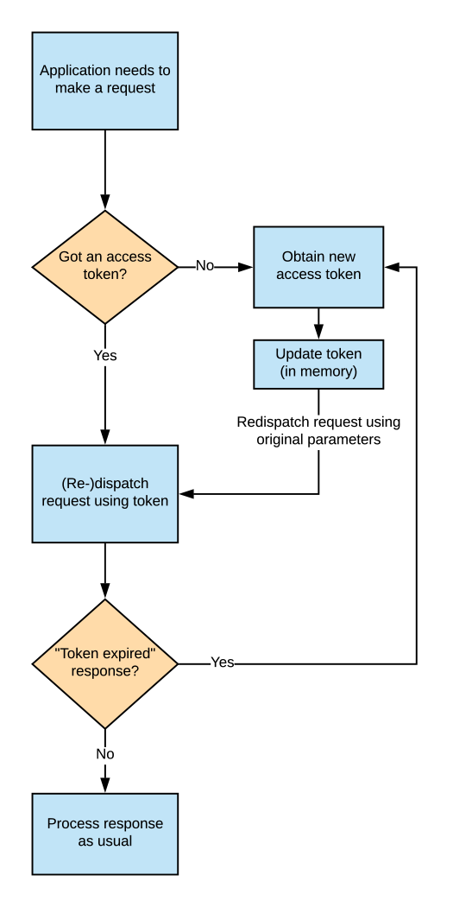

OAuth2 Authentisierung mit Service-Schlüsseln und Tokens
--------------------------------------------------------

Diese Authentisierungs-Methode erlaubt Maschine-zu-Maschine Authentisierung
durch den Einsatz von Service-Schlüsseln, signierten Requests zur
Token-Anforderung und kurzlebigen Access-Tokens.

Diese Methode eignet sich für die Authentisierung von Service-Applikationen
(z.B. Fachanwendungen), welche die Authentisierung selbstständig und ohne
menschliche Interaktion durchführen sollen.

Übersicht
^^^^^^^^^

Die Authentisierung der Requests erfolgt mittels kurzlebigen **Access-Tokens**.
Diese haben eine beschränkte Gültigkeitsdauer (default: eine Stunde), und
müssen von der Service-Applikation regelmässig neu bezogen werden.

Das Beziehen eines Access-Tokens erfolgt mit einem sogenannten
**"JWT Authorization Grant"** - eine signierte Anforderung, mit der die
Service-Applikation von GEVER ein neues Access-Token verlangt.

Dieser Authorization Grant muss mit einem **privaten Schlüssel** signiert
werden, der an einen bestimmten Benutzer gebunden ist und zuvor (einmalig) in
GEVER über die Benutzeroberfläche ausgestellt wurde.

Authentisierungs-Flow
^^^^^^^^^^^^^^^^^^^^^

Der Prozess umfasst dementsprechend vier Schritte:

1. Ausstellen eines :ref:`Service-Schlüssels <manage-service-keys>` für einen
   Benutzer in GEVER, und hinterlegen dieses Schlüssels in der
   Service-Applikation.
2. Die Service-Applikation erstellt einen
   :ref:`JWT Authorization Grant <create-jwt-authorization-grant>`, um ein
   Access-Token anzufordern, und signiert diesen Grant mit dem privaten
   Schlüssel.
3. Die Service-Applikation bezieht dann über den Token-Endpoint in GEVER mit
   diesem JWT Grant ein :ref:`Access Token <obtain-access-token>`.
4. Für Requests auf GEVER verwendet die Service-Applikation dann dieses
   Access-Token um sich zu :ref:`authentisieren <authenticate-using-token>`
   (bis es abläuft, in welchem Fall ein neuer JWT Grant erstellt werden muss
   um erneut ein Token zu beziehen).

Wenn der Benutzer bereits einen Service-Schlüssel ausgestellt und für die
Service-Applikation hinterlegt hat, sieht der Authentisierungs-Flow
folgendermassen aus:

|tokenauth-auth-flow|

..
   Image Source: https://drive.google.com/open?id=1F8C4QB57ALF705vx9xkTDIX8AqMCJ30v

.. _manage-service-keys:

Verwalten von Service-Schlüsseln
^^^^^^^^^^^^^^^^^^^^^^^^^^^^^^^^

Service-Schlüssel für einen Account können über die Benutzeroberfläche von
GEVER verwaltet werden. Für Accounts, für welche das Ausstellen von Schlüsseln
erlaubt wurde, kann über die Aktion :guilabel:`Service-Schlüssel verwalten` im
Menü für persönliche Einstellungen das Management-Interface aufgerufen werden.

Im Management-Interface werden die vorhandenen Schlüssel aufgelistet, und
Details zu den mit den Schlüsseln assozierten Metadaten und Einstellungen.

|tokenauth-manage-keys|

------------

Über die Aktion :guilabel:`Neuen Service-Schlüssel ausstellen` kann ein neuer
Schlüssel erzeugt werden. Dem Schlüssel muss mindestens ein Titel zugewiesen
werden, der den Verwendungsweck beschreiben sollte.

Optional kann ein IP-Range definiert werden, von welchem aus mit diesem
Schlüssel bezogene Access Tokens zur Authentisierung verwendet werden dürfen.

|tokenauth-issue-key|

------------

Nach dem Erzeugen wird der private Teil des Schlüssels genau einmal
dargestellt, und muss gespeichert werden. Der öffentliche Schlüssel verbleibt
auf dem Server, und der private Schlüssel wird auf dem Dateisystem so
hinterlegt, dass er nur für die Service-Applikation zugänglich ist.

Bei der Erstellung eines Schlüssels wird diesem eine eindeutige Client-ID
vergeben. Diese Client-ID identifiziert die Service-Applikation, und ein
Schlüssel sollte daher jeweils nur für eine Applikation verwendet werden.

|tokenauth-download-key|

------------

Über das Bearbeitungsformular können Titel und IP-Range für bereits erstellte
Schlüssel angepasst werden. Änderungen am erlaubten IP-Range sind sofort
wirksam, und gelten auch für Access Tokens welche bereits mit diesem Schlüssel
ausgestellt wurden.

|tokenauth-edit-key|

------------

In der Übersicht des Management-Interfaces wird der Zeitpunkt dargestellt, zu
welchem ein Schlüssel das letzte Mal verwendet wurde, um ein Access Token zu
beziehen.

Ein Klick auf dieses Datum zeigt ausführliche Logs über die letzten
Verwendungen des Schlüssels an. Eine Verwendung wird immer dann protokolliert,
wenn ein mit dem entsprechenden Schlüssel signierter JWT Authorization Grant
benutzt wird, um ein Access Token zu beziehen.

|tokenauth-usage-logs|

.. _create-jwt-authorization-grant:

JWT Authorization Grant erstellen
^^^^^^^^^^^^^^^^^^^^^^^^^^^^^^^^^

Um ein Access Token zu beziehen, erstellt die Service-Applikation einen
JWT Authorization Grant, und signiert diesen mit ihrem privaten Schlüssel.

Ein Authorization Grant ist ein JWT (JSON Web Token) mit einem vordefinierten
Satz an Claims, welche sich von Zeitstempeln abgesehen alle aus dem Service-Key
ableiten lassen.

Das JWT muss folgende Claims enthalten:

==== ========================================================================
Name Beschreibung
==== ========================================================================
iss  Issuer - die ``client_id`` aus dem Service-Key
aud  Audience - die ``token_uri`` aus dem Service-Key
sub  Subject - die ``user_id`` aus dem Service-Key
iat  Die Zeit zu welcher der Grant ausgestellt wurde, angegeben als
     Unix-Timestamp [#f1]_
exp  Die Ablauf-Zeit des JWTs, als Unix-Timestamp [#f1]_.
     Maximum: 1 Tag, Empfehlung: 1 Stunde
==== ========================================================================

.. [#f1] Sekunden seit Epoch (00:00:00 UTC, 1. Januar, 1970).

Das JWT muss dann mit dem privaten Schlüssel signiert werden. Der einzige
unterstützte Signatur-Algorithmus ist ``RS256`` (RSA Signatur mit SHA256)).

Für .NET Applikationen existiert eine Library
`Jwt.Net <https://github.com/jwt-dotnet/jwt>`_ welche für das Erstellen und
Signieren von JWTs verwendet werden kann.

Beispiel in Python:

.. code:: python

    import json
    import jwt
    import time

    # Load saved key from filesystem
    service_key = json.load(open('my_saved_key.json', 'rb'))

    private_key = service_key['private_key'].encode('utf-8')

    claim_set = {
        "iss": service_key['client_id'],
        "sub": service_key['user_id'],
        "aud": service_key['token_uri'],
        "iat": int(time.time()),
        "exp": int(time.time() + (60 * 60)),
    }
    grant = jwt.encode(claim_set, private_key, algorithm='RS256')

.. _obtain-access-token:

Access Token beziehen
^^^^^^^^^^^^^^^^^^^^^

Um ein Access Token zu beziehen, macht die Client-Applikation einen
Token-Request, um das zuvor erstellte und signierte JWT gegen ein Token
einzutauschen.

Der Token Request muss auf die im Service-Key angegebene ``token_uri``
gemacht werden. Dieser Request muss ein ``POST`` Request mit dem
``Content-Type: application/x-www-form-urlencoded`` sein, und als Body die
form-encodeten Parameter enthalten.

Zwei Parameter werden benötigt:

=========== =================================================================
Name        Beschreibung
=========== =================================================================
grant_type  Muss immer ``urn:ietf:params:oauth:grant-type:jwt-bearer`` sein
assertion   Der JWT Authorization Grant
=========== =================================================================

Der Token Endpoint antwortet dann mit einer Token Response, welche das Access
Token enthält:

.. code:: json

    {
      "access_token": "<token>",
      "expires_in": 3600,
      "token_type": "Bearer"
    }

Diese Response ist vom ``Content-Type: application/json`` und enthält einen
JSON encodeten Body.

Beispiel in Python:

.. code:: python

    import requests

    GRANT_TYPE = 'urn:ietf:params:oauth:grant-type:jwt-bearer'

    payload = {'grant_type': GRANT_TYPE, 'assertion': grant}
    response = requests.post(service_key['token_uri'], data=payload)
    token = response.json()['access_token']

Im Fehlerfall antwortet der Token Endpoint mit einem JSON-Dictionary, das
Details zum Fehler enthält:

.. code:: json

    {
      "error": "invalid_grant",
      "error_description": "<Fehlerbeschreibung>"
    }

.. _authenticate-using-token:

Access Token zur Authentisierung verwenden
^^^^^^^^^^^^^^^^^^^^^^^^^^^^^^^^^^^^^^^^^^

Die Client-Applikation kann dann das erhaltene Access Token verwenden, um
Requests zu Authentisieren. Das Token muss im HTTP ``Authorization`` Header
als ``Bearer`` Token gesendet werden.

Wenn das Token abgelaufen ist, muss die Client-Applikation einen neuen JWT
Grant erstellen und signieren, und damit ein neues Token beziehen.

Beispiel in Python:

.. code:: python

    with requests.Session() as session:
        session.headers.update({'Authorization': 'Bearer %s' % token})
        response = session.get('http://localhost:8080/Plone/')
        # ...

Wenn das von der Client-Applikation gesendete Token abgelaufen ist, sendet
der Server eine entsprechende Fehler-Response:

.. code:: json

    {
      "error": "invalid_token",
      "error_description": "Access token expired"
    }

Der Client muss in diesem Fall ein neues JWT erstellen und signieren, und den
zuvor gescheiterten Request mit den ursprünglichen Parametern, aber dem neuen
Token, wiederholen.

Empfohlene Client-Implementierung
^^^^^^^^^^^^^^^^^^^^^^^^^^^^^^^^^

Die oben beschriebenen Schritte stellen den einfachen Fall dar, dass sich ein
Client genau einmal authentisieren soll.

Für einen Client, der kontinuierlich authentisierte Requests durchführen soll,
muss eine gewisse Logik implementiert werden um das Token regelmässig zu
erneuern.

Diese Logik sollte ungefähr so implementiert werden:

|tokenauth-client-flow|

..
   Image Source: https://drive.google.com/open?id=1wVua7R5VQUxJKGL8dq1kGV4AjLgjGSXZ

Der Client sollte, statt versuchen die Ablaufzeit des Tokens vorherzusagen,
damit rechnen dass jeder Request aufgrund eines abgelaufenen Tokens scheitern
kann. In diesem Fall soll er ein neues Token beziehen, und den Request
mit dem neuen Token wiederholen.

Um dies Umzusetzen, empfehlen wir das durchführen der Requests an eine Klasse
zu delegieren, welche diese ganze Retry-Logik enthält, und aus der
Business-Logik der Client-Applikation nicht direkt Requests abzusetzen.

Beim Durchführen von Requests um neue Tokens zu beziehen muss auf zwei
Dinge geachtet werden:

- Diese Requests sollen keinen ``Authorization`` Header enthalten. Sonst
  scheitern sie u.U. wenn aus Versehen ein abgelaufenes Token mitgesendet wird.

- Diese Requests müssen wie oben beschrieben mit dem
  ``Content-Type: application/x-www-form-urlencoded`` durchgeführt werden,
  während Requests auf die GEVER API den ``Content-Type: application/json``
  haben müssen.

Aus diesen Gründen ist es empfehlenswert, für "normale" Requests und Requests
zur Token-Erneuerung unterschiedliche Sessions (persistente HTTP-Verbindungen)
zu verwenden.

Eine Beispiel-Implementation in Python für einen kontinuierlich
authentisierenden Client:

.. container:: collapsible

    .. container:: header

       **Beispiel-Client (Python)**

    .. literalinclude:: examples/oauth2-client-example.py

.. |tokenauth-auth-flow| image:: ../../_static/img/tokenauth-auth-flow.png

