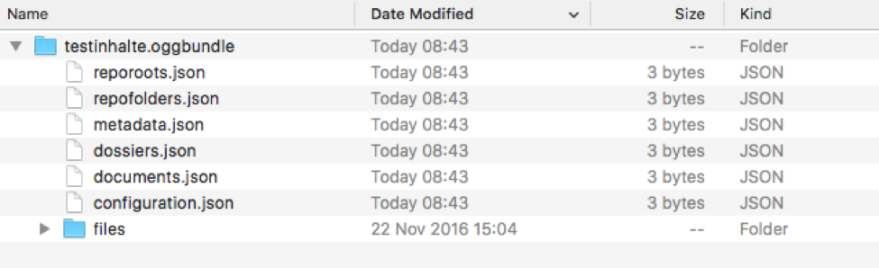

.. _kapitel-oggbundle:

=======================
Spezifikation OGGBundle
=======================

Dieses Dokument beschreibt die Spezifikation der Datenschnittstelle zur Migration eines Mandanten aus dem OS-Laufwerk in den zugehörigen GEVER-Mandanten.

Changelog:

+---------------+--------------+-------------+--------------------------------------------------------+
| **Version**   | **Datum**    | **Autor**   | **Kommentar**                                          |
+===============+==============+=============+========================================================+
| 1.0           | 16.10.2017   | LG, PG      | Referenzierung von bestehendem Inhalt via Aktenzeichen |
+---------------+--------------+-------------+--------------------------------------------------------+
| 0.1.3         | 10.02.2017   | LG          | Ergänzt: Setzen des Workflow-Status                    |
+---------------+--------------+-------------+--------------------------------------------------------+
| 0.1.2         | 16.01.2017   | LG          | JSON-Schemas referenziert                              |
+---------------+--------------+-------------+--------------------------------------------------------+
| 0.1.1         | 12.01.2017   | LG          | Nicht erlaubte Dateiformate definiert                  |
+---------------+--------------+-------------+--------------------------------------------------------+
| 0.1           | 26.11.2016   | LG, DE      | Initialer Entwurf                                      |
+---------------+--------------+-------------+--------------------------------------------------------+

Status: In Arbeit

Die hier beschriebene Schnittstelle dient dem einmaligen Import eines Ordnungssystems, seiner Ordnungspositionen, Dossiers/Subdossiers und Dokumente/Mails nach OneGov GEVER. Die Migration findet ab einem JSON-basierten Zwischenformat statt. Dieses muss einem validen Schema entsprechen, und die darin enthaltenen Daten müssen die in OneGov GEVER geltenden Geschäftsregeln erfüllen.

Zu migrierende Inhaltstypen
---------------------------

+------------------------------+-------------+
| **Ordnungssysteme**          | Ja          |
+==============================+=============+
| **Ordnungspositionen**       | Ja          |
+------------------------------+-------------+
| **Dossiers**                 | Ja          |
+------------------------------+-------------+
| **Dokumente**                | Ja          |
+------------------------------+-------------+
| **Mails**                    | Ja          |
+------------------------------+-------------+
| Kontakte                     | Nein \*     |
+------------------------------+-------------+
| Organisationseinheiten       | Nein \*\*   |
+------------------------------+-------------+
| Sitzungen                    | Nein        |
+------------------------------+-------------+
| Aufgaben / Weiterleitungen   | Nein        |
+------------------------------+-------------+

\* *“Kontakte” bezeichnet in diesem Zusammenhang einen speziellen Inhaltstyp in OneGov GEVER, mit welchem Adressdaten direkt in GEVER erfasst werden können, welche nicht in anderen Systemen wie z.B. AD geführt werden. Benutzer aus dem AD werden hingegen in OneGov GEVER auch importiert werden, allerdings direkt aus dem AD, nicht als Teil des Zwischenformats*

\*\* *Details wie die mit Organisationseinheiten verknüpften Berechtigungen aus OS-Laufwerk genau migriert werden müssen noch geklärt werden. Die Organisationseinheiten selbst müssen jedoch nicht migriert werden.*

Inhalt:
-------
.. contents::

OneGov GEVER Bundle (OGGBundle)
-------------------------------

Das Zwischenformat für den Export von Daten aus OS-Laufwerk und dem Import in OneGov GEVER wird als OneGov GEVER Bundle (**OGGBundle**) bezeichnet.

Das Bundle kann als "virtuelles Verzeichnis" verstanden werden: Es folgt einer Verzeichnisstruktur, welche nach einem bestimmten Muster aufgebaut ist, und alle nötigen Informationen des Exports enthält. Das Bundle kann somit für sehr kleine Datenmengen als ZIP-Datei mit der Endung **.oggbundle** (z.B. **testinhalte.oggbundle**) abgeliefert werden, oder auch als Verzeichnis mit der Endung **.oggbundle** auf einem Server hinterlegt oder gemountet werden. Der konkrete Transportmechanismus ist nicht Teil dieser Spezifikation, und kann dem Anwendungszweck gemäss gewählt werden.

Alle Pfad-Angaben in einem Bundle sind relativ zum root des Bundles.

Das Bundle besteht aus einer Sammlung von JSON-Dateien, deren Inhalt einem bestimmten Schema folgen muss, und einem Unterverzeichnis :ref:`files/ <files>` welches die Dateien für Dokumente (Primärdaten) enthält.

----

Ein Bundle beinhaltet eine Datei pro zu importierendem Inhaltstyp. Darin müssen die jeweiligen Inhalte flach (ohne Verschachtelung) im JSON-Format gespeichert werden. Für jede solche Datei wird ein `JSON-Schema <http://json-schema.org/>`__ zur Verfügung gestellt, welches den Aufbau der JSON-Datei genau beschreibt und mit dem die Inhalte vor einem Import validiert werden müssen. Die folgenden Abschnitte beschreiben die im Moment unterstützten Inhaltstypen und die damit assoziierten Dateien im Bundle.

|img-image-1|

Konfiguration und Bundle-Metadaten
----------------------------------

metadata.json
~~~~~~~~~~~~~

Diese Datei beinhaltet Metadaten über das Bundle, z.B. den Erstellungszeitpunkt und Ersteller des Bundles oder den Verwendungszweck (optional).

configuration.json
~~~~~~~~~~~~~~~~~~

Diese Datei beinhaltet die Konfiguration des Mandanten, insbesondere auch die zur Validierung der Inhalte benötigten Wertebereiche, welche für gewisse Felder pro Mandant konfigurierbar sind.

JSON Schema: :ref:`configuration.schema.json <configuration_schema_json>`

Daten für Inhaltstypen
----------------------

reporoots.json
~~~~~~~~~~~~~~

Diese Datei beinhaltet ein oder mehrere Ordnungssystem-Wurzeln.

JSON Schema: :ref:`reporoots.schema.json <reporoots_schema_json>`

repofolders.json
~~~~~~~~~~~~~~~~

Diese Datei beinhaltet die einzelnen Ordnungspositionen, die in den Ordnungssystem-Wurzeln abgelegt werden.

JSON Schema: :ref:`repofolders.schema.json <repofolders_schema_json>`

dossiers.json
~~~~~~~~~~~~~

Diese Datei beinhaltet Dossiers und Subdossiers, diese können in den Ordnungspositionen abgelegt werden.

JSON Schema: :ref:`dossiers.schema.json <dossiers_schema_json>`

documents.json
~~~~~~~~~~~~~~

Diese Datei beinhaltet die Metadaten der Dokumente. Die Binärdateien werden im Ordner **files/** zur Verfügung gestellt und müssen mit einem zum Bundle relativen Pfad referenziert werden. Die Metadaten beinhalten unter anderem auch den Dateinamen, der Dateiname der Datei auf dem Filesystem wird nicht verwendet, sondern von den Metadaten überschrieben.

Siehe untenstehende Erläuterungen im Abschnitt :ref:`files/ <files>` zu Details bezüglich den Dateipfaden.

JSON Schema: :ref:`documents.schema.json <documents_schema_json>`

.. _files:

files/
~~~~~~

Dieser Ordner beinhaltet die Primärdateien der Dokumente. Ob die Dateien flach abgelegt werden, oder in weitere Unterordner verschachtelt werden ist nicht vorgegeben - die Strukturierung dieses Verzeichnisses ist dem Lieferanten des Bundle überlassen. Die Dateinamen müssen jedoch normalisiert werden um Inkompatibilitäten zu vermeiden, die Aufgrund unterschiedlicher Zeichensätzen in unterschiedlichen Umgebungen entstehen können. Wir empfehlen ein einfaches Schema mit aufsteigender Nummerierung wie z.B. **file\_00123.pdf**.

Der tatsächlich in OneGov GEVER verwendete Titel / Dateiname wird gesteuert über das Attribut **title** in den im **documents.json** gelieferten Metadaten: Im Attribut **title** soll der ursprüngliche Dateiname, inklusive Dateiendung geliefert werden. In OneGov GEVER wird der Titel des Dokuments dann von diesem Attribut abgeleitet, indem die Dateiendung entfernt wird. Die Dateiendung selbst hingegen wird zur Bestimmung des Inhaltstyps (MIME-Type) verwendet.

Folgende Dateitypen sind in OGGBundles nicht erlaubt:

-  **.exe**

-  **.dll**

Pfade / Dateinamen dürfen nur alphanumerische Zeichen, Unterstrich und Bindestrich enthalten (**[0-9][a-zA-Z][-\_]**). Alle Pfade sind case-sensitive, und dürfen eine maximale Länge von 255 Zeichen nicht überschreiten. Die Pfade sind als UNIX-Pfade relativ zum root des Bundles anzugeben (getrennt mit Forward-Slash).

Abbildung von Verschachtelung (containment)
-------------------------------------------

Die hierarchische Beziehung zwischen Objekten wird mittels Parent-Pointers abgebildet.

parent_guid
~~~~~~~~~~~

Da die Daten in den JSON-Dateien nicht verschachtelt abgelegt werden, ist es nötig diese Verschachtelung während dem Import aufzulösen. Diese Verschachtelung wird mittels global eindeutiger ID (GUID) und einem Pointer von Children auf das enthaltende Parent abgebildet. Dazu muss jedes Objekt über eine GUID verfügen. Diese muss im Attribut **guid** gespeichert werden. Die Verschachtelung wird mittels einer Referenz auf das Parent hergestellt, dazu muss jedes Objekt, das ein Parent besitzt, das Attribut **parent\_guid** definieren, und damit auf das Parent referenzieren:

code::

  {
  "guid": "7777-0000-0000-0000",
  ...
  },
  {
  "guid": "9999-0000-0000-0000",
  "parent_guid": "7777-0000-0000-0000",
  ...
  }

Es ist auch möglich, über die ``parent_guid`` ein Objekt als Parent zu referenzieren, das sich aufgrund eines früheren Imports bereits im System befindet. Dieses Parent-Item muss dann im Bundle nicht mehr mitgeliefert werden (darf aber, solang die GUID gleich bleibt).

Wenn sowohl im Bundle ein Item mit einer bestimmten GUID geliefert wird, und sich auch im System bereits ein Objekt mit identischer GUID befindet, wird das Item aus dem Bundle ignoriert und übersprungen (es werden also auch keine Metadaten des bereits existierenden Objekts aktualisiert).

Dies bedeutet, wenn nacheinander zwei Bundles importiert werden, von denen das zweite *zusätzliche* Daten enthält, wird nur die Differenz importiert (Objekte mit GUIDs welche im ersten Bundle noch nicht existiert haben). Dies setzt aber zwingend voraus, dass für Objekte die als "gleich" / "schon vorhanden" erkannt werden sollen, sich die GUID nicht ändert (ansonsten werden die Objekte erneut importiert werden, und dementsprechend doppelt vorhanden sein).

parent_reference
~~~~~~~~~~~~~~~~

Alternativ zur GUID kann auch das Akzenzeichen eines Objekts als eindeutige Referenz auf das Parent verwendet werden. Die Verwendung des Aktenzeichens als Parent-Pointer erlaubt es, bereits existierende Objekte über deren eindeutiges Aktenzeichen zu referenzieren, und ermöglicht so partielle Importe. So ist z.B. das importieren von Dokumenten in ein bestehendes Dossier möglich, indem dieses Dossier über sein Aktenzeichen referenziert wird.

Wird zur Referenzierung das Aktenzeichen verwendet, muss dazu das Attribut **parent\_reference** (statt **parent\_guid**) gesetzt werden. Das Aktenzeichen in diesem Attribut wird als verschachtelte Arrays von Integern erwartet, welche die einzelnen Komponenten des Aktenzeichens (ohne Formatierung) abbilden. Beispiel: `[[1, 3, 5], [472, 9]` entspricht dem Aktenzeichen `1.3.5 / 472.9` (Position 1.3.5, Dossier 472, Subdossier 9):

code::

  {
  "guid": "9999-0000-0000-0000",
  "parent_reference": [[1, 3, 5], [472, 9],
  ...
  }

Siehe auch Abschnitt :ref:`Geschäftsregeln <geschaeftsregeln>` für Angaben, welche Inhaltstypen wie verschachtelt werden dürfen.

Berechtigungen
--------------

Berechtigungen werden in OneGov GEVER standardmässig auf die Children vererbt. Es ist auf den Stufen Ordnungssystem, Ordnungsposition und Dossier erlaubt die Berechtigungen zu setzen, wobei Berechtigungen auf Stufe Dossier die Ausnahme sein sollten.

Die Berechtigungen können granular für die folgenden Rollen vergeben werden:

-  ``read`` (Lesen)

-  ``add`` (Dossiers hinzufügen)

-  ``edit`` (Dossiers bearbeiten)

-  ``close`` (Dossiers abschliessen)

-  ``reactivate`` (Dossiers reaktivieren)

-  ``manage_dossiers`` (Dossiers verwalten)

Zusätzlich kann mit einem **block\_inheritance** Flag spezifiziert werden, ob die Vererbung der Berechtigungen auf dieser Stufe unterbrochen werden soll. Dies führt dazu, dass ab dieser Stufe nur die explizit definierten Zugriffsberechtigungen gültig sind, und keine Berechtigungen mehr via Vererbung vom Parent übernommen werden.

Berechtigungen werden an einen oder mehrere “Principals” vergeben, dies entspricht einem Benutzer oder einer Gruppe.

Setzen von Werten
-----------------

Defaultwerte werden nur gesetzt, falls die entsprechenden Attribute im gelieferten JSON nicht vorhanden sind.

Setzen des Workflow-Status
--------------------------

Für Objekte mit einem Workflow kann über das Property ``review_state`` angegeben werden, in welchem Status das Objekt erstellt werden kann.

Die vollständige Liste der gültigen Workflow-States ist im Schema der entsprechenden Objekte definiert.

Ordnungssysteme
~~~~~~~~~~~~~~~
| 

+-----------------------------------+---------+
| ``repositoryroot-state-active``   | Aktiv   |
+-----------------------------------+---------+

Initial-Zustand: ``repositoryroot-state-active``

JSON Schema: :ref:`reporoots.schema.json <reporoots_schema_json>`

Ordnungspositionen
~~~~~~~~~~~~~~~~~~
| 

+-------------------------------------+---------+
| ``repositoryfolder-state-active``   | Aktiv   |
+-------------------------------------+---------+

Initial-Zustand: ``repositoryfolder-state-active``

JSON Schema: :ref:`repofolders.schema.json <repofolders_schema_json>`

Dossiers
~~~~~~~~
| 

+------------------------------+------------------+
| ``dossier-state-active``     | In Bearbeitung   |
+------------------------------+------------------+
| ``dossier-state-resolved``   | Abgeschlossen    |
+------------------------------+------------------+

Initial-Zustand: ``dossier-state-active``

Um ein Dossier im abgeschlossenen Zustand abzuliefern, wird daher der
``review_state`` auf den entsprechenden Wert gesetzt:

  ...

  "review_state": "dossier-state-resolved",

  ...

Wenn ein Dossier im abgeschlossenen Zustand abgeliefert wird, MUSS jedes darin enthaltene Subdossier ebenfalls den Status ``dossier-state-resolved`` haben. Das Erfüllen der Regeln zu “losen Blättern” und Datumsbereichen hingegen ist empfohlen, wird aber für den Import nicht strikt verlangt (wird protokolliert, aber “as-is” importiert).

JSON Schema: :ref:`dossiers.schema.json <dossiers_schema_json>`

Dokumente
~~~~~~~~~
| 

+----------------------------+----------------------+
| ``document-state-draft``   | (Standard-Zustand)   |
+----------------------------+----------------------+

Initial-Zustand: ``document-state-draft``

JSON Schema: :ref:`documents.schema.json <documents_schema_json>`

Zusätzliche Validierung
-----------------------

Schema
~~~~~~

-  Die GUID eines jeden eingelesenen Objektes muss zwingend eindeutig sein.

-  Das Aktenzeichen eines Dossiers/Dokumentes muss zwingend eindeutig sein, ebenso die Positionsnummer einer Ordnungsposition.

-  Date und DateTime Felder müssen gemäss `RFC 3339 <http://www.ietf.org/rfc/rfc3339.txt>`__ formatiert werden.

.. _geschaeftsregeln:

Geschäftsregeln
~~~~~~~~~~~~~~~

Die folgenden Geschäftsregeln gelten in OneGov GEVER:

-  Die Konfigurationsvariable **maximum\_repository\_depth** und **maximum\_dossier\_depth** definieren wie tief Ordnungspositionen und Dossiers ineinander verschachtelt werden dürfen.

-  Abgeschlossene Dossiers:

   -  Abgeschlossene Dossiers dürfen keine offenen Subdossiers enthalten.

   -  Ist ein Dossier abgeschlossen und hat Subdossiers, so müssen alle Dokumente einem Subdossier zugeordnet werden, das Hauptdossier darf keine ihm direkt zugeordneten Dokumente enthalten (“keine losen Blätter”).

   -  Das Enddatum eines abgeschlossenen Dossiers muss immer grösser oder gleich dem Enddatum aller seiner Subdossiers, und grösser oder gleich dem Dokumentdatum eines enthaltenen Dokumentes sein.

-  Eine Ordnungsposition kann nur entweder Dossiers oder weitere Ordnungspositionen enthalten, nie Objekte beider Inhaltstypen gleichzeitig. Dossiers dürfen dementsprechend nur in Leaf-Nodes (Rubriken) des Ordnungssystems enthalten sein.

-  Bei den folgenden Feldern ist die Auswahlmöglichkeit durch den Parent eingeschränkt:

   -  ``custody_period`` (Archivische Schutzfrist)

   -  ``archival_value`` (Archivwürdigkeit)

   -  ``classification`` (Klassifikation)

   -  ``privacy_layer`` (Datenschutzstufe)

   -  ``retention_period`` (Aufbewahrungsdauer) - *Je nach Konfiguration ist diese Regel auch nicht aktiv*

   Einschränken bedeutet in diesem Zusammenhang, dass die Liste der zur
   Verfügung stehenden Elemente gemäss JSON-Schema Definition auf das
   vom Parent ausgewählte Element und alle Folge-Elemente reduziert
   wird.

Aktenzeichen und Laufnummern
----------------------------

In OneGov GEVER werden Aktenzeichen geführt, und auf den Ebenen Dossier und Dokument dargestellt. Das Darstellungsformat des Aktenzeichens (Gruppierung, Trennzeichen) ist pro Mandant konfigurierbar, und die einzelnen Bestandteile werden unabhängig vom formatierten String separat gespeichert.

| Ein Beispiel für das Aktenzeichen eines Dokumentes in GEVER sieht wie folgt aus:
| **FD 0.7.1.1 / 5.3 / 54**

Die einzelnen Komponenten stehen hier für folgendes:

-  **FD** - ein pro Mandant konfigurierbares Kürzel das im Aktenzeichen verwendet wird

-  **0.7.1.1** - die Nummer der Ordnungsposition. Zusammengesetzt aus den Einzelkomponenten (**0**, **7**, **1**, und **1**) welche lokal auf den entsprechenden Ordnungspositionen geführt werden / gespeichert sind. Separiert durch ein konfigurierbares Trennzeichen (Standardmässig Punkt).

-  **5** - die Nummer des Dossiers innerhalb der Rubrik (aufsteigender Zähler pro Rubrik)

-  **3** - die Nummer eines Subdossiers innerhalb des Dossiers, falls Subdossiers existieren

-  **54** - die global eindeutige Laufnummer des Dokuments (auch ohne den Rest des Aktenzeichens eindeutig)

Die Aktenzeichen für Dossiers/Subdossiers lassen den letzten Teil
(Laufnummer des Dokuments) weg.

Abgrenzungen
------------

-  Es können vorerst nur die erwähnten Inhaltstypen importiert werden, nicht alle in OneGov GEVER verfügbaren Typen.

-  Dokument-Versionen können nicht importiert werden.

-  Mails können beim automatischen import nicht verlustlos von *\*.msg* nach *\*.eml* konvertiert werden, daher müssen diese Vorgängig nach \*.eml konvertiert werden.

-  Es kann nicht überprüft werden, ob die Rechte “sinnvoll” gesetzt sind (optimale Nutzung des Vererbungsmechanismus, keine Redundanzen). Eine allfällige Vereinfachung der Berechtigungen muss vor einem Import der Daten nach OneGov GEVER durchgeführt werden.

.. _kapitel-oggbundle-anhang:

Anhang
------

Schemas
~~~~~~~

Die JSON-Schemas, welche die Struktur der JSON-Dateien für die Metadaten definieren, sind hier abgelegt:

.. _configuration_schema_json:

:download:`configuration.schema.json <data/configuration.schema.json>`

.. container:: collapsible

    .. container:: header

       Schema anzeigen

    .. literalinclude:: data/configuration.schema.json
       :language: json

----------

.. _documents_schema_json:

:download:`documents.schema.json <../../../../opengever/bundle/schemas/documents.schema.json>`

.. container:: collapsible

    .. container:: header

       Schema anzeigen

    .. literalinclude:: ../../../../opengever/bundle/schemas/documents.schema.json
       :language: json

----------

.. _dossiers_schema_json:

:download:`dossiers.schema.json <../../../../opengever/bundle/schemas/dossiers.schema.json>`

.. container:: collapsible

    .. container:: header

       Schema anzeigen

    .. literalinclude:: ../../../../opengever/bundle/schemas/dossiers.schema.json
       :language: json

----------

.. _repofolders_schema_json:

:download:`repofolders.schema.json <../../../../opengever/bundle/schemas/repofolders.schema.json>`

.. container:: collapsible

    .. container:: header

       Schema anzeigen

    .. literalinclude:: ../../../../opengever/bundle/schemas/repofolders.schema.json
       :language: json

----------

.. _reporoots_schema_json:

:download:`reporoots.schema.json <../../../../opengever/bundle/schemas/reporoots.schema.json>`

.. container:: collapsible

    .. container:: header

       Schema anzeigen

    .. literalinclude:: ../../../../opengever/bundle/schemas/reporoots.schema.json
       :language: json

========================
Generieren von OGGBundle
========================

Mit ``bin/create-bundle`` kann ein ``OGGBundle`` von einem Datenverzeichnis generiert werden.

-  Wenn ``--repo-nesting-depth`` gesetzt ist, wird das Skript ein ``OGGBundle`` für ein komplettes ``Ordnungssystem`` generieren. In diesem Fall wird das ``source_dir`` im ``OGGBundle`` als ein ``reporoot`` abgebildet, und alle Verzeichnisse welche eine Verschachtelungstiefe geringer als ``--repo-nesting-depth`` haben werden als ``repofolders`` abgebildet. Andere Verzeichnisse als ``dossiers`` und Dateien als ``documents``.

- Wenn ``--repo-nesting-depth`` nicht gesetzt ist (``--repo-nesting-depth=-1``), dann generiert das Skript ein ``OGGBundle`` für einen partiellen Import. In diesem Fall wird das ``source_dir`` im ``OGGBundle`` nicht abgebildet, alle enthaltenen Verzeichnisse werden als ``dossiers`` abgebildet und Dateien als ``documents``. Die Ordnungsposition oder das Dossier in welches das ``OGGBundle`` importiert werden soll, muss man mit ``--import-repository-references`` und optional ``--import-dossier-reference`` spezifizieren.

Metadaten
---------

Das Erstelldatum von einer Datei wird als ``document_date`` im entsprechendem OGG Objekt verwendet und das Modifikationsdatum der Datei wird als Änderungsdatum verwendent.
