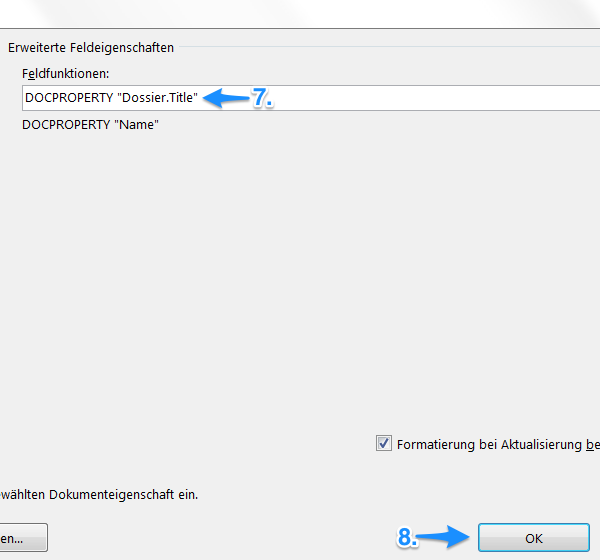

DocProperties in Vorlagen verwenden
-----------------------------------

Damit DocProperties in Worddokumenten verwendet werden können, muss in einem
ersten Schritt die entsprechende Wordvorlage, die in OneGov GEVER über den
Menüpunkt Vorlagen abgelegt ist, vorbereitet werden:

1. Wählen Sie die Wordvorlage im Vorlagenbereich von OneGov GEVER aus, und
   öffnen Sie das Dokument zur Bearbeitung (Auschecken und bearbeiten).

2. Begeben Sie sich in Word auf Datei > Eigenschaften > Erweiterte
   Eigenschaften > Anpassen.

3. Geben Sie den Namen der gewünschten DocProperty im Feld Name ein.

4. Als “Wert” kann vorerst ein Leerschlag (Space) eingefügt werden. Dieser
   wird bei der Erstellung eines neuen Dokuments ab Vorlage automatisch mit
   dem aktuellen Metadatenwert überschrieben.

5. Die so erstellte DocProperty kann nun über das Feld Hinzufügen den
   Eigenschaften hinzugefügt werden.

   |docprops-3|

6. Die so erstellten DocProperties sind nun in den Eigenschaften ersichtlich.

7. Wenn alle gewünschten DocProperties erstellt wurden, mit OK abschliessen.

   |docprops-4|

.. admonition:: Vorlagen kopieren

   Für die Erarbeitung einer neuen Vorlage können auch bestehende Vorlagen
   überarbeitet werden. So müssen nicht alle DocProperties jedes Mal manuell
   neu erstellt werden, sondern werden mitkopiert.

Sind alle benötigten DocProperties in der Wordvorlage definiert, können sie
nun nach Belieben im Haupttext verwendet werden.

Dies geschieht in Word wie folgt:

1. Die gewünschte Stelle, an der die DocProperty eingefügt werden soll,
   markieren.

   |docprops-5|

2. Den Menüpunkt Einfügen auswählen.

3. Unter Schnellbausteine die Option Feld auswählen.

   |docprops-6|

4. Feldname auswählen = DocProperty.

5. Gewünschte Eigenschaft auswählen.

6. Die Option “Feldfunktionen” auswählen.

   |docprops-7|

7. Ausgewähltes DocProperty in Anführungs- und Schlusszeichen setzen.

8. Mit “OK” bestätigen.

   |docprops-8|

Die DocProperty ist eingefügt und kann in Word mit Doppelklick > Rechtsklick
> Feldfunktion ein an der gewünschten Position im Dokument angezeigt und
überprüft werden.

|docprops-9|

.. |docprops-3| image:: ../_static/img/kurzref_adm_docprops_3.png
.. |docprops-4| image:: ../_static/img/kurzref_adm_docprops_4.png
.. |docprops-5| image:: ../_static/img/kurzref_adm_docprops_5.png
.. |docprops-6| image:: ../_static/img/kurzref_adm_docprops_6.png
.. |docprops-7| image:: ../_static/img/kurzref_adm_docprops_7.png

.. |docprops-9| image:: ../_static/img/kurzref_adm_docprops_9.png
