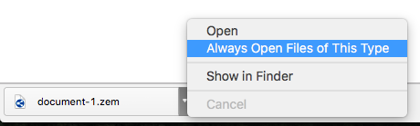
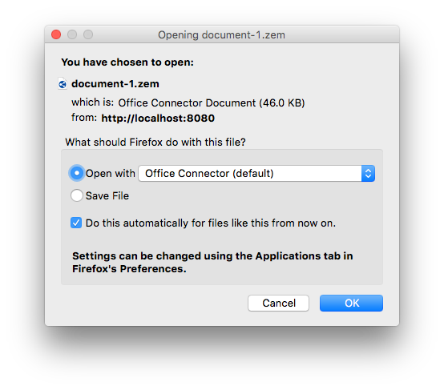

.. _label-office-connector:

Dateien automatisch mit OfficeConnector öffnen
==============================================

Das automatische Öffnen ist eine Einstellung des Browsers, zur Konfiguration muss bei jedem Browser etwas anders vorgehen.
Die Einstellungen funktioneren analog, wenn man den Zope External Editor verwendet, es muss einfach jeweils anstatt dem OfficeConnector
die Applikation "ZopeEdit: External Editor Client" ausgewählt werden.

Chrome
------

*Die folgenden Anweisungen funktionieren sowohl für Chrome auf OSX wie auch auf Windows.*

Beim ersten Auschecken/Bearbeiten eines Dokumentes muss die Datei manuell gespeichert werden. Danach sollte der Benutzer eine Download-Bar am unteren Rand des
Fensters sehen. Neben der heruntergeladenen Datei kann der Benutzer auf den schwarzen Pfeil klicken und mittels "Dateien dieses Typs immer öffnen" einstellen,
dass eine Datei immer automatisch geöffnet wird.

Möchte ein Benutzer seine bestehenden Einstellungen ändern gibt es nur die Möglichkeit die bestehenden Einstellunge zu löschen. Dies kann man in den erweiterten
Einstellungen mit dem Button "Einstellungen für das automatische Öffnen löschen". Danach kann man erneut eine Datei auschecken/Bearbeiten und die Einstellungen
vornehmen wie oben beschrieben.

.. image:: images/chrome_settings.png

Firefox
-------

*Die folgenden Anweisungen funktionieren sowohl für Firefox auf OSX wie auch auf Windows.*

Beim ersten Auschecken/Bearbeiten eines Dokumentes werden die Benutzer in einem Fenster zum Datei-Download gefragt mit welcher Anwendung die Datei
geöffnet werden soll. Dort soll als Applikation Office Connector angewählt werden, desweiteren muss der Benutzer die Option
"Für Dateien dieses Typs immer diese Aktion ausführen" anwählen, damit sich der Office Connector automatisch öffnet.

Hat ein Benutzer schon einmal eine Auswahl getroffen und möchte diese ändern, muss man zuerst die Firefox-Einstellungen öffnen. Danach kann man
dort im Abschnitt Anwendungen die Aktion für den Dateityp Office Connector Document auf "Mit Office Connector öffnen" ändern.

.. image:: images/firefox_applications.png

Safari
------

Zuerst muss man einstellen, dass Dateien automatisch nach dem herunterladen geöffnet werden. Dies kann man in den Einstellungen mit der Option "Sichere Dateien nach dem laden automatisch öffnen".

.. image:: images/safari_auto_open.png

Danach müssen die Office-Connector Dateien als sichere Datei registriert werden. Dies kann man indem man die folgende Datei erstellet (Achtung der Pfad ist relativ zum user-home):

:code:`~/Library/Preferences/com.apple.DownloadAssessment.plist`

und folgenden Inhalt einfügt:

.. code::

    <?xml version="1.0"?>
    <!DOCTYPE plist PUBLIC "-//Apple Computer//DTD PLIST 1.0//EN" "http://www.apple.com-PropertyList-1.0.dtd">
    <plist version="1.0">
      <dict>
        <key>LSRiskCategorySafe</key>
        <dict>
          <key>LSRiskCategoryExtensions</key>
          <array>
            <string>zem</string>
          </array>
        </dict>
      </dict>
    </plist>

Sollte die Datei schon existieren ist es wichtig, dass man die die folgende Zeile am richtigen Ort unterhalb der schon bestehenden Einträge ergänzt:

.. code::

        <string>zem</string>

Internet Explorer
-----------------

In der windows registry muss der Key

.. code::

    HKEY_CURRENT_USER\Software\Microsoft\Windows\Shell\AttachmentExecute\{0002DF01-0000-0000-C000-000000000046}

auf den folgenden Wert gesetzt werden:

.. code::

    "OfficeConnector.Document.1"=hex(0)
