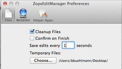
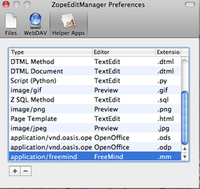

Zope Edit Manager für OSX
==========================

Mit dem ZopeEditManager (ExternalEditor für Mac) können Files direkt bearbeitet
werden. Der Editor kann auf `4teamwork.ch <https://www.4teamwork.ch/office-connector>`_ heruntergeladen werden,
danach die Anwendung ins Programm Verzeichnis verschoben und gestartet werden.

.. note::
    Der ZopeEditManager für Mac OS X wird aktuell nicht weiterentwickelt und ist
    das auslaufende Vorgängermodell vom :ref:`Office Connector <label-office-connector>`.

Im Menüpunkt ZopeEditManager/Preferences können die spezifischen Extensions
konfiguriert werden:

Type Editor (Extensions)
~~~~~~~~~~~~~~~~~~~~~~~~

- application/vnd.ms-excel | Microsoft Excel | .xls

- application/msword | Microsoft Word | .doc

- application/vnd.openxmlformats-officedocument.wordprocessingml.document | Microsoft Word | .docx

- application/vnd.openxmlformats-officedocument.spreadsheetml.sheet | Microsoft Excel | .xlsx

- application/vnd.oasis.opendocument.text | LibreOffice | .odt

- application/vnd.oasis.opendocument.spreadsheet | LibreOffice | .ods

- application/vnd.oasis.opendocument.presentation | LibreOffice | .odp

- application/vnd.oasis.opendocument.graphics | LibreOffice | .odg

- application/freemind | FreeMind | .mm

.. note::
    Die Option Save edits every 1 seconds sollte zudem aktiviert werden.
    Nach dem Schliessen der Anwendung (z.B. OpenOffice) muss unbedingt geprüft
    werden, ob ZopeEditManager die Datei gesynct hat, ansonsten gehen die
    Änderungen verloren.

Konfiguration für Safari
~~~~~~~~~~~~~~~~~~~~~~~~~

Dabei muss folgende Einstellung für den Zope Edit Manager getätigt werden:

|img-zem-1|

Die Helper App wird gemäss unten konfiguriert:

|img-zem-2|

