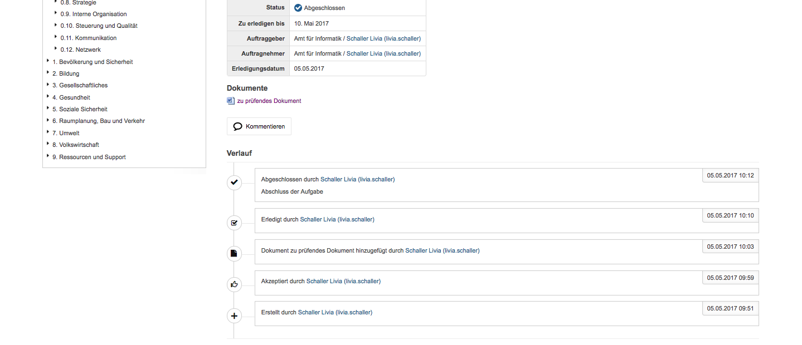

Auflistung von Statusänderungen, Antworten und Dokumenten
---------------------------------------------------------

Statusänderungen, Antworttexte und hinzugefügte Dateien werden im
unteren Teil der Aufgabenmaske aufgelistet. Dadurch kann der ganze
Verlauf nachvollzogen werden. Die neueste Antwort befindet sich dabei
immer zuoberst.

|img-aufgaben-21|

