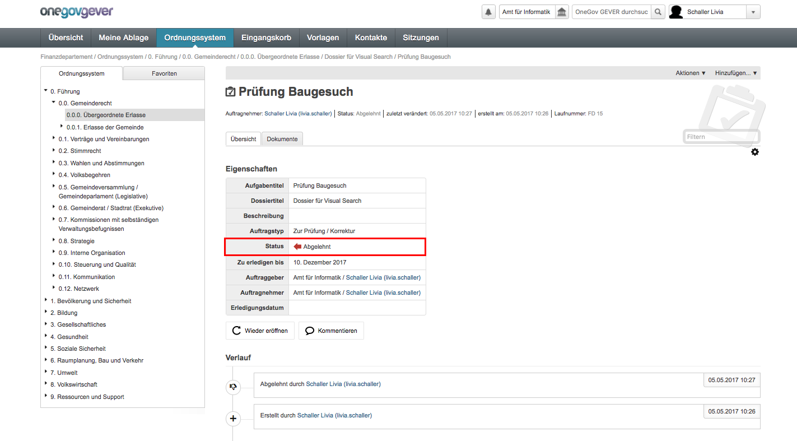
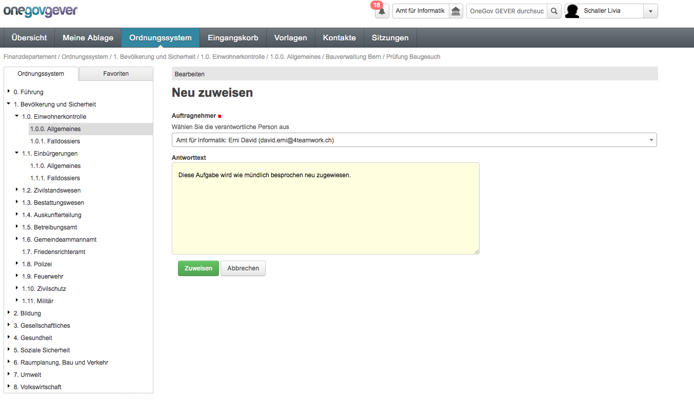
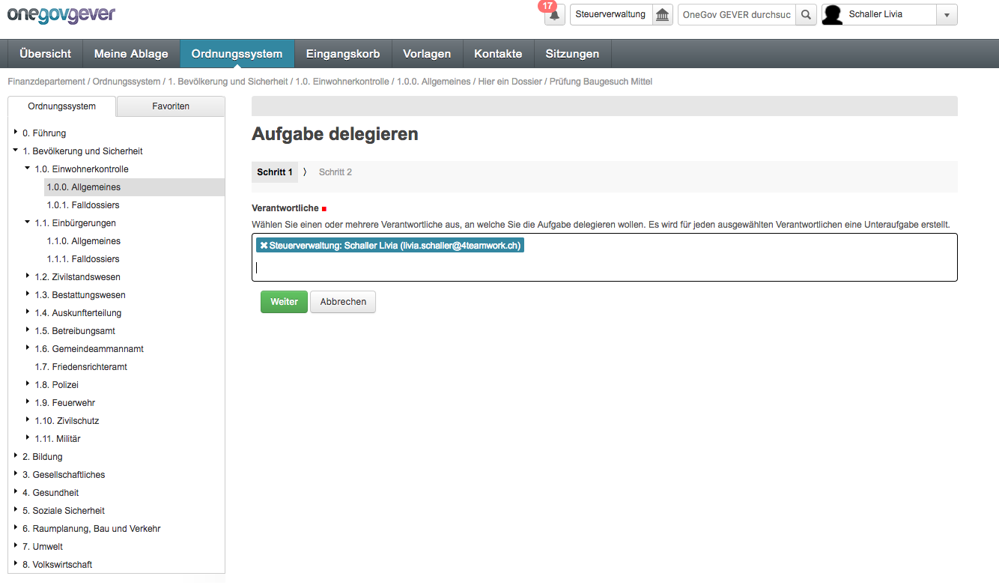
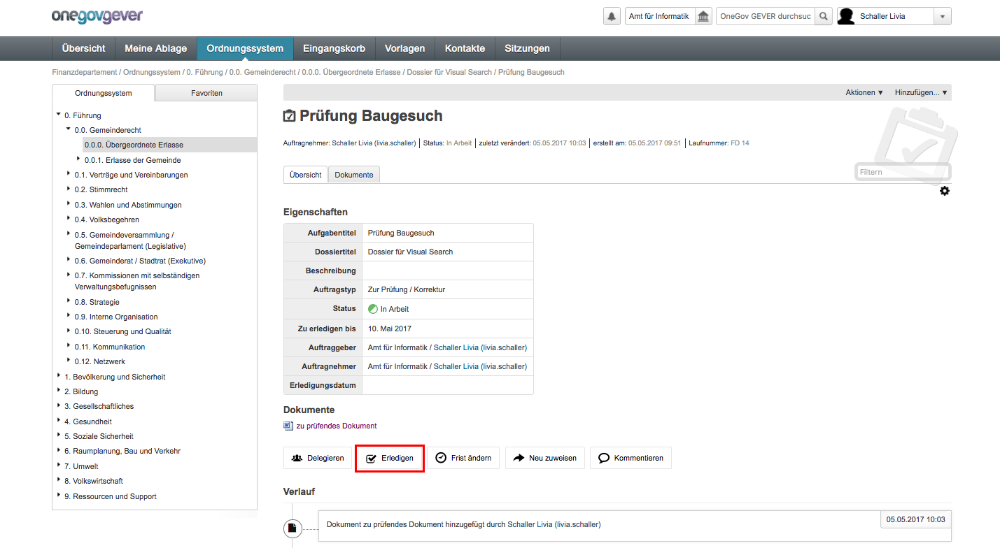
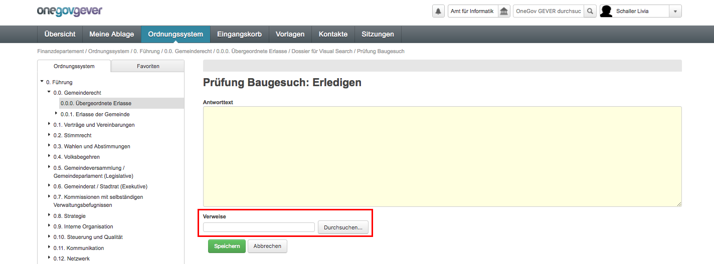
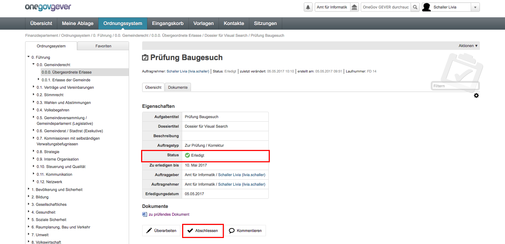

Eine empfangene Aufgabe als Verantwortlicher bearbeiten
-------------------------------------------------------

Nach der Erstellung befindet sich eine Aufgabe im Status *Offen*. Der
Aufgabe beigefügte Dokumente befinden sich unter dem Reiter *Dokumente*;
gleichzeitig werden sie unter dem Titel "Dokumente" aufgelistet:

|img-aufgaben-8|

Aufgabe akzeptieren
~~~~~~~~~~~~~~~~~~~

Mit *Aktionen → Aufgabe akzeptieren* übernimmt der Auftragnehmer die
Aufgabe. Bei Bedarf kann ein Kommentar hinzugefügt werden. Der Status wechselt
nun von *Offen* auf *In Arbeit*.

|img-aufgaben-8b|

Aufgabe ablehnen
~~~~~~~~~~~~~~~~

Wird die Aufgabe abgelehnt (z.B. wegen Ferien) wechselt der Status auf
"Abgelehnt". Die Aufgabe wird dadurch automatisch dem Auftraggeber zurück
zugewiesen. Dadurch hat der Auftraggeber die Möglichkeit, die Aufgabe wieder zu
öffnen und einem neuen Sachbearbeiter zuzuweisen.

|img-aufgaben-22|
|img-aufgaben-23|

Aufgabe neu zuweisen
~~~~~~~~~~~~~~~~~~~~

Eine Aufgabe kann auch einem anderen Sachbearbeitenden zugewiesen werden.
Dadurch wird der Auftragnehmer der Aufgabe geändert. Wählen Sie dazu
*Aktionen → Neuzuweisen*. Diese Möglichkeit besteht auch im späteren
Arbeitsverlauf noch.

|img-aufgaben-24|

In der neuen Maske kann die Person ausgewählt werden, welcher die Aufgabe
zugewiesen werden soll. Im Kommentar-Feld können bei Bedarf noch weitere Inputs
gegeben werden. Die Aktion mit "Zuweisen" abschliessen.

|img-aufgaben-25|

In der Detailansicht der Aufgabe kann die Neuzuweisung des Auftragnehmers
nachträglich unten im Verlauf nachvollzogen werden.

|img-aufgaben-26|

Aufgabe delegieren
~~~~~~~~~~~~~~~~~~

Eine Aufgabe kann einer anderen Person auch delegiert werden. Dadurch wird eine
Unteraufgabe erstellt. Der Auftraggeber der Hauptaufgabe bleibt dabei jedoch
bestehen. Akzeptieren Sie dazu zuerst die Aufgabe und gehen Sie dann auf
*Aktionen → Delegieren*.

|img-aufgaben-30|

Wählen Sie in einem ersten Schritt zuerst die Personen aus, an welche die
Aufgab delegiert werden soll.

|img-aufgaben-31|

In einem zweiten Schritt kann dann der Auftraggeber gewählt werden.
Schliessen Sie die Delegation der Aufgabe wie gewohnt mit "Speichern" ab.

|img-aufgaben-32|

Mit den Aufgaben verknüpfte Dokumente (Verweise) bearbeiten
~~~~~~~~~~~~~~~~~~~~~~~~~~~~~~~~~~~~~~~~~~~~~~~~~~~~~~~~~~~

Mit den Aufgaben verknüpfte Dokumente können direkt aus der Aufgabe
heraus bearbeitet werden. Fahren Sie unter dem Reiter *Dokumente* über den
Titel, um das referenzierte Dokument auszuchecken und zu bearbeiten. Die
Änderungen werden nach dem Einchecken als neue Version gespeichert.

|img-aufgaben-12|

Dokumente in einer Aufgabe
~~~~~~~~~~~~~~~~~~~~~~~~~~

Dokument hinzufügen
^^^^^^^^^^^^^^^^^^^

Mit *Hinzufügen → Dokument* kann eine Datei aus dem Filesystem
importiert werden.

|img-aufgaben-13|

Neu hinzugefügte Dokumente werden sowohl unter dem Reiter *Dokumente*
der Aufgabe angezeigt als auch unter der Rubrik "Dokumente" und in der
Auflistung der Antworten. Gleichzeitig werden sie automatisch in die
Dokumentenliste des betreffenden Dossiers gelegt.

Auf bestehendes Dokument verweisen
^^^^^^^^^^^^^^^^^^^^^^^^^^^^^^^^^^

Eine bereits in OneGov GEVER vorhandene Datei kann beim Erledigen im
Feld *Verweise* referenziert werden. (Siehe nächster Schritt)

Aufgabe erledigen
~~~~~~~~~~~~~~~~~

Wählen Sie *Erledigen*.

|img-aufgaben-16|

Falls Sie auf ein im Dossier befindliches Dokument verweisen möchten,
ist dies im Feld Verweis möglich. Ein Antworttext ist fakultativ. Je nach
Aufgabenstellung kann ein Auftrag auch nur durch eine Antwort erledigt werden.

|img-aufgaben-17|

Nach dem Speichern wechselt der Aufgabenstatus auf *Erledigt*. Soll der Antwort
nochmals etwas hinzugefügt werden, kann die Aufgabe mit
*Aktion → Überarbeiten* wieder in den Status *In Arbeit* gesetzt werden.

|img-aufgaben-18|

.. |img-aufgaben-8| image:: ../img/media/img-aufgaben-8.png
.. |img-aufgaben-8b| image:: ../img/media/img-aufgaben-8b.png
.. |img-aufgaben-22| image:: ../img/media/img-aufgaben-22.png

.. |img-aufgaben-24| image:: ../img/media/img-aufgaben-24.png

.. |img-aufgaben-26| image:: ../img/media/img-aufgaben-26.png
.. |img-aufgaben-30| image:: ../img/media/img-aufgaben-30.png

.. |img-aufgaben-32| image:: ../img/media/img-aufgaben-32.png
.. |img-aufgaben-12| image:: ../img/media/img-aufgaben-12.png
.. |img-aufgaben-13| image:: ../img/media/img-aufgaben-13.png

.. disqus::
