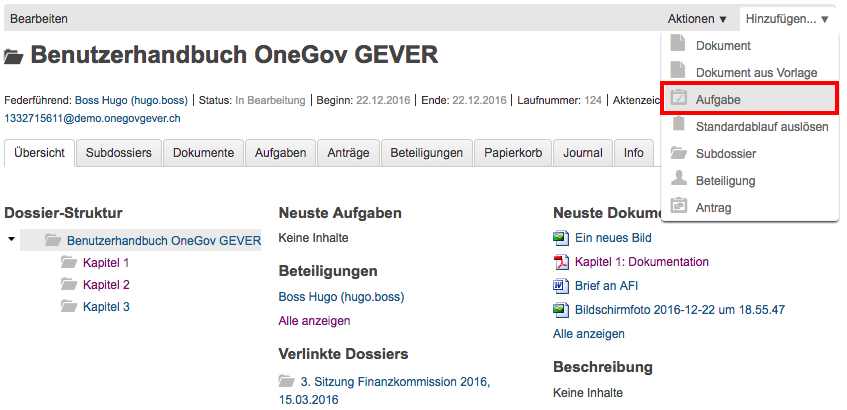
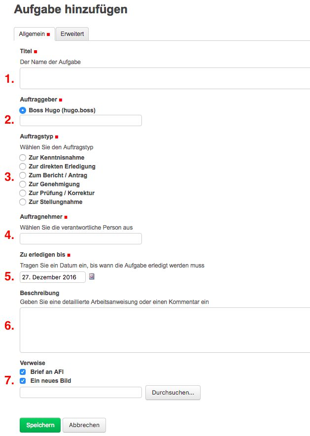

.. _label-aufgaben_erstellen:

Eine Aufgabe erstellen
----------------------

Es gibt im Wesentlichen zwei Möglichkeiten, um eine Aufgabe zu erstellen:

-  Auf Stufe Dossier oder Subdossier rufen Sie mit *Hinzufügen →
   Aufgabe* die Erfassungsmaske auf.

   |img-aufgaben-1|

-  Wählen Sie in der Dokumentenliste eines oder mehrere Dokumente (mit
   der Taste :kbd:`Ctrl-Taste`) aus und klicken Sie auf *Aufgabe erstellen*.

   |img-aufgaben-2|

Die Aufgabenmaske ist in die beiden Reiter *Allgemein* und *Erweitert*
gegliedert. Der jeweils aktive Reiter ist grau hinterlegt.
Obligatorische Felder sind jeweils mit einem roten Quadrat markiert.

Reiter Allgemein
~~~~~~~~~~~~~~~~

|img-aufgaben-3|

1. **Titel:** Inhaltliche Beschreibung der Aufgabe

2. **Auftragsgeber:** Diejenige Person, die den Auftrag erteilt.
   Standardmässig wird die an OneGov GEVER angemeldete Person
   vorgeschlagen.

3. **Auftragstyp:** Mit dem Auftragstyp wird angegeben, was vom
   Auftragnehmer erwartet wird. In OneGov GEVER werden standardmässig
   sechs Auftragstypen unterschieden:

    - Zur Kenntnisnahme [#FN1]_

    - Zur direkten Erledigung [#FN1]_

    - Zum Bericht / Antrag

    - Zur Genehmigung

    - Zur Prüfung / Korrektur

    - Zur Stellungnahme

    .. [#FN1] Vom Auftraggeber wird keine Antwort erwartet, die überprüft
      werden muss; daher kann bei diesen beiden Auftragstypen die Aufgabe
      durch den Auftragnehmer abgeschlossen werden.

    Mehr zu diesem Thema, beispielsweise auch welche Rechte je Auftragstyp gelten findet sich unter :ref:`label-aufgaben-workflow`.

4. **Auftragnehmer:** Diejenige Person, die den Auftrag erledigen soll.

   Bei Mehrmandanteninstallationen von OneGov GEVER
   kann hier zusätzlich der entsprechende Zielmandant ausgewählt werden
   (sog. mandantenübergreifende Zusammenarbeit).

5. **Zu erledigen bis:** Frist, bis wann der Auftrag erfüllt sein soll.
   Als Vorschlag wird das aktuelle Datum +5 Tage gesetzt.

6. **Beschreibung:** Bei Bedarf kann im Beschreibungsfeld der Auftrag
   detailliert beschrieben werden.

7. **Verweise:** Dokumente, die in Zusammenhang mit der Aufgabe stehen,
   können durch Hinzufügen oder durch direkte Texteingabe verknüpft
   werden.

   Wurde die Aufgabe über eine Vorauswahl von Dokumenten über den Reiter
   *Dokumente* erzeugt, sind die ausgewählten Dokumente bereits als
   Verweise aufgeführt.

8. **Info an:** Die ausgewählten Benutzer und Gruppen werden über die
   Erstellung dieser Aufgabe benachrichtigt.

Reiter Erweitert
~~~~~~~~~~~~~~~~

|img-aufgaben-4|

Mit Ausnahme des Erledigungsdatums sind die Felder auf die
Leistungserfassung ausgerichtet.

Das Erledigungsdatum wird mit der Aktion *Erledigen* automatisch
gesetzt.

.. note::
   Nach dem Speichern erhält die Aufgabe den Status *offen*.
   Im Status *offen* kann der Auftraggeber die Felder der Aufgabe noch bearbeiten
   (z.B. die Frist), später nicht mehr. Ausserdem können Aufgaben im Status
   *offen* vom Auftraggeber noch storniert werden, danach ist dies nicht mehr
   möglich.

.. |img-aufgaben-2| image:: ../img/media/img-aufgaben-2.png

.. |img-aufgaben-4| image:: ../img/media/img-aufgaben-4.png

.. disqus::
