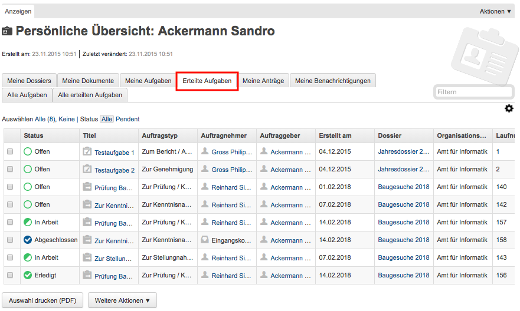
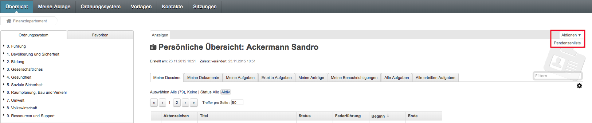
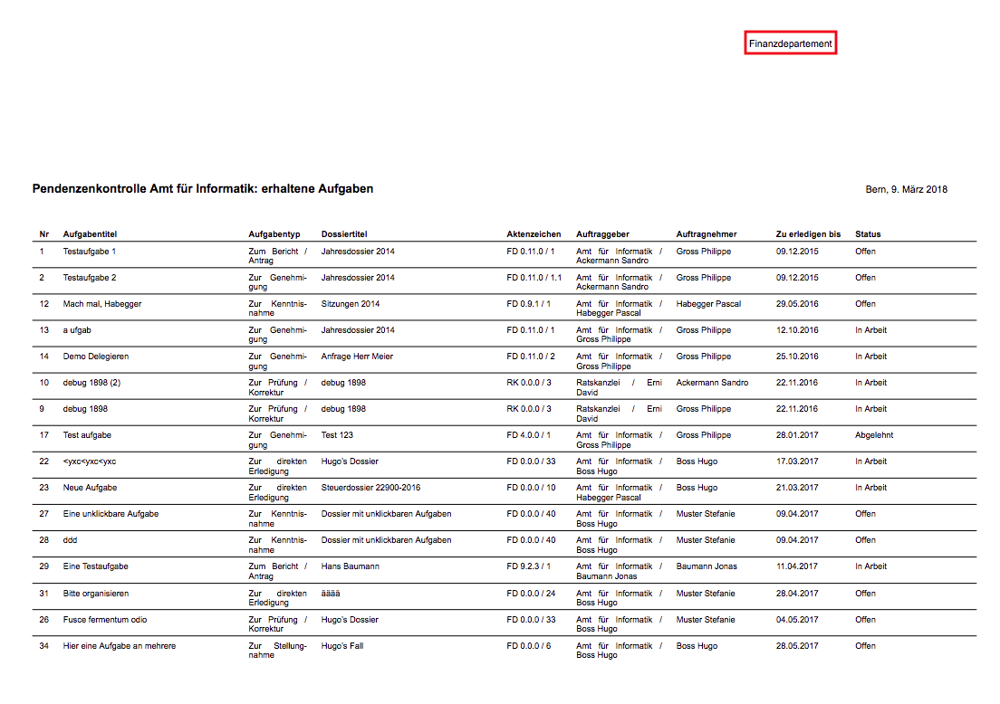

Aufgaben überwachen (Pendenzenkontrolle)
----------------------------------------

Unter *Übersicht* werden die persönlichen Aufgaben aufgelistet. Dies ermöglicht
eine persönliche Pendenzenkontrolle.

Persönliche Aufgabenkontrolle
~~~~~~~~~~~~~~~~~~~~~~~~~~~~~

Die Reiter *Meine Aufgaben* und *Erteilte Aufgaben* unter *Übersicht*
dienen der persönlichen, dossierübergreifenden Aufgabenübersicht.

Standardmässig werden nur die pendenten Aufgaben angezeigt: Status
*Offen*, *In Arbeit*, *Erledigt*, *Abgelehnt*. Sollen auch die
abgeschlossenen und stornierten Aufgaben angezeigt werden, muss beim
Status *Alle* gewählt werden.

|img-aufgaben-33|

|img-aufgaben-34|

Zentrale Aufgabenkontrolle durch Pendenzenliste
~~~~~~~~~~~~~~~~~~~~~~~~~~~~~~~~~~~~~~~~~~~~~~~
Wer der Eingangskorb-Gruppe angehört, hat zusätzlich unter *Aktionen* die
Möglichkeit, eine Pendenzenliste mit allen Aufgaben des gesamten Mandanten
zu genereieren.

|img-aufgaben-35|

Wird diese Aktion durchgeführt, generiert das System eine PDF-Datei mit einer
Übersicht über alle Pendenzen des Mandanten.

.. |img-aufgaben-33| image:: ../img/media/img-aufgaben-33.png

.. disqus::
