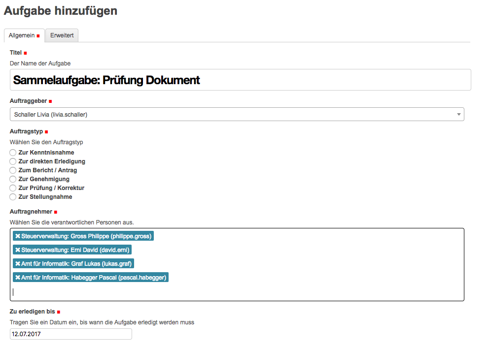
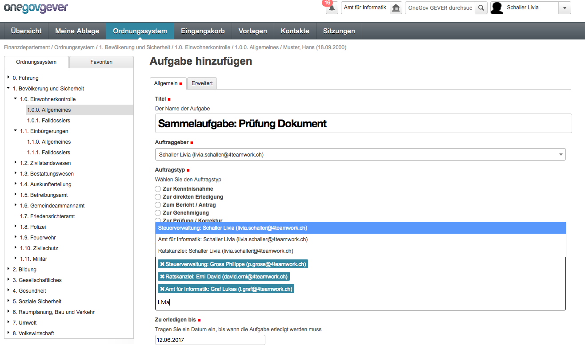

Sammelaufgaben
--------------
OneGov GEVER bietet mittels Sammelaufgaben auch die Möglichkeit, eine Aufgabe an
mehrere Empfänger zu richten. Für jeden Auftragnehmer wird dadurch automatisch
eine einzelne, losgelöste Aufgabe erstellt. Nach der Erstellung können die
einzelnen Aufgaben jedoch nicht mehr als Sammelaufgaben identifiziert werden.
Sie dienen einzig dem Zweck, eine Aufgabe an mehrere Personen zu adressieren.
Eine Sammelaufgabe weist keine Unterschiede zu einer Aufgabe an einen einzelnen
Empfänger aus.

Der Ablauf ist daher auch analog Aufgabe an eine einzelne Person. Sobald im Feld
„Auftraggeber“ jedoch mehrere Personen ausgewählt werden, wird es automatisch zu
einer Sammelaufgabe. Es wird dadurch an jeden ausgewählten Auftragnehmer eine
losgelöste, eigene Aufgabe erstellt. Im Nachhinein kann aber kein Empfänger
hinzugefügt werden und es kann auch nicht mehr nachverfolgt werden, welche
Aufgaben durch die Sammelaufgabe erzeugt wurden.

|img-aufgaben-27|
|img-aufgaben-28|

Nach dem Eintragen der Angaben in der Aufgabe, wie gewohnt mittels „Speichern“
den Vorgang abschliessen.

In der Übersicht erscheint unter „Erteilte Aufgaben“ nun jede Aufgabe an jeden
Auftragnehmer einzeln. Bei Klick auf eine Aufgabe öffnet sich die gewohnte
Aufgaben-Maske. Im Tab „Erteile Aufgaben“ kann wie gewohnt in der Spalte
„Status“ auch nachverfolgt werden, wer die Aufgabe bereits akzeptiert oder
erledigt und bei wem sie noch in Arbeit ist.

|img-aufgaben-29|

.. |img-aufgaben-29| image:: ../img/media/img-aufgaben-29.png
