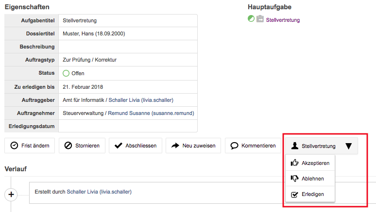

Aufgaben stellvertretend bearbeiten
-----------------------------------

Personen, die berechtigt sind, alle Aufgaben einer Amtsstelle zu sehen,
können Aufgaben stellvertretend für ihre Mitarbeiter bearbeiten. Dabei
können Sie Aktionen stellvertretend für Mitarbeiter durchführen.

Es kann z.B. eine Sekretärin stellvertretend für einen abwesenden
Sachbearbeiter eine Aufgabe erledigen. Dies kann direkt im
Stellvertreter-Dropdown vorgenommen werden.

|image222|

Persönliche Aufgaben
~~~~~~~~~~~~~~~~~~~~
Das Anwählen der Checkbox *Persönliche Aufgabe* ermöglicht, dass eine Aufgabe
nicht an die Eingangskorb-Gruppe adressiert wird, sondern direkt einer Person.
Diese Funktion kann vor allem bei Aufgaben mit heiklen Daten sowie
personenbezogenen Tasks eingesetzt werden.

|img-stellvertretung-1|

.. |img-stellvertretung-1| image:: ../img/media/img-stellvertretung-1.png

.. disqus::
