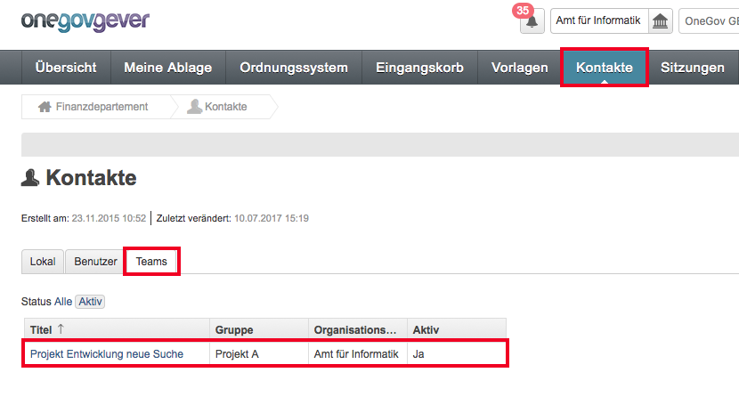
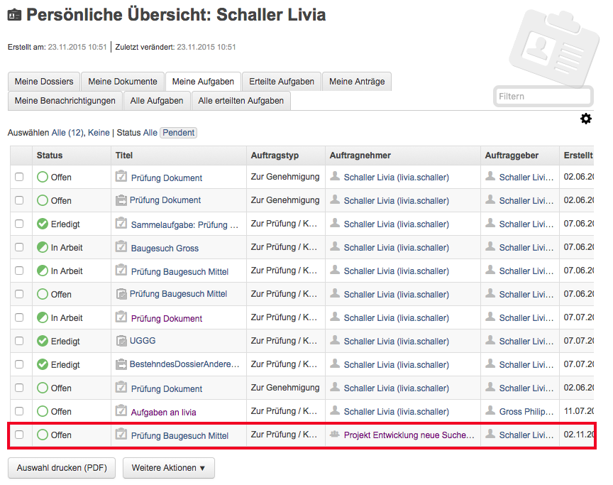
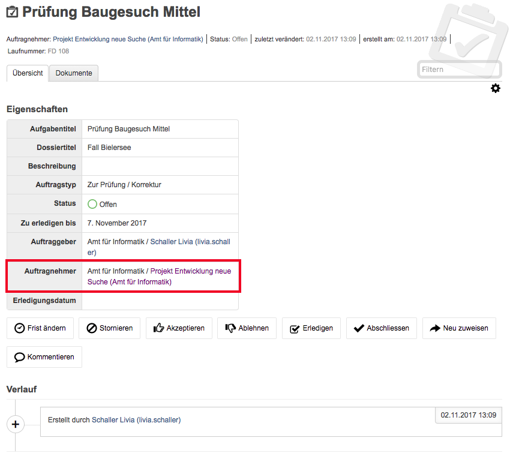
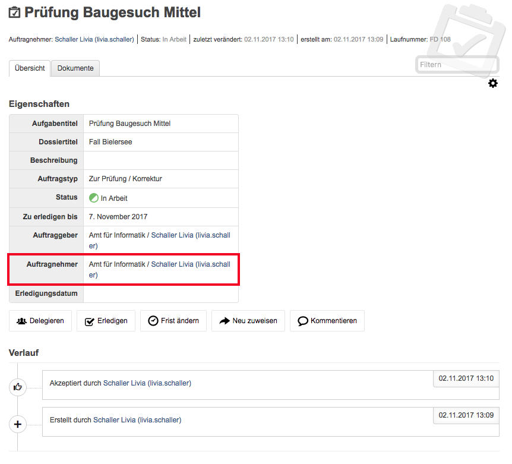

Teamaufgaben
------------

Mittels den Teamaufgaben können Aufgaben an AD-Gruppen adressiert werden. Diese
Teams können durch den Adminsitrator erfasst werden.

|img-aufgaben-team-1|

Ist das Team erfasst, können diesem Aufgaben zugewiesen werden. Eine Aufgabe
wird wie gewohnt erstellt und beim Feld Auftragnehmer kann dann das gewünschte
Team ausgewählt werden.

|img-aufgaben-team-2|

Zuerst erscheint die Aufgabe bei allen Teammitgliedern bei der persönlichen
Übersicht.

|img-aufgaben-team-3|

Bei der Detailansicht der Aufgabe ist zu diesem Zeitpunkt noch das ganze Team
der Auftragnehmer.

|img-aufgaben-team-4|

Sobald ein Teammitglied die Aufgabe akzeptiert hat, erscheint diese nur noch bei
diesem Teammitglied als pendent und er wird automatisch als einziger
Auftragnehmer angezeigt.

|img-aufgaben-team-5|

.. |img-aufgaben-team-2| image:: ../img/media/img-aufgaben-team-2.png

