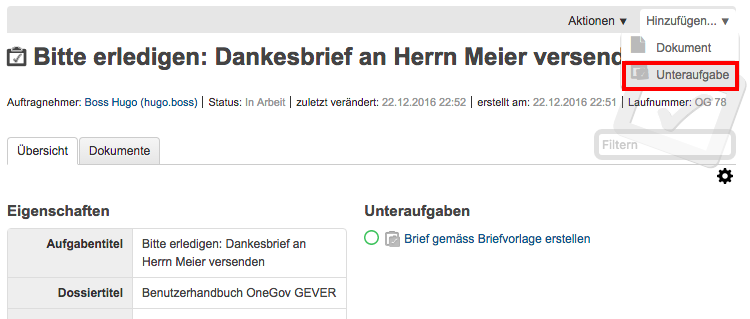
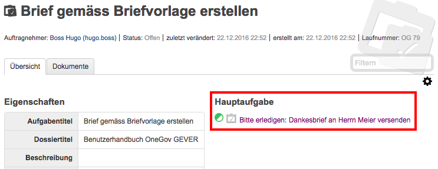

Eine Unteraufgabe erstellen
---------------------------

Zu einer Aufgabe können beliebig viele Unteraufgaben eröffnet werden.
Zuvor muss jedoch die Hauptaufgabe akzeptiert werden. Klicken Sie auf
Stufe Aufgabe *Hinzufügen → Unteraufgabe*.

|img-aufgaben-6|

Hierauf öffnet sich ein Formular, analog zu demjenigen der Aufgabe. Die
Unteraufgabe wird in der Hauptaufgabe dargestellt (siehe
:ref:`aufgabe-detailansicht`).

Mit Klick gelangt man direkt auf die Unteraufgabe. Die Hauptaufgabe wird
in der Unteraufgabe ebenfalls dargestellt:

|img-aufgaben-7|

