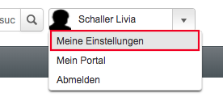
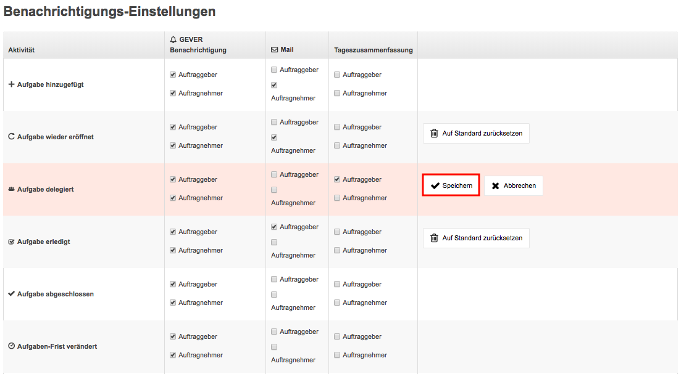

.. _label-benachrichtigungen:

Benachrichtigungs-Einstellungen
===============================

Bei der Benachrichtigungs-Einstellung können Sie individuell einstellen, wann
und wie OneGov GEVER Sie über Ihre Aktivitäten benachrichtigen soll.
Gehen Sie dazu oben rechts auf Ihren Profilnamen und dann auf *Meine Einstellungen* :

|img-benachrichtigungs-einstellungen-1|

Danach gelangen Sie automatisch auf die untenstehende Übersicht, welche die
aktuellen geltenden Regeln wie OneGov GEVER über Ihre Aktivitäten
benachrichtigt, darstellt. Sie können nun pro Aktivität definieren, in welcher
Rolle Sie über welchen Kanal benachrichtigt werden wollen. Zurzeit stehen die
Kanäle *GEVER Benachrichtigung* (Glocke im mittleren Headerbereich) oder Mail
(Benachrichtigung direkt per Mail) zur Verfügung. Zudem können Sie anwählen, ob
Sie eine tägliche Zusammenfassung (Daily Digest) erhalten möchten.

|img-benachrichtigungs-einstellungen-2|

Möchten Sie die Default-Einstellungen ändern, klicken Sie einfach auf die
entsprechenden Checkbox um diese zu entfernen resp. wenn diese noch nicht
angewählt ist um diese zu aktivieren. OneGov GEVER blendet sofort eine
Meldung ein, damit Sie die Änderung entweder speichern oder abbrechen und
somit rückgängig machen können.

|img-benachrichtigungs-einstellungen-3|

Individualisierte Einstellungen können mit der Aktion *Auf Standard zurücksetzen*
gelöscht und somit auf den GEVER Standard zurück gesetzt werden.

|img-benachrichtigungs-einstellungen-4|

Benachrichtigungen für Erinnerungen, Anträge und Teamräume
----------------------------------------------------------
Analog den Benachrichtigungen für Aufgaben, kann in den Tabs *Erinnerungen*,
*Anträge* sowie *Teamräume* (wenn *Teamräume* via Konfigurationsoption aktiviert sind)
die Benachrichtigungen für diese Aktivitäten eingestellt werden.

|img-benachrichtigungs-einstellungen-5|

Benachrichtigung für Dossiers
-----------------------------
Um eine Benachrichtigung für überfälliges Dossiers zu erstellen, müssen
zwei Schritte beachtet werden:

1. Enddatum beim Dossier setzen

|img-benachrichtigungs-einstellungen-6|

2. Benachrichtigung in Tab *Dossiers* setzen

|img-benachrichtigungs-einstellungen-7|

Allgemeine Einstellungen für Benachrichtigungen
-----------------------------------------------
Im Reiter "Allgemein" befinden sich die globalen Einstellungen. Dort können Sie einstellen, ob Sie auch über Ihre eigenen Aktionen benachrichtigt werden wollen. Sie können hier auch einstellen, ob Sie als Mitglied einer Eingangskorbgruppe benachrichtigt werden wollen, wenn eine Benachrichtigung an alle Benutzer dieses Eingangskorbes gesendet wird.

Ausserdem können Sie in diesem Reiter festlegen, über welche Kanäle Sie benachrichtigt werden wollen, wenn Sie als Beobachter hinzugefügt worden sind.

.. |img-benachrichtigungs-einstellungen-2| image:: img/media/img-benachrichtigungs-einstellungen-2.png

.. |img-benachrichtigungs-einstellungen-4| image:: img/media/img-benachrichtigungs-einstellungen-4.png
.. |img-benachrichtigungs-einstellungen-5| image:: img/media/img-benachrichtigungs-einstellungen-5.png
.. |img-benachrichtigungs-einstellungen-6| image:: img/media/img-benachrichtigungs-einstellungen-6.png
.. |img-benachrichtigungs-einstellungen-7| image:: img/media/img-benachrichtigungs-einstellungen-7.png

.. disqus::
