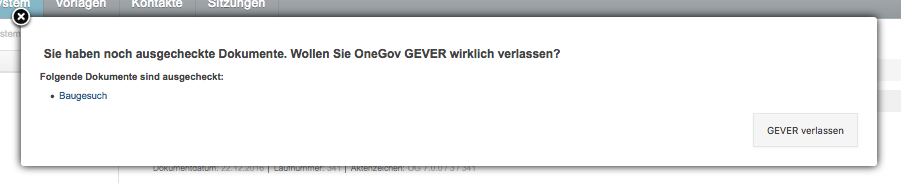

.. _kapitel-mit-dokumenten-arbeiten:

Mit Dokumenten arbeiten
=======================

Ein neues Dokument erstellen
----------------------------

Das Menü :menuselection:`Hinzufügen` bietet zwei Möglichkeiten an, um ein neues
Dokument zu erzeugen:

1. Dokument heraufladen (importieren)

2. Dokument aus Vorlage erstellen

Zusätzlich können Dokumente mit Drag & Drop hinzugefügt werden.

Ein Dokument heraufladen (importieren)
~~~~~~~~~~~~~~~~~~~~~~~~~~~~~~~~~~~~~~

Auf die Dokumenten-Erfassungsmaske gelangen Sie, indem Sie *Hinzufügen→
Dokument* wählen. Die Erfassungsmaske ist in die beiden Reiter
*Allgemein* und *Sichtbarkeit* gegliedert; der jeweils aktive Reiter ist
grau hinterlegt. Obligatorische Felder sind mit einem roten Quadrat
markiert

Reiter Allgemein
^^^^^^^^^^^^^^^^

1. **Titel:** Kerninformationen zum Dokument. Abkürzungen und Codes
   sollten vermieden werden, damit die Information für Dritte ebenfalls
   verständlich ist.

   *Das Titelfeld lässt bei der Eingabe zwei Varianten zu:*

   -  Der Titel wird manuell eingegeben: Die angehängte Datei übernimmt den
      eingegebenen Titel automatisch.

   -  Es wird kein Titel eingegeben: Der Titel der angehängten Datei wird
      automatisch ins Titelfeld übertragen.

   Dateiname und Titel werden immer miteinander synchronisiert, auch
   bei einer späteren Änderung des Titels.

    |img-dokumente-1|

2.  **Beschreibung:** Erläuterungen, Ergänzungen zum Dokumentinhalt

3.  **Schlagworte:** Zusätzlich zu Titel und Beschreibung können
    Schlüsselwörter vergeben werden.

4.  **Fremdzeichen:** Aktenzeichen des Absenders

5.  **Dokumentdatum:** Datum, an dem das Dokument erstellt wurde (nicht
    zu verwechseln mit dem Datum der Erfassung, das automatisch vergeben
    wird).

6.  **Eingangsdatum:** Datum, an dem das Dokument eingetroffen ist

7.  **Ausgangsdatum:** Datum, an dem das Dokument versandt wurde

8.  **Dokumenttyp:** Bericht, Antrag, etc.

9.  **Autor:** Verfasser des Dokuments (das verwaltungsinterne
    Benutzerkürzel wird automatisch in “Name, Vorname” aufgelöst)

10. **Datei:** Mit Klick auf Durchsuchen wird der Explorer geöffnet, und
    die gewünschte Datei kann hinzugefügt werden.

11. **In Papierform aufbewahrt:** Gibt an, dass das Dokument in
    Papierform aufbewahrt wird. Pro Mandant kann eingestellt werden, ob
    der Standardwert "in Papierform aufbewahrt" gesetzt werden soll oder
    nicht.

12. **Verwandte Dokumente:** Mit diesem Feld kann auf verwandte
    Dokumente verwiesen werden.

    -  Kennt man den Dokumenttitel oder Bestandteile davon, wird der
       Text direkt ins Feld eingegeben. Darauf erscheint die in Frage
       kommende Liste, aus der das gewünschte Dokument ausgewählt werden
       kann.

    |img-dokumente-2|

    -  Kennt man den Dokumenttitel nicht, klickt man auf Hinzufügen und
       navigiert durch das Ordnungssystem.

    |img-dokumente-3|

Reiter Sichtbarkeit
^^^^^^^^^^^^^^^^^^^^

Bei den Feldern *Klassifikation*, *Datenschutzstufe* und
*Öffentlichkeitsstatus* werden jene Werte angezeigt, die bereits auf
Stufe Dossier bzw. Ordnungsposition hinterlegt sind. Bei Bedarf können
die Werte auf Dokumentstufe noch verschärft, aber nicht gelockert
werden. Beispiel: Statt "Nicht klassifiziert" kann "Vertraulich" oder
"Geheim" gewählt werden.

.. _dokument-aus-vorlage:

Ein Dokument aus einer Vorlage erstellen
~~~~~~~~~~~~~~~~~~~~~~~~~~~~~~~~~~~~~~~~

|img-dokumente-4|

Über *Hinzufügen → Dokument ab Vorlage* werden die Dokumentvorlagen
aufgerufen.

Wählen Sie die gewünschte Vorlage aus und tragen Sie den Dokumenttitel
ein. Nach dem Speichern wird im Hintergrund die Dossierhülle mit den
Metadaten erstellt und danach das Dokument mit dem External Editor
geöffnet.

Speichern und schliessen Sie die Datei nach dem Bearbeiten und checken
Sie die Datei ein.

Ein Dokument erstellen, das nur in Papierform vorhanden ist
~~~~~~~~~~~~~~~~~~~~~~~~~~~~~~~~~~~~~~~~~~~~~~~~~~~~~~~~~~~

Mit *Hinzufügen → Dokument* wird die Dokumentmaske aufgerufen und wie
unter 3.1 beschrieben ausgefüllt. Der Unterschied zu einem
elektronischen Dokument besteht lediglich darin, dass keine Datei
heraufgeladen wird.

Dokumente ohne Datei sind am Icon |image43| erkennbar. Es dient als
Stellvertreter für Dateien, die lediglich in Papierform vorhanden sind:

|img-dokumente-5|

Soll nachträglich eine elektronische Datei hinzugefügt werden – z.B.
weil man einen Brief inzwischen eingescannt hat – kann dies über
*Metadaten bearbeiten* ausgeführt werden.

Dokumente mit Drag & Drop hinzufügen
~~~~~~~~~~~~~~~~~~~~~~~~~~~~~~~~~~~~

Dokumente können mittels Drag & Drop in ein Dossier, in den Eingangskorb
oder in die Vorlagen importiert werden. Hierzu das gewünschte Dossier
öffnen und das Dokument in den grauen Bereich ziehen. Bei Dokumenten,
die mit Drag & Drop hinzugefügt werden, wird beim Dokumentdatum
automatisch das aktuelle Datum gesetzt.

|img-dokumente-6|

.. _label-dokument-checkin:

Dokumente bearbeiten (einchecken / auschecken )
---------------------------------------------------------------

External Editor / Office Connector
~~~~~~~~~~~~~~~~~~~~~~~~~~~~~~~~~~

Zum Bearbeiten von Dokumenten muss der External Editor oder Office Connector
installiert werden. Wir empfhelen den Office Connector, da dieser laufend von
4teamwork weiterentwickelt und verbessert wird.

Sie können diesen für Windows und Mac unter nachstehendem Link herunterladen:
https://www.4teamwork.ch/office-connector.

Der Office Connector unter Windows bietet zusätzliche Funktionen, welche
nach dem Basis-Teil im Kapitel "Zusätzliche Funktionen Windows" erläutert
werden.

Grundlagen
~~~~~~~~~~

Um Dokumente bearbeiten zu können, müssen sie ausgecheckt werden. Im
ausgecheckten Zustand sind Dokumente nur noch für den Bearbeiter bzw.
die Bearbeiterin verfügbar.

Ein ausgechecktes Dokument erkennt man daran, dass in der Dokumentliste
die Spalte *„In Bearbeitung“* ausgefüllt ist.

Nur Metadaten (Eigenschaften) bearbeiten
~~~~~~~~~~~~~~~~~~~~~~~~~~~~~~~~~~~~~~~~

Fahren Sie mit der Maus in der Dokumentliste auf das Icon des Dokuments,
dessen Eigenschaften (z.B. Titel, Beschreibung) Sie bearbeiten möchten
und wählen Sie im angezeigten Tooltip-Fenster die Option "Metadaten
bearbeiten".

|img-dokumente-8|

Diese Option finden Sie auch auf der Eigenschaftenmaske des
entsprechenden Dokuments:

|img-dokumente-7|

In der Dokument-Erfassungsmaske können anschliessend die gewünschten
Änderungen vorgenommen werden.

Dokument auschecken und bearbeiten
~~~~~~~~~~~~~~~~~~~~~~~~~~~~~~~~~~

Fahren Sie mit der Maus in der Dokumentliste auf das Icon des Dokuments,
das Sie bearbeiten möchten und wählen Sie im angezeigten Tooltip-Fenster
die Option "Auschecken / Bearbeiten". (Dieselbe Option befindet sich
auch auf der Eigenschaftenmaske des Dokuments.)

|img-dokumente-9|

Die Datei wird nun durch den External Editor / Office Connector mit der
entsprechenden Anwendung geöffnet und kann bearbeitet werden. Während der
Bearbeitung erstellt der External Editor eine temporäre Datei, die nach dem
Einchecken wieder verschwindet.

Speichern Sie während der Bearbeitung die Datei regelmässig,
insbesondere bevor Sie den Arbeitsplatz für längere Zeit verlassen. Wenn
Sie mit der Bearbeitung fertig sind, schliessen Sie bitte die Datei und
die Anwendung (z.B. Microsoft Word). Ab der Version 0.9.5 zeigt der
External Editor / Office Connector nach Abschluss der Bearbeitung, je nachdem,
ob Änderungen gemacht wurden oder nicht, eine entsprechende Hinweismeldung an.

**Wichtig:** Eine Datei kann jeweils nur einmal zur Bearbeitung in der
entsprechenden Anwendung geöffnet sein. Will man dasselbe Dokument
während dieser Zeit via Bleistift-Icon oder Link auf der
Dokumentansicht in OneGov GEVER nochmals öffnen, so erscheint ein entsprechender
Hinweis.

Nach dem Schliessen wird die Eigenschaftenmaske des Dokuments mit den
weiteren Bearbeitungsmöglichkeiten angezeigt.

|img-dokumente-10|

1. **Widerrufen:** Die vorgenommenen Änderungen am Dokument werden
   rückgängig gemacht und die Datei auf den zuletzt eingecheckten
   Zustand (= Version vor dem Auschecken) zurückgesetzt.

2. **Einchecken:** Durch “Einchecken“ gibt das Dokument wieder für die übrigen
    Sachbearbeiter/innen frei.

Zugelassene Dokumenttypen
~~~~~~~~~~~~~~~~~~~~~~~~~

Der External Editor und der Office Connector unterstützen die gängigen Datei-
formate zur Bearbeitung von Text und Tabellen (Microsoft Word, Microsoft Excel,
Microsoft Powerpoint, OpenOffice (nur Mac), Adobe Acrobat) sowie zusätzlich
einige viel verwendete Anwendungen (MindManager, Microsoft Project, Microsoft
Visio). Bedingung dazu ist, dass die jeweilige Anwendung auf dem PC
installiert ist.

Die Bearbeitung von Adobe Grafikdateien (Photoshop, Illustrator,
InDesign) mit dem External Editor funktioniert zwar, wird aber nicht
empfohlen, da es zu unerwarteten Fehlern kommen kann. Für solche und
ähnliche Dateien sollte untenstehender Hinweis befolgt werden.

Zusätzliche Funktionen des Office Connectors auf Windows
~~~~~~~~~~~~~~~~~~~~~~~~~~~~~~~~~~~~~~~~~~~~~~~~~~~~~~~~

Auf Windows bietet der Office Connector folgende zusätzliche Funktionalitäten:

Funktionalität "Mit Mailprogramm versenden":

Unter den Buttons "Einchecken / Auschecken" erscheint zusätzlich der Button
"Mit Mailprogramm versenden".

|img-dokumente-35|

Bei Klick darauf öffnet sich das Mailprogramm "Outlook" mit einem vorbereiteten
Mail, in welchem das Dokument bereits angefügt und im Mail-Text der OneGov GEVER
Link auf das Dokument hinterlegt ist. Zu Dokumentationszwecken wird ein B.c.c.
ins Dossier, in welchem das Dokument abgelegt ist, geschickt.

|img-dokumente-36|

Danach kann das Mail nach Wunsch bearbeitet, ergänzt und an den / die gwünschten
Empfänger verschickt werden.

Funktionalität direkt einchecken:

Mit dem Office Connector auf Windows kann ein Dokument auch direkt (und nicht in
zwei Schritten wie oben unter Kapitel "Dokument auschecken und bearbeiten"
beschrieben) eingecheckt werden. Dazu das Dokument auschecken, die gwünschten
Anpassungen vornehmen, speichern und das Dokument schliessen. Danach erscheint
automatisch eine Meldung, mit welcher das Dokument direkt eingecheckt werden
kann. Bei Bedarf kann auch dort ein Kommentar zur Änderung hinterlegt werden:

|img-dokumente-37|

Nach dem erfolgreichen Einchecken erscheint unten rechts folgende
Bestätigungsmeldung:

|img-dokumente-38|

Dokumente ohne External Editor / Office Connector bearbeiten
~~~~~~~~~~~~~~~~~~~~~~~~~~~~~~~~~~~~~~~~~~~~~~~~~~~~~~~~~~~~

Wählen Sie die Aktion *Auschecken*. Klicken Sie nach dem Auschecken auf
*Metadaten bearbeiten*, wodurch sich die Dokumentenmaske öffnet.

Wählen Sie nun *Mit neuer Datei ersetzen* und suchen Sie im Filesystem
die gewünschte Datei. Mit Speichern und anschliessendem Einchecken wird
die neue Datei als neuste Version gespeichert.

|img-dokumente-12|

Diese Aktion wird auch benötigt, wenn Dateien nicht mit External Editor
bearbeitet werden können oder der External Editor nicht zur Verfügung
steht.

-  Wählen Sie die Aktion *Auschecken*.

-  Wählen Sie "Kopie herunterladen" und anschliessend "Datei
   speichern", um die Datei im Filesystem bzw. auf dem Desktop
   zwischenzuspeichern. Achtung: Die Änderungen werden bei diesem
   Vorgehen nicht automatisch ins GEVER übernommen.

|img-dokumente-11|

Bearbeiten Sie die Datei und schliessen Sie sie nach dem Speichern der
Änderungen. Um die geänderte Datei in OneGov GEVER zu importieren, kann
diese via Drag'n'Drop wieder ins GEVER gezogen werden.

Mit Speichern und anschliessendem Einchecken wird die geänderte Datei
als neuste Version gespeichert.

Ausgecheckte Dokumente finden
-----------------------------

Wenn Sie OneGov GEVER über "GEVER verlassen" beenden, wird Ihnen
untenstehende Meldung angezeigt, falls Sie noch ausgecheckte
Dokumente haben. Durch Anwählen des Dokumententitels werden
Sie direkt zum entsprechenden Dokument geleitet.

Mit der erweiterten Suche
~~~~~~~~~~~~~~~~~~~~~~~~~

In der erweiterten Suche kann beim Inhaltstyp „Dokument“ nach
aus gecheckten Dokumenten eines Sachbearbeiters/einer
Sachbearbeiterin gesucht werden.

Dokumentenversionen
~~~~~~~~~~~~~~~~~~~

Bei jedem Eincheck-Vorgang wird eine neue Version des Dokuments
gespeichert. Klickt man von der Eigenschaften-Maske des Dokuments aus
auf *Versionen*, werden diese Versionen mit folgenden Informationen
angezeigt: Versionsnummer, Bearbeiter/In, Zeitpunkt der Änderung (inkl.
Erstellungsdatum „Initialversion“), Kommentar (falls beim Einchecken
angegeben).

|img-dokumente-14|

Mögliche Aktionen:

-  **Kopie herunterladen:** Mit Klick auf Datei wird die Datei im
   Originalformat (nicht in pdf) aufgerufen. Hinweis: Eine Datei kann
   von hier aus nicht direkt bearbeitet werden (schreibgeschützter
   Modus)! Sie kann aber beispielsweise heruntergeladen werden

-  **PDF Vorschau:** Mit Klick auf die PDF Vorschau wird die
   entsprechende Version im PDF-Format angezeigt. Voraussetzung: Ein
   externer PDF-Rendition-Dienst ist vorhanden und in OneGov GEVER
   entsprechend konfiguriert.

-  **Zurücksetzen:** Zurücksetzen legt eine frühere Version über die
   aktuelle. Beispiel:

Versionen im Originalformat herunterladen (ohne auszuchecken)
~~~~~~~~~~~~~~~~~~~~~~~~~~~~~~~~~~~~~~~~~~~~~~~~~~~~~~~~~~~~~

OneGov GEVER öffnet eingecheckte Dokumente stets im Lese-Modus.Will man
den Inhalt einer Datei bearbeiten, muss diese bekanntlich ausgecheckt
werden. Wenn man jedoch die Originaldatei (z.B. Word, Excel) ansehen,
auf den Arbeitsplatz speichern oder Inhalte aus der Originaldatei
herauskopieren will, kann man diese in der Datei-Übersicht (aktuelle
Version) oder in den Versionen (alle Versionen) mit "Kopie
herunterladen" downloaden.

|img-dokumente-15|

Vorgehen und Möglichkeiten beim Versionen-Download:

-  Aufklappen der Versionen über das [+]-Symbol (Dokument muss nicht
   ausgecheckt werden)

-  Anklicken der Option "Kopie herunterladen" bei der aktuellsten oder
   bei einer älteren Version (siehe Screenshot oben).

-  Je nach Web-Browser erscheint ein Dialogfenster mit folgenden
   Optionen:

   -  | Öffnen: Die Originaldatei wird schreibgeschützt im
        Standard-Programm (Word, Excel, etc.) geöffnet. Somit können
        Inhaltspassagen gelesen oder herauskopiert werden. Bei diesen
        Aktionen kann die Datei danach einfach wieder geschlossen
        werden. Ändert man jedoch etwas am Inhalt dieser
        schreibgeschützten Datei, so erscheint der übliche
        Speichern-Dialog von Microsoft Office.
      | **Achtung:** Die Datei wird in diesem Fall auf dem PC
        abgespeichert - die Änderungen werden nicht nach OneGov GEVER
        übernommen.

   -  *Speichern*: Wählen Sie diese Option, wenn Sie die Originaldatei
      auf Ihrem PC abspeichern wollen. Die Datei kann unter dem
      aktuellen Namen *[Speichern]* oder einem neuen Namen *[Speichern
      unter]* im Filesystem abgespeichert und dort für andere Zwecke
      verwendet werden. Am Dokument in OneGov GEVER ändert sich dadurch
      ebenfalls nichts.

**Im Chrome:**

|img-dokumente-16|

**Im Internet Explorer:**

|image67|

**Im Firefox:**

|image68|

Dieses Vorgehen ermöglicht die Verwendung der Originaldatei eines
GEVER-Dokuments zu anderen Zwecken (z.B. Text kopieren), ohne dass man
dazu das Dokument auschecken muss.

|img-dokumente-17|

Ein bestehendes Dokument einsehen (Lesemodus)
---------------------------------------------

Diese Funktion steht nur zur Verfügung, wenn ein entsprechender PDF
Rendition Dienst (z.B. Adobe LiveCycle Server) installiert und mit
OneGov GEVER konfiguriert ist.

Klicken Sie in der Liste auf das Icon des Dokuments, das Sie einsehen
möchten und wählen Sie im Tooltip "PDF Vorschau". Optional kann mit dem
Befehl "Rechtsklick - Link in neuem Tab öffnen" das PDF geöffnet werden,
ohne dass der Browser die aktuelle Seite (Dossierstufe) verlässt. GEVER
erzeugt von den Dokumenten im Hintergrund eine pdf-Datei. Auf diese
Weise kann verhindert werden, dass nicht ausgecheckte Dokumente
versehentlich bearbeitet werden.

|img-dokumente-18|

Die Datei kann nun direkt geöffnet oder auf dem Filesystem abgespeichert
werden. Das PDF-Rendering benötigt etwas Zeit. Klickt man nach dem Einchecken
sofort auf die Datei, ist möglicherweise das Vorschau-PDF noch nicht bereit. Es
erscheint die Meldung *"PDF noch nicht vorhanden, wird noch
erstellt."*

In diesem Fall wird beim Klicken auf die Datei die Originaldatei angezeigt.
Soll die Datei bearbeitet werden, muss sie wieder ausgecheckt werden,
ansonsten werden die Änderungen nicht gespeichert!

Übersicht über die Dateiformate, die in ein PDF umgewandelt werden
können (ist jedoch abhängig von der jeweiligen Installation):

-  Standard: rtf, txt, jpg, htm, html

-  Bild: jpg, jpeg, bmp, gif, tif, tiff, png, jpf, jpx, jp2, j2k, j2c,
   jpc

-  Flash-Videos: swf, flv

-  Microsoft Word: doc, docx

-  Microsoft Excel: xls, xlsx

-  Microsoft Powerpoint: ppt, pptx

-  Microsoft Visio: vsd

-  Microsoft Project: mpp

-  Microsoft Publisher: pub

-  OpenOffice Writer: odt, ott, sxw, stw

-  OpenOffice Calc: ods, ots, sxc stc

-  OpenOffice Draw: odg, otg, sxd, std

-  OpenOffice Impress: odf, otp, sxi, sti

-  Adobe Framemaker: fm

-  Adobe Photoshop: psd

Ein Dokument in den Papierkorb verschieben
~~~~~~~~~~~~~~~~~~~~~~~~~~~~~~~~~~~~~~~~~~

Dokumente in OneGov GEVER können nicht gelöscht, sondern nur in den
Papierkorb verschoben werden. Gehen Sie dabei wie folgt vor:

1. Klicken Sie in der Dokumentenliste auf das zu löschende Dokument

2. Wählen Sie unter *Weitere Aktionen* die Aktion *In den Papierkorb
   verschieben*

   |img-dokumente-19|

3. Mit dieser Aktion wechselt OneGov GEVER auf den Reiter
   *Papierkorb* und verschiebt das Dokument dorthin. Bei Bedarf kann das
   Dokument reaktiviert werden.

   |img-dokumente-20|

Ein Dokument kopieren
~~~~~~~~~~~~~~~~~~~~~

Klicken Sie in der Dokumentliste auf das zu kopierende Dokument und
wählen Sie *Weitere Aktionen → Kopieren*.

|img-dokumente-21|

Öffnen Sie anschliessend das Ziel-Dossier und klicken Sie auf *Aktionen
→ Einfügen*. Dadurch wird das kopierte Dokument automatisch unter dem
Reiter *Dokumente* abgelegt.

|img-dokumente-22|

Das kopierte Dokument erscheint in der Dokumentenliste als *"Kopie von
…."*

|img-dokumente-23|

Ein Dokument per E-Mail versenden
---------------------------------

Wählen Sie in der Dokumentenliste das Dokument aus, das Sie versenden
möchten und klicken Sie auf *Weitere Aktionen → Als E-Mail
versenden*.

|img-dokumente-24|

Darauf wird das E-Mail-Formular geöffnet. Obligatorische Felder sind mit
einem roten Quadrat markiert.

Die ausgewählten Dokumente können entweder als Datei im Anhang des
E-Mails oder aber als in das E-Mail integrierter Direktlink auf das
GEVER-Dokument (Option anklicken) versandt werden. Die E-Mail enthält im
zweiten Fall nur den Link auf das Dokument im GEVER und hat keinen
Datei-Anhang (siehe Bsp. unten).

|img-dokumente-25|

Der Empfänger gelangt mit einem Klick auf den Link auf das Dokument.
Voraussetzung ist jedoch, dass der Empfänger im entsprechenden Mandanten
auf dem entsprechenden Dossier berechtigt ist!

Der Mailversand wird im Journal vermerkt. In der Spalte *Kommentar* wird
das versandte Dokument referenziert; ebenfalls dort angegeben sind die
Empfänger, der Betreff und die Nachricht (vollständige Ansicht mit
Mouseover).

|img-dokumente-26|

Eine E-Mail im Dossier ablegen
------------------------------

Eine E-Mail importieren
~~~~~~~~~~~~~~~~~~~~~~~

Jedes Dossier ist mit einer E-Mail-Adresse versehen. Soll eine E-Mail
importiert werden, gehen Sie wie folgt vor:

- Klicken Sie auf die E-Mail-Adresse des Dossiers:

  |img-dokumente-27|

- Darauf wird in Outlook ein neues E-Mail-Formular geöffnet. Klicken
  Sie auf *Element anfügen* und wählen Sie anschliessend aus dem
  Posteingang das zu importierende E-Mail aus und bestätigen Sie mit
  *OK*.

- Fügen Sie das E-Mail immer als Anhang hinzu, selbst wenn dem E-Mail
  keine Dateien beigefügt sind. Das Feld *Betreff* muss nicht
  ausgefüllt werden, es wird nicht importiert.

  |image84|

- Wechseln Sie zum GEVER-Dossier und aktualisieren Sie die Website
  mit der Funktionstaste *F5*. Das Mail wird nun in der
  Dossier-Übersicht sowie unter dem Reiter *Dokumente* angezeigt.

  |img-dokumente-29|

Eine E-Mail gleichzeitig ins Dossier senden
~~~~~~~~~~~~~~~~~~~~~~~~~~~~~~~~~~~~~~~~~~~

Erstellen Sie die E-Mail wie gewohnt in Outlook. Kopieren Sie die
E-Mail-Adresse des Dossiers ins CC- oder BCC-Feld des E-Mails. Auf diese
Weise wird die E-Mail gleichzeitig im GEVER-Dossier abgelegt.

|img-dokumente-28|

Mail-Anhänge separat speichern
~~~~~~~~~~~~~~~~~~~~~~~~~~~~~~

Öffnet man in OneGov GEVER die E-Mail, werden die Mitteilung
und eventuelle Anhänge angezeigt. Mit der Aktion *Anhänge speichern* können
die E-Mail-Anhänge separat als Dokumente gespeichert werden. Wahlweise können
die Anhänge der E-Mail gelöscht werden.

|img-dokumente-31|

Ein in OneGov GEVER abgelegtes E-Mail erneut versenden
~~~~~~~~~~~~~~~~~~~~~~~~~~~~~~~~~~~~~~~~~~~~~~~~~~~~~~

In OneGov GEVER abgelegte E-Mails werden im programmunabhängigen Format
*.eml* abgelegt. Soll eine solche E-Mail wieder verschickt werden, gehen
Sie wie folgt vor:

-  Wählen Sie *Bearbeiten* und klicken Sie auf den Link der
   Originalnachricht

   |img-dokumente-32|

-  Nun können Sie die Nachricht mit Outlook öffnen und
   beispielsweise weiterleiten.

   |img-dokumente-33|

ZIP-Export/Import
-----------------

.. _label-dokumente-zip-export:

ZIP-Export
~~~~~~~~~~

Einzelne oder mehrere Dokumente können in eine ZIP-Datei verpackt und
exportiert werden.

-  Markieren Sie in der Dokumentenübersicht die Dokumente aus, welche
   exportiert werden sollen (mit :kbd:`Ctrl` + rechter Maustaste können mehrere
   Dokumente markiert werden)

-  Öffnen Sie unterhalb der Dokumentenliste das "Weitere Aktionen" Menü
   und klicken auf "Als ZIP-Datei" exportieren. Auf diese Weise werden
   sämtliche Dokumente eines Dossiers exportiert.

   |img-dokumente-34|

-  Wählen Sie den Speicherort für die ZIP-Datei aus.

ZIP-Import
~~~~~~~~~~

ZIP-Dateien können in GEVER hochgeladen werden. Diese werden jedoch
nicht automatisch vom System entpackt, sondern direkt bei den Dokumenten
abgelegt. Der Inhalt des ZIP-Archives wird nicht indexiert und kann
somit nicht durchsucht werden. Ein Suchen ist nur über die Metadaten
möglich. Ein PDF-Rendering (PDF Vorschau) steht ebenfalls nicht zur
Verfügung.

.. note::
   Das Hochladen von ZIP-Dateien wird grundsätzlich nicht empfohlen.
   Werden trotzdem ZIP-Dateien hochgeladen, so sollten die Dateien über
   den Windows-Explorer verpackt werden (rechte Maustaste > Senden an >
   ZIP-komprimierter Ordner)

Dokumentvorlagen verwalten
--------------------------

Dokumentvorlagen
~~~~~~~~~~~~~~~~

Die Anwendungskomponente *Vorlagen* befindet sich in der
GEVER-Übersichtsleiste und beinhaltet die Menüs *Dokumente* und
*Standardabläufe* (siehe auch :ref:`kapitel-standardablaeufe`).

|img-dokumentvorlagen-1|

Verwendungszweck von Dokumentvorlagen
~~~~~~~~~~~~~~~~~~~~~~~~~~~~~~~~~~~~~

Die Vorlagen in OneGov GEVER dienen als Grundlage für neu zu erstellende
Dokumente und unterscheiden sich in ihrer Funktion von den aus Microsoft
Office bekannten Vorlagen-Formaten und deren Anwendungsmöglichkeiten.
Die in OneGov GEVER abgelegten Vorlagen werden deshalb anders als die
Office-Vorlagenformate (.dot, .xlt, .pot) im normalen Office-Format
(.doc, .xls, .ppt) in OneGov GEVER gespeichert und verwendet. Beim
Erstellen eines Dokuments aus einer Vorlage (siehe :ref:`dokument-aus-vorlage`)
wird denn auch „nur“ eine Kopie der abgelegten Vorlage geöffnet und zur
Bearbeitung als neues Dokument in OneGov GEVER angelegt.

Eine neue Dokumentvorlage erstellen
~~~~~~~~~~~~~~~~~~~~~~~~~~~~~~~~~~~~~~

Im Bereich *Vorlagen* können über *Hinzufügen -> Dokument* analog zum
Erstellen von Dokumenten in Dossiers neue Vorlagen-Dokumente erstellt
werden. Unter *Datei* kann dazu die zuvor im eigenen Filesystem
erstellte und gespeicherte Vorlage (z.B. Office-Datei) hinaufgeladen
werden. Dabei ist bei Office-Dateien wie schon erwähnt darauf zu achten,
dass die Datei im normalen Office-Format (z.B. ".doc") heraufgeladen
wird. Nach dem Speichern ist die Vorlage in OneGov GEVER abgelegt und
kann beim Erstellen von Dokumenten aus Vorlagen ausgewählt werden.

|img-dokumentvorlagen-2|

Dokumentenvorlagen bearbeiten / löschen
~~~~~~~~~~~~~~~~~~~~~~~~~~~~~~~~~~~~~~~

Das nachträgliche Bearbeiten von Vorlagen funktioniert analog zur
Bearbeitung von normalen Dokumenten. Sie können die Metadaten
(*Metadaten bearbeiten*, z.B. Titel, Datum) sowie den Inhalt
(*Auschecken und bearbeiten*) Ihrer Vorlagen jederzeit ändern. Die
inhaltlichen Änderungen können durch das Zurücksetzen auf eine vorherige
Version jederzeit rückgängig gemacht werden.

|img-dokumentvorlagen-3|

.. |img-dokumente-1| image:: img/media/img-dokumente-1.png
.. |img-dokumente-2| image:: img/media/img-dokumente-2.png
.. |img-dokumente-3| image:: img/media/img-dokumente-3.png
.. |img-dokumente-4| image:: img/media/img-dokumente-4.png
.. |image43| image:: img/media/image43.png
.. |img-dokumente-5| image:: img/media/img-dokumente-5.png
.. |img-dokumente-6| image:: img/media/img-dokumente-6.png
.. |img-dokumente-7| image:: img/media/img-dokumente-7.png
.. |img-dokumente-8| image:: img/media/img-dokumente-8.png
.. |img-dokumente-9| image:: img/media/img-dokumente-9.png
.. |img-dokumente-10| image:: img/media/img-dokumente-10.png
.. |img-dokumente-12| image:: img/media/img-dokumente-12.png
.. |img-dokumente-11| image:: img/media/img-dokumente-11.png

.. |img-dokumente-15| image:: img/media/img-dokumente-15.png
.. |img-dokumente-16| image:: img/media/img-dokumente-16.png
.. |image67| image:: img/media/image67.png
.. |image68| image:: img/media/image68.png
.. |img-dokumente-17| image:: img/media/img-dokumente-17.png
.. |img-dokumente-18| image:: img/media/img-dokumente-18.png
.. |img-dokumente-19| image:: img/media/img-dokumente-19.png
.. |img-dokumente-20| image:: img/media/img-dokumente-20.png
.. |img-dokumente-21| image:: img/media/img-dokumente-21.png
.. |img-dokumente-22| image:: img/media/img-dokumente-22.png
.. |img-dokumente-23| image:: img/media/img-dokumente-23.png
.. |img-dokumente-24| image:: img/media/img-dokumente-24.png
.. |img-dokumente-25| image:: img/media/img-dokumente-25.png
.. |img-dokumente-26| image:: img/media/img-dokumente-26.png
.. |img-dokumente-27| image:: img/media/img-dokumente-27.png
.. |image84| image:: img/media/image84.png
.. |img-dokumente-29| image:: img/media/img-dokumente-29.png
.. |img-dokumente-28| image:: img/media/img-dokumente-28.png
.. |img-dokumente-31| image:: img/media/img-dokumente-31.png
.. |img-dokumente-32| image:: img/media/img-dokumente-32.png
.. |img-dokumente-33| image:: img/media/img-dokumente-33.png
.. |img-dokumente-34| image:: img/media/img-dokumente-34.png
.. |img-dokumente-35| image:: img/media/img-dokumente-35.png
.. |img-dokumente-36| image:: img/media/img-dokumente-36.png
.. |img-dokumente-37| image:: img/media/img-dokumente-37.png
.. |img-dokumente-38| image:: img/media/img-dokumente-38.png
.. |img-dokumentvorlagen-1| image:: img/media/img-dokumentvorlagen-1.png
.. |img-dokumentvorlagen-2| image:: img/media/img-dokumentvorlagen-2.png
.. |img-dokumentvorlagen-3| image:: img/media/img-dokumentvorlagen-3.png

.. disqus::
