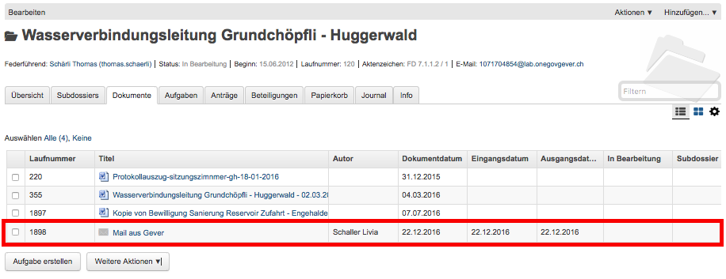
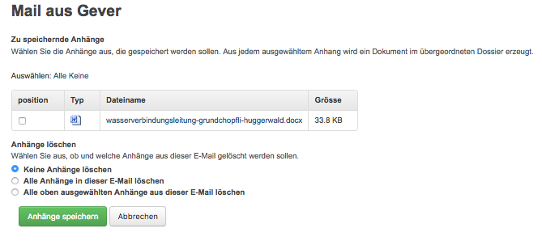
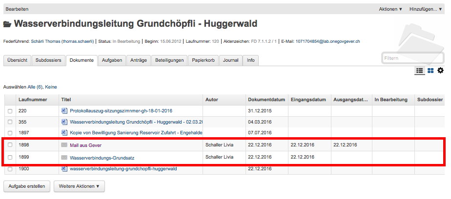
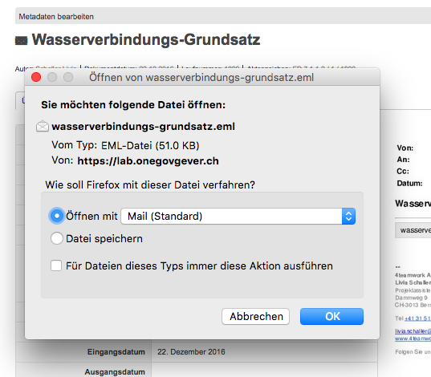
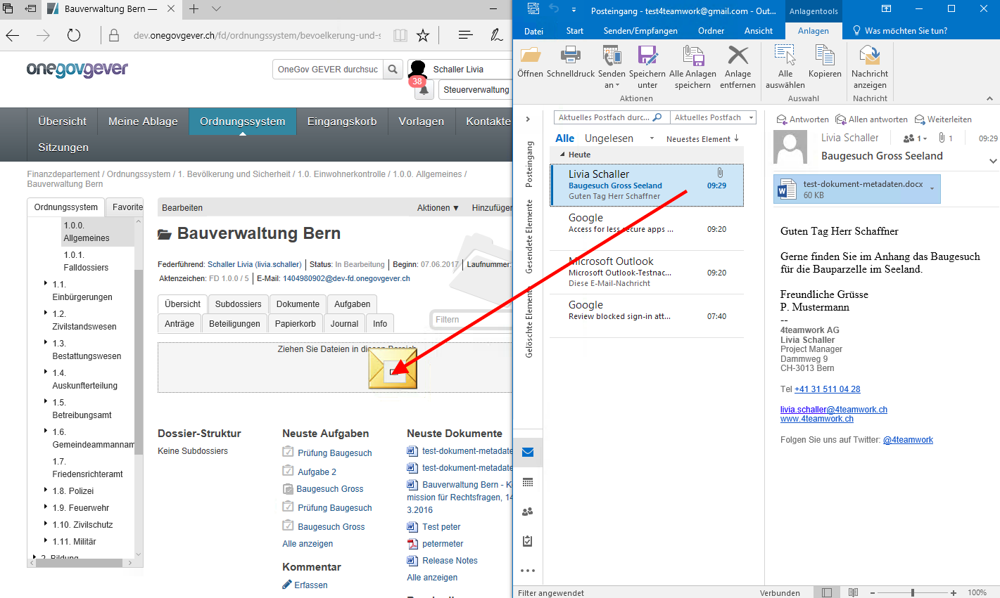
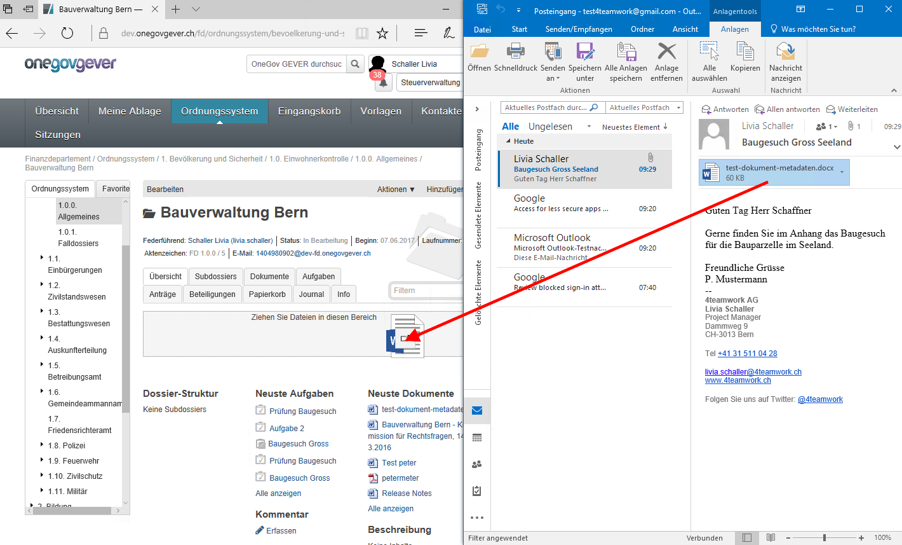

E-Mail als Dokument ablegen
===========================

.. _label-emailimportieren:

Eine E-Mail importieren
~~~~~~~~~~~~~~~~~~~~~~~

Jedes Dossier ist mit einer E-Mail-Adresse versehen. Soll eine E-Mail
importiert werden, gehen Sie wie folgt vor:

- Klicken Sie auf die E-Mail-Adresse des Dossiers:

  |img-dokumente-27|

- Darauf wird in Outlook ein neues E-Mail-Formular geöffnet. Klicken
  Sie auf *Element anfügen* und wählen Sie anschliessend aus dem
  Posteingang das zu importierende E-Mail aus und bestätigend Sie mit
  *OK*.

- Fügen Sie das E-Mail immer als Anhang hinzu, selbst wenn dem E-Mail
  keine Dateien beigefügt sind. Das Feld *Betreff* muss nicht
  ausgefüllt werden, es wird nicht importiert.

  |image84|

- Wechseln Sie zum GEVER-Dossier und aktualisieren Sie die Website
  mit der Funktionstaste *F5*. Das Mail wird nun in der
  Dossier-Übersicht sowie unter dem Reiter *Dokumente* angezeigt.

  |img-dokumente-29|

Eine E-Mail gleichzeitig ins Dossier senden
~~~~~~~~~~~~~~~~~~~~~~~~~~~~~~~~~~~~~~~~~~~

Erstellen Sie die E-Mail wie gewohnt in Outlook. Kopieren Sie die
E-Mail-Adresse des Dossiers ins CC- oder BCC-Feld des E-Mails. Auf diese
Weise wird die E-Mail gleichzeitig im GEVER-Dossier abgelegt.

|img-dokumente-28|

Mail-Anhänge separat speichern
~~~~~~~~~~~~~~~~~~~~~~~~~~~~~~

Öffnet man in OneGov GEVER die E-Mail, werden die Mitteilung
und eventuelle Anhänge angezeigt. Mit der Aktion *Anhänge speichern* können
die E-Mail-Anhänge separat als Dokumente gespeichert werden. Wahlweise können
die Anhänge der E-Mail gelöscht werden.

*(Für signierte E-Mails (Dateiendung *.p7m) können Anhänge nicht gelöscht
werden, weil dadurch sonst die Signatur invalidiert würde)*

|img-dokumente-31|

Ein in OneGov GEVER abgelegtes E-Mail erneut versenden
~~~~~~~~~~~~~~~~~~~~~~~~~~~~~~~~~~~~~~~~~~~~~~~~~~~~~~

In OneGov GEVER abgelegte E-Mails werden im programmunabhängigen Format
*.eml* abgelegt. Soll eine solche E-Mail wieder verschickt werden, gehen
Sie wie folgt vor:

-  Wählen Sie *Bearbeiten* und klicken Sie auf den Link der
   Originalnachricht

   |img-dokumente-32|

-  Nun können Sie die Nachricht mit Outlook öffnen und
   beispielsweise weiterleiten.

   |img-dokumente-33|

Eine Mail aus Outlook in OneGov GEVER ziehen (Drag'n'Drop for Outlook)
~~~~~~~~~~~~~~~~~~~~~~~~~~~~~~~~~~~~~~~~~~~~~~~~~~~~~~~~~~~~~~~~~~~~~~
Das Zusatzmodul „OneGov GEVER Drag’n’Drop for Outlook“ ermöglicht das einfache
Reinziehen von E-Mails und/oder Anhängen aus Microsoft Outlook in OneGov GEVER
in ein beliebiges Dossier via Drag’n’Drop. Ist das Produkt Visual Search
aktiviert, wird In OneGov GEVER für jedes E-Mail sowie deren Anhänge eine
PDF-Vorschau erzeugt.

Eine E-Mail via Drag'n'Drop in OneGov GEVER ziehen:

  |img-dokumente-40|

Einen Anhang via Drag'n'Drop in OneGov GEVER ziehen:

  |img-dokumente-41|

.. |img-dokumente-27| image:: ../img/media/img-dokumente-27.png
.. |image84| image:: ../img/media/image84.png

.. |img-dokumente-28| image:: ../img/media/img-dokumente-28.png

.. disqus::
