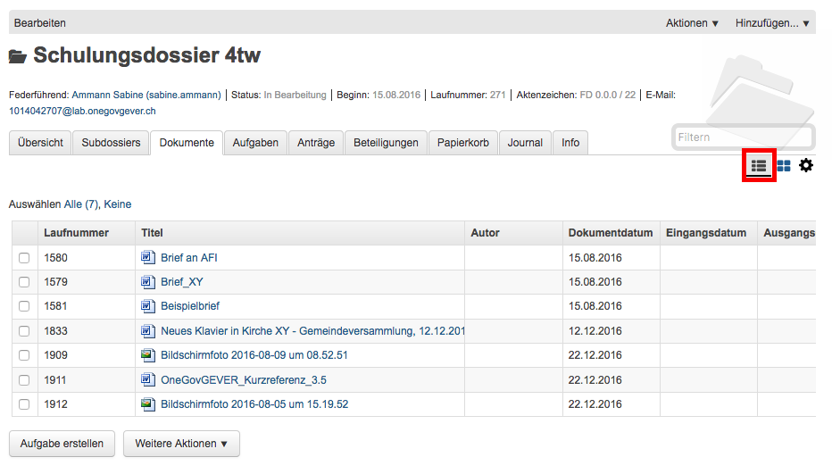
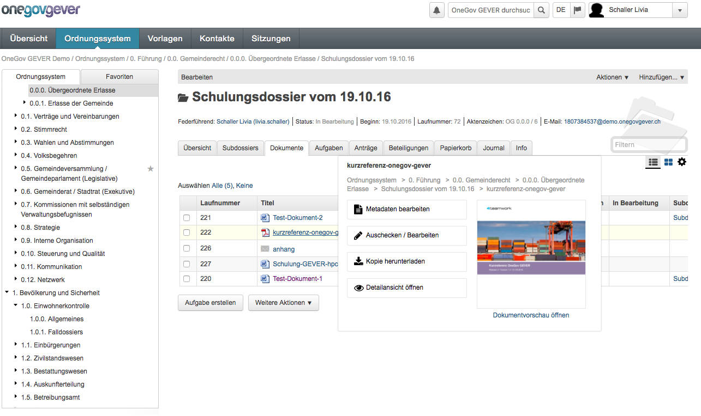
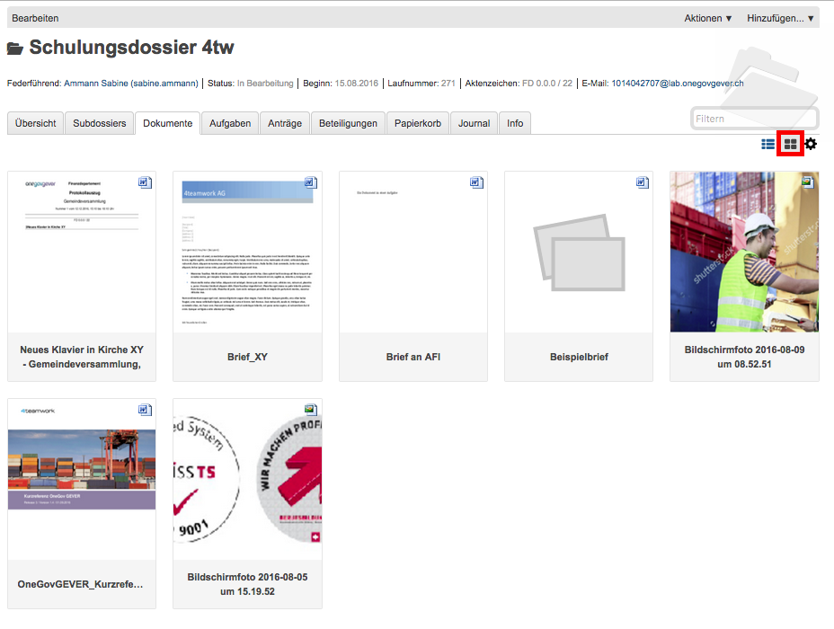
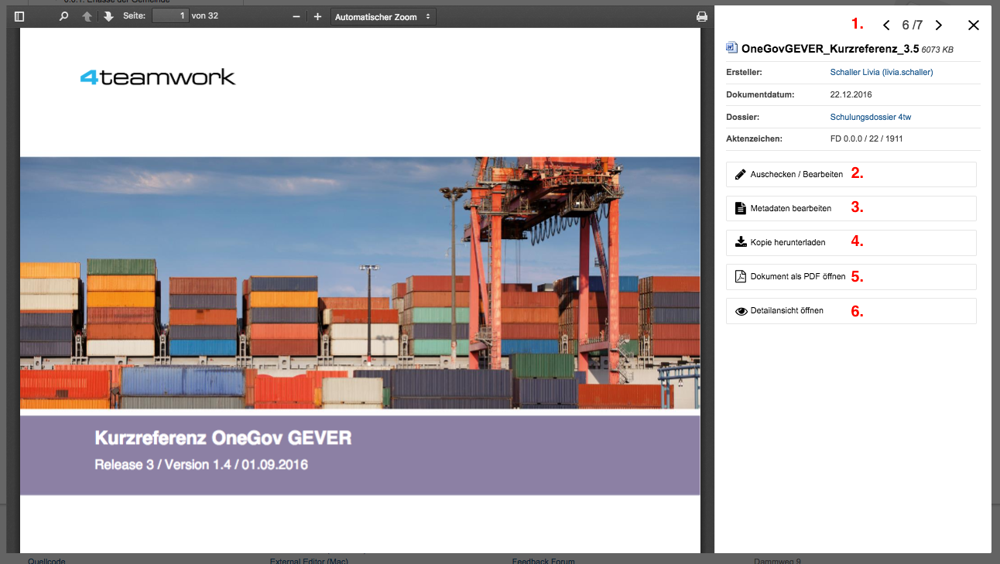

Ein Dokument anschauen
======================

Visuelle Suche
--------------

Die Erweiterung „Visuelle Suche“ unterstützt die intuitive Suche der Benutzer
dank Galerieansicht der Dokumente und verbesserter Dokumentvorschau als
Overlay-Fenster. Die folgenden Abschnitte beschreiben das Modul im Detail.

Standard-Ansicht
~~~~~~~~~~~~~~~~

Standardmässig ist bei Dokumentauflistungen nach wie vor die bestehende
Tabellenansicht dargestellt. Für den Wechsel zur Galerieansicht stehen
dem Benutzer entsprechende Bedienelemente zur Verfügung. Wird die Ansicht
gewechselt, so speichert OneGov GEVER die neue Einstellung im Profil des
Benutzers und verwendet diese für künftige Auflistungen.

|img-grundlagen-10|

Bei Mouse-Over erscheint eine erste kleine Dokument-Vorschau sowie die
Möglichkeit, die Metadaten des Dokumentes zu bearbeiten, dieses auszuchecken
sowie eine Kopie davon zu machen.

|img-grundlagen-11|

Galerie-Ansicht
~~~~~~~~~~~~~~~

Alle Dokumentauflistungen werden beim Modul visuelle Suche in einer
Galerieansicht dargestellt. Sie stellt für jedes Dokument ein Vorschaubild
der jeweils ersten Seite dar. Zusätzlich sind Titel und Dateityp (als Icon)
ersichtlich.

|img-grundlagen-12|

Detail-Ansicht
~~~~~~~~~~~~~~~

In der Detail-Ansicht kann folgendes ausgeführt werden:

1. Mittels den Pfeilen kann zwischen den verschiedenen Dokumenten geswitcht
   werden.

2. Metadaten bearbeiten

3. Auschecken und Bearbeiten

4. Kopie herunterladen

5. Dokument als PDF öfnnen

6. Detailansicht öffnen

|img-grundlagen-13|

Unterstützte Dokumenttypen
~~~~~~~~~~~~~~~~~~~~~~~~~~

Folgende Dokumenttypen werden von der Visuellen Suche unterstützt:

=================================== =============== ======================
Dokumenttyp                           Extension       Anwendung
=================================== =============== ======================
Word Dokument                         .doc, .docx     Microsoft Word

Word Vorlage                          .dot, .dotx     Microsoft Word

Word Perfect Dokument                 .wpd            Microsoft Word

Wordpad Dokument                      .wpc            Microsoft Word

Richt Text                            .rtf            Microsoft Word

HTML                                  .htm, .html     Browser

Outlook Nachricht                     .msg            Microsoft Outlook

Excel Dokument                        .xls, .xlsx     Microsoft Excel

Excel Vorlage                         .xlt, .xltx     Microsoft Excel

PowerPoint Präsentation               .ppt, .pptx     Microsoft PowerPoint

PowerPoint Vorlage                    .pot, .potx     Microsoft PowerPoint

PowerPoint Bildschirmpräsentation     .pps, .ppsx     Microsoft PowerPoint

PowerPoint Präsentation mit Makros    .pptm           Microsoft PowerPoint

Visio Zeichnung                       .vsd, .vdx      Microsoft Visio

Visio Vorlage                         .vst, .vtx      Microsoft Visio

Skalierbare Vektorgrafik              .svg, .svgz     Microsoft Visio

Project Projekt                       .mpp            Microsoft Project

Project Vorlage                       .mpt            Microsoft Project

RFC822 Internet Message Format        .eml            k.A.

ODF Textdokument                      .odt            OpenOffice Writer

ODF Textdokumentvorlage               .ott            OpenOffice Writer

OpenOffice Textdokument               .sxw            OpenOffice Writer

OpenOffice Textdokumentvorlage        .stw            OpenOffice Writer

ODF Tabellendokument                  .ods            OpenOffice Calc

ODF Tabellendokumentvorlage           .ots            OpenOffice Calc

OpenOffice Tabellendokument           .sxc            OpenOffice Calc

OpenOffice Tabellendokumentvorlage    .stc            OpenOffice Calc

ODF Präsentation                      .odp            OpenOffice Impress

ODF Präsentationsdokumentvorlage      .otp            OpenOffice Impress

OpenOffice Präsentation               .sxi            OpenOffice Impress

OpenOffice Präsentationsvorlage       .sti            OpenOffice Impress

ODF Zeichnung                         .odg            OpenOffice Draw

ODF Zeichnungsdokumentvorlage         .otg            OpenOffice Draw

OpenOffice Zeichnung                  .sxd            OpenOffice Draw

OpenOffice Zeichnungsvorlage          .std            OpenOffice Draw

ODF Formel                            .odf            OpenOffice Math

OpenOffice Formel                     .sxm            OpenOffice Math

Text                                  .txt, .log,     TXT2PDF
                                      .ini

Windows Enhanced Metafile             .emf            k.A

PDF                                   .pdf            PDF Tools builtin

=================================== =============== ======================

.. disqus::
