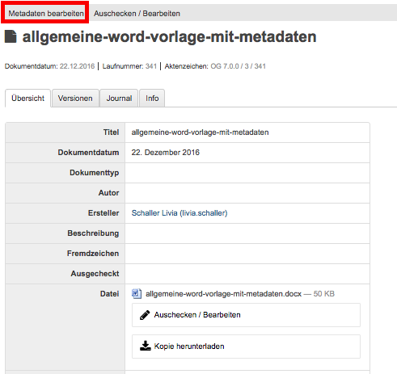
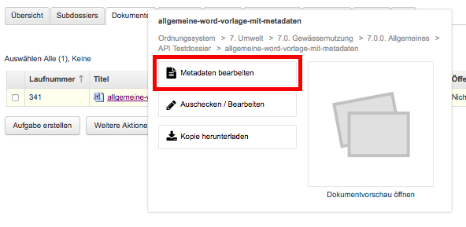
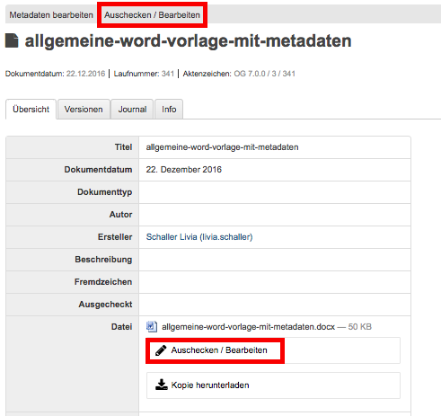
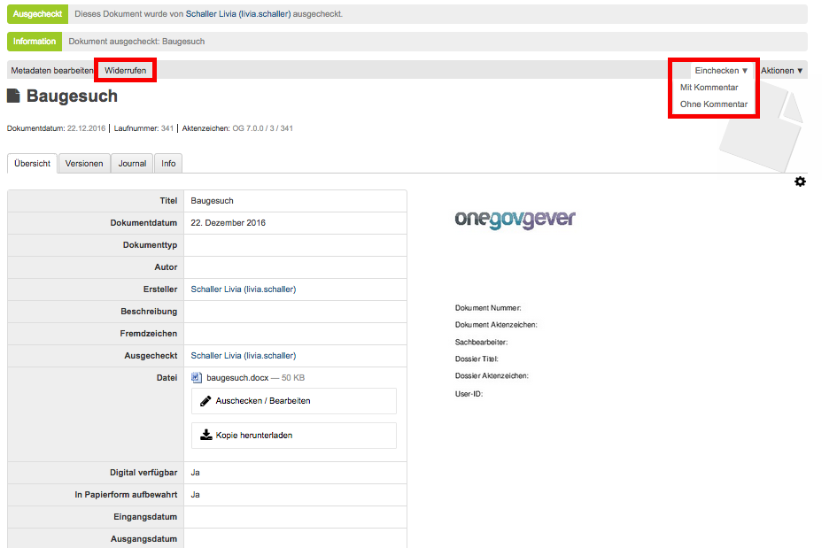
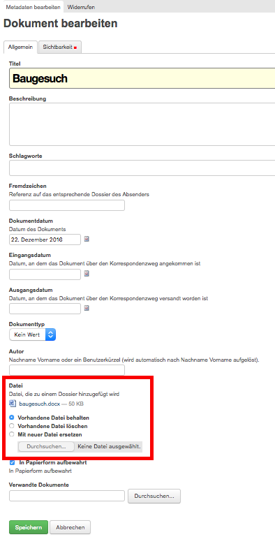
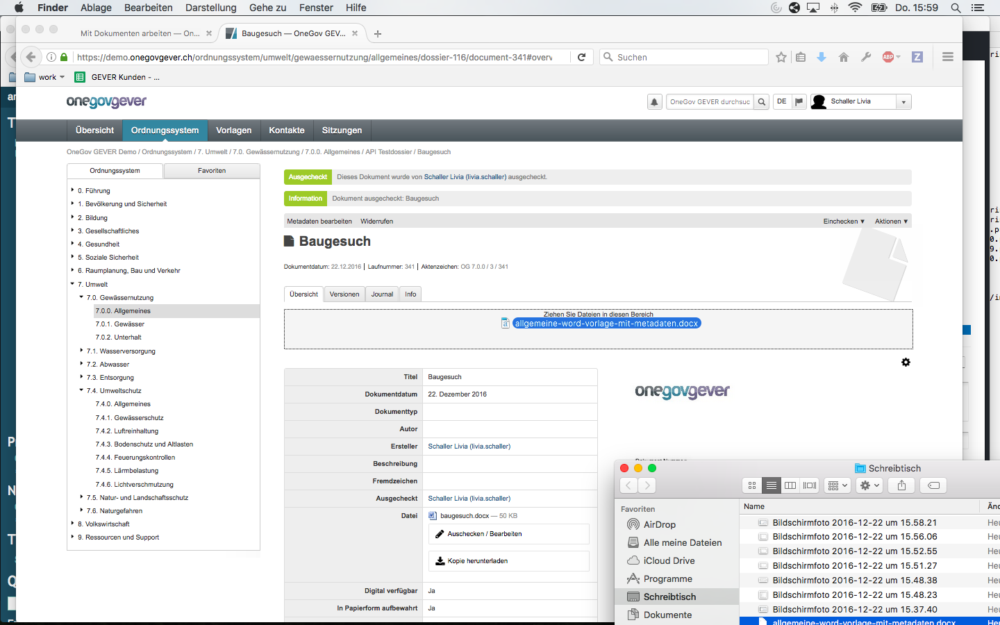
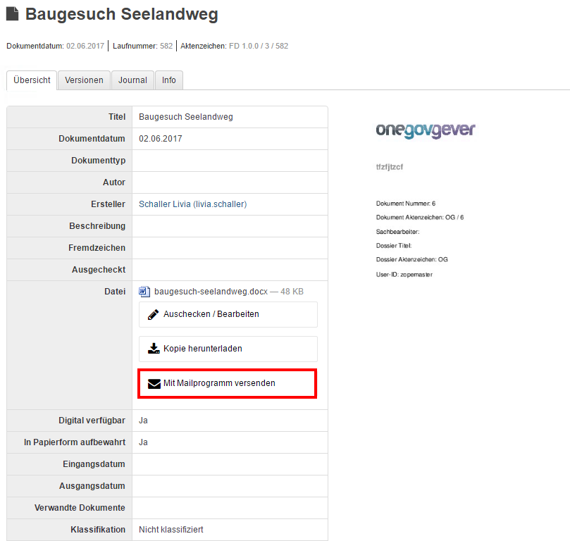
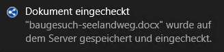

.. _label-dokument-checkin:

Dokumente bearbeiten
====================

External Editor / Office Connector
~~~~~~~~~~~~~~~~~~~~~~~~~~~~~~~~~~

Zum Bearbeiten von Dokumenten muss der External Editor oder Office Connector
installiert werden. Wir empfhelen den Office Connector, da dieser laufend von
4teamwork weiterentwickelt und verbessert wird.

Sie können den Office Connector für Windows und Mac `auf der 4teamwork-Website <https://www.4teamwork.ch/office-connector>`_ herunterladen.
Sie finden dort auch die Download-Links zu den beiden nicht mehr weiter
gewarteten Anwendungen External Editor für Windows sowie ZopeEditManager für Mac.

Grundlagen
~~~~~~~~~~

Um Dokumente bearbeiten zu können, müssen sie ausgecheckt werden. Im
ausgecheckten Zustand sind Dokumente nur noch für den Bearbeiter bzw.
die Bearbeiterin verfügbar.

Ein ausgechecktes Dokument erkennt man daran, dass in der Dokumentliste
die Spalte *„In Bearbeitung“* ausgefüllt ist.

Nur Metadaten (Eigenschaften) bearbeiten
~~~~~~~~~~~~~~~~~~~~~~~~~~~~~~~~~~~~~~~~

Fahren Sie mit der Maus in der Dokumentliste auf das Icon des Dokuments,
dessen Eigenschaften (z.B. Titel, Beschreibung) Sie bearbeiten möchten
und wählen Sie im angezeigten Tooltip-Fenster die Option "Metadaten
bearbeiten".

|img-dokumente-8|

Diese Option finden Sie auch auf der Eigenschaftenmaske des
entsprechenden Dokuments:

|img-dokumente-7|

In der Dokument-Erfassungsmaske können anschliessend die gewünschten
Änderungen vorgenommen werden.

Dokument auschecken und bearbeiten
~~~~~~~~~~~~~~~~~~~~~~~~~~~~~~~~~~

Fahren Sie mit der Maus in der Dokumentliste auf das Icon des Dokuments,
das Sie bearbeiten möchten und wählen Sie auf der Eigenschaftenmaske des
Dokuments die Option "Auschecken und Bearbeiten".

|img-dokumente-9|

Die Datei wird nun durch den External Editor / Office Connector mit der
entsprechenden Anwendung geöffnet und kann bearbeitet werden. Während der
Bearbeitung erstellt der External Editor eine temporäre Datei, die nach dem
Einchecken wieder verschwindet.

Speichern Sie während der Bearbeitung die Datei regelmässig,
insbesondere bevor Sie den Arbeitsplatz für längere Zeit verlassen. Wenn
Sie mit der Bearbeitung fertig sind, schliessen Sie bitte die Datei und
die Anwendung (z.B. Microsoft Word). Ab der Version 0.9.5 zeigt der
External Editor / Office Connector nach Abschluss der Bearbeitung, je nachdem,
ob Änderungen gemacht wurden oder nicht, eine entsprechende Hinweismeldung an.

**Wichtig:** Eine Datei kann jeweils nur einmal zur Bearbeitung in der
entsprechenden Anwendung geöffnet sein. Will man dasselbe Dokument
während dieser Zeit via Bleistift-Icon oder Link auf der
Dokumentansicht in OneGov GEVER nochmals öffnen, so erscheint ein entsprechender
Hinweis.

Ein ausgechecktes Dokument wird mit einem orangen Punkt gekennzeichnet:

-  ein gefüllter oranger Punkt falls der Benutzer selbst das Dokumente ausgecheckt hat, oder

-  ein oranger Ring wenn das Dokument durch einen anderen Benutzer ausgecheckt wurde

Nach dem Schliessen des Dokumentes wird die Eigenschaftenmaske des Dokuments mit
den weiteren Bearbeitungsmöglichkeiten angezeigt.

|img-dokumente-10|

1. **Einchecken:** Durch “Einchecken“ wird das Dokument wieder für die übrigen
   Sachbearbeitenden frei. Dies kann mit oder ohne Kommentar und entweder
   bei 1a. oder 1b. erfolgen.

2. **Checkout widerrufen:** Die vorgenommenen Änderungen am Dokument werden
   rückgängig gemacht und die Datei auf den zuletzt eingecheckten Zustand
   (= Version vor dem Auschecken) zurückgesetzt. Die Aktion muss doppelt bestätigt werden.

Mit Mailprogramm versenden
~~~~~~~~~~~~~~~~~~~~~~~~~~

Unter den Buttons "Einchecken / Auschecken" findet sich zusätzlich der Button
"Mit Mailprogramm versenden".

|img-dokumente-35|

Bei Klick darauf öffnet sich das Mailprogramm "Outlook" mit einem vorbereiteten
Mail, in welchem das Dokument bereits angefügt und im Mail-Text der OneGov GEVER
Link auf das Dokument hinterlegt ist. Zu Dokumentationszwecken wird ein B.c.c.
ins Dossier, in welchem das Dokument abgelegt ist, geschickt.

|img-dokumente-36|

Danach kann das Mail nach Wunsch bearbeitet, ergänzt und an den / die gwünschten
Empfänger verschickt werden.

Direkt einchecken
~~~~~~~~~~~~~~~~~
Mit dem Office Connector kann ein Dokument auch direkt (und nicht in
zwei Schritten wie oben unter Kapitel "Dokument auschecken und bearbeiten"
beschrieben) eingecheckt werden. Dazu das Dokument auschecken, die gwünschten
Anpassungen vornehmen, speichern und das Dokument schliessen. Danach erscheint
automatisch eine Meldung, mit welcher das Dokument direkt eingecheckt werden
kann. Bei Bedarf kann auch dort ein Kommentar zur Änderung hinterlegt werden:

|img-dokumente-37|

Nach dem erfolgreichen Einchecken erscheint unten rechts folgende
Bestätigungsmeldung:

|img-dokumente-38|

Zugelassene Dokumenttypen
~~~~~~~~~~~~~~~~~~~~~~~~~

Der External Editor und der Office Connector unterstützen folgende Anwendungen.
Bedingung dazu ist, dass die jeweilige Anwendung auf dem PC installiert ist.

====================== ========= =========
Anwendung               Windows     Mac
====================== ========= =========
MS Excel                  x          x

MS Powerpoint             x          x

MS Word                   x          x

MS Visio                  x

MS Project                x

MS OneNote                x

MS Publisher              x

Open office                          x

Acrobat Pro, Reader       x          x

Adone InDesign            x

Adobe Photoshop           x

Adobe Illustrator         x

MindManager               x

Preview                              x

TextEdit                             x

Apple Numbers                        x

Apple Keynote                        x

Apple Pages                          x

====================== ========= =========

Die Bearbeitung von Adobe Grafikdateien (Photoshop, Illustrator,
InDesign) mit dem External Editor funktioniert zwar, wird aber nicht
empfohlen, da es zu unerwarteten Fehlern kommen kann. Für solche und andere,
nicht unterstützte Dateien sollte untenstehender Hinweis unter `Dokumente ohne External Editor / Office Connector bearbeiten`_ befolgt werden.

Dokumente ohne External Editor / Office Connector bearbeiten
~~~~~~~~~~~~~~~~~~~~~~~~~~~~~~~~~~~~~~~~~~~~~~~~~~~~~~~~~~~~~~~~~

Wählen Sie die Aktion *Auschecken*. Klicken Sie nach dem Auschecken auf
*Metadaten bearbeiten*, wodurch sich die Dokumentenmaske öffnet.

Wählen Sie nun *Mit neuer Datei ersetzen* und suchen Sie im Filesystem
die gewünschte Datei. Mit Speichern und anschliessendem Einchecken wird
die neue Datei als neuste Version gespeichert.

|img-dokumente-12|

Diese Aktion wird auch benötigt, wenn Dateien nicht mit External Editor
bearbeitet werden können oder der External Editor nicht zur Verfügung
steht.

-  Wählen Sie die Aktion *Auschecken*.

-  Wählen Sie "Kopie herunterladen" und anschliessend "Datei
   speichern", um die Datei im Filesystem bzw. auf dem Desktop
   zwischenzuspeichern. Achtung: Die Änderungen werden bei diesem
   Vorgehen nicht automatisch ins GEVER übernommen.

|img-dokumente-11|

Bearbeiten Sie die Datei und schliessen Sie sie nach dem Speichern der
Änderungen. Um die geänderte Datei in OneGov GEVER zu importieren, kann
diese via Drag'n'Drop wieder ins GEVER gezogen werden.

Mit Speichern und anschliessendem Einchecken wird die geänderte Datei
als neuste Version gespeichert.

.. |img-dokumente-36| image:: ../img/media/img-dokumente-36.png
.. |img-dokumente-37| image:: ../img/media/img-dokumente-37.png

.. disqus::
