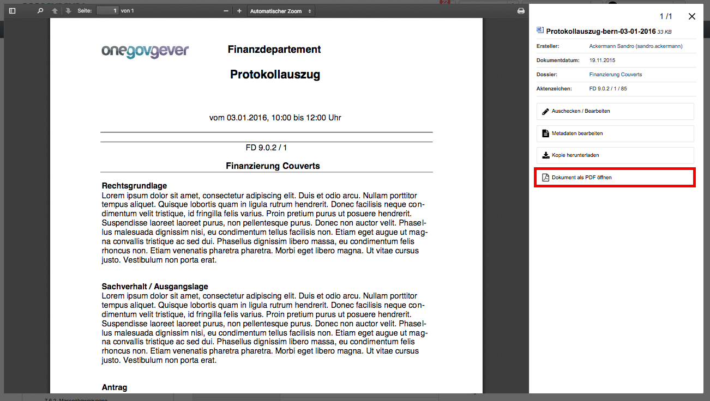
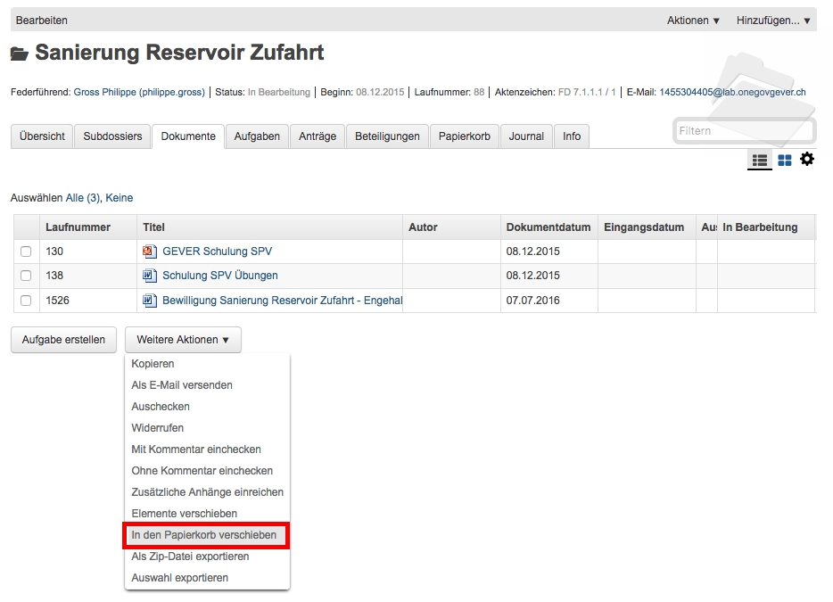
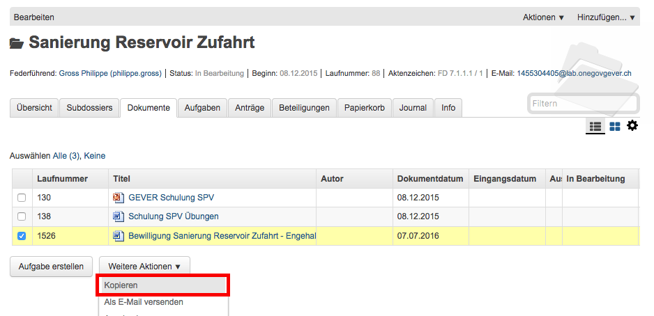
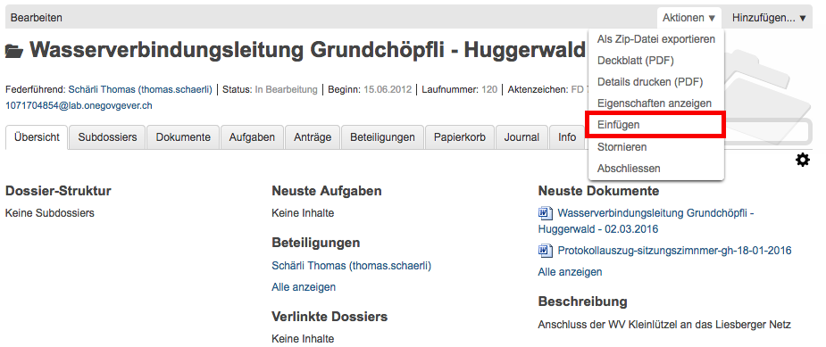
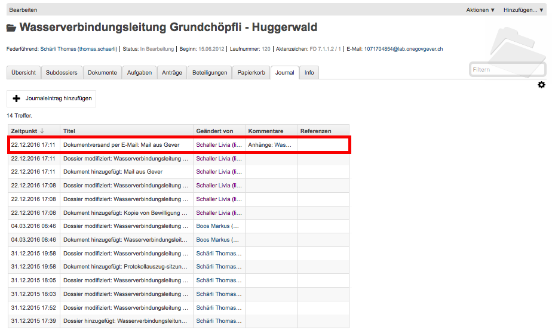
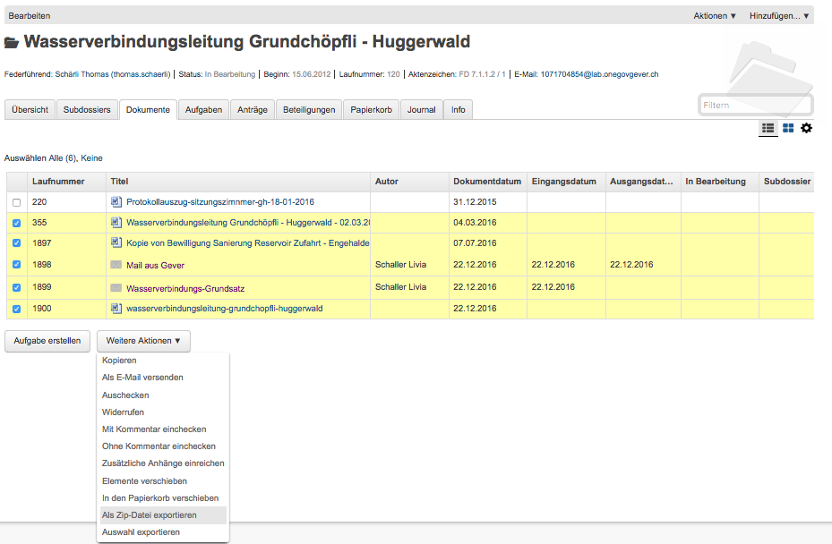

Diverse Aktionen
================

OneGov GEVER bietet verschiedene Aktionen, welche mit Dokumenten durchgeführt
werden können:

- Ein bestehendes Dokument einsehen (Lesemodus)

- Ein Dokument in den Papierkorb verschieben

- Ein Dokument kopieren

- Ein Dokument per E-Mail versenden

- ZIP-Export/Import

- Ein bestehendes Dokument als PDF speichern

Ein bestehendes Dokument einsehen (Lesemodus)
~~~~~~~~~~~~~~~~~~~~~~~~~~~~~~~~~~~~~~~~~~~~~

Diese Funktion steht nur zur Verfügung, wenn ein entsprechender PDF
Rendition Dienst (z.B. Adobe LiveCycle Server) installiert und mit
OneGov GEVER konfiguriert ist.

Klicken Sie in der Liste auf das Icon des Dokuments, das Sie einsehen
möchten und wählen Sie im Tooltip "PDF Vorschau". Optional kann mit dem
Befehl "Rechtsklick - Link in neuem Tab öffnen" das PDF geöffnet werden,
ohne dass der Browser die aktuelle Seite (Dossierstufe) verlässt. GEVER
erzeugt von den Dokumenten im Hintergrund eine pdf-Datei. Auf diese
Weise kann verhindert werden, dass nicht ausgecheckte Dokumente
versehentlich bearbeitet werden.

|img-dokumente-18|

Die Datei kann nun direkt geöffnet oder auf dem Filesystem abgespeichert
werden. Das PDF-Rendering benötigt etwas Zeit. Klickt man nach dem Einchecken
sofort auf die Datei, ist möglicherweise das Vorschau-PDF noch nicht bereit. Es
erscheint die Meldung *"PDF noch nicht vorhanden, wird noch
erstellt."*

In diesem Fall wird beim Klicken auf die Datei die Originaldatei angezeigt.
Soll die Datei bearbeitet werden, muss sie wieder ausgecheckt werden,
ansonsten werden die Änderungen nicht gespeichert!

Übersicht über die Dateiformate, die in ein PDF umgewandelt werden
können (ist jedoch abhängig von der jeweiligen Installation):

-  Standard: rtf, txt, jpg, htm, html

-  Bild: jpg, jpeg, bmp, gif, tif, tiff, png, jpf, jpx, jp2, j2k, j2c,
   jpc

-  Flash-Videos: swf, flv

-  Microsoft Word: doc, docx

-  Microsoft Excel: xls, xlsx

-  Microsoft Powerpoint: ppt, pptx

-  Microsoft Visio: vsd

-  Microsoft Project: mpp

-  Microsoft Publisher: pub

-  OpenOffice Writer: odt, ott, sxw, stw

-  OpenOffice Calc: ods, ots, sxc stc

-  OpenOffice Draw: odg, otg, sxd, std

-  OpenOffice Impress: odf, otp, sxi, sti

-  Adobe Framemaker: fm

-  Adobe Photoshop: psd

Ein Dokument in den Papierkorb verschieben
~~~~~~~~~~~~~~~~~~~~~~~~~~~~~~~~~~~~~~~~~~

Dokumente in OneGov GEVER können von normalen Benutzenden nicht gelöscht,
sondern nur in den Papierkorb verschoben werden. Dort können diese mittels
Reaktivierung wieder ins Dossier zurückgespielt werden. Der Administrator hat
zudem die Möglichkeit, einen :ref:`Soft-Delete <label-soft-delete>` vorzunehmen.

Beim Verschieben in den Papierkorb gehen Sie wie folgt vor:

1. Klicken Sie in der Dokumentenliste auf das zu löschende Dokument

2. Wählen Sie unter *Weitere Aktionen* die Aktion *In den Papierkorb
   verschieben*

   |img-dokumente-19|

3. Mit dieser Aktion wechselt OneGov GEVER auf den Reiter
   *Papierkorb* und verschiebt das Dokument dorthin. Bei Bedarf kann das
   Dokument reaktiviert werden.

   |img-dokumente-20|

Ein Dokument kopieren
~~~~~~~~~~~~~~~~~~~~~

Klicken Sie in der Dokumentliste auf das zu kopierende Dokument und
wählen Sie *Weitere Aktionen → Kopieren*.

|img-dokumente-21|

Öffnen Sie anschliessend das Ziel-Dossier und klicken Sie auf *Aktionen
→ Einfügen*. Dadurch wird das kopierte Dokument automatisch unter dem
Reiter *Dokumente* abgelegt.

|img-dokumente-22|

Das kopierte Dokument erscheint in der Dokumentenliste als *"Kopie von
…."*

|img-dokumente-23|

Ein Dokument per E-Mail versenden
~~~~~~~~~~~~~~~~~~~~~~~~~~~~~~~~~

Wählen Sie in der Dokumentenliste das Dokument aus, das Sie versenden
möchten und klicken Sie auf *Weitere Aktionen → Als E-Mail
versenden*.

|img-dokumente-24|

Darauf wird das E-Mail-Formular geöffnet. Obligatorische Felder sind mit
einem roten Quadrat markiert.

Die ausgewählten Dokumente können entweder als Datei im Anhang des
E-Mails oder aber als in das E-Mail integrierter Direktlink auf das
GEVER-Dokument (Option anklicken) versandt werden. Die E-Mail enthält im
zweiten Fall nur den Link auf das Dokument im GEVER und hat keinen
Datei-Anhang (siehe Bsp. unten).

|img-dokumente-25|

Der Empfänger gelangt mit einem Klick auf den Link auf das Dokument.
Voraussetzung ist jedoch, dass der Empfänger im entsprechenden Mandanten
auf dem entsprechenden Dossier berechtigt ist!

Der Mailversand wird im Journal vermerkt. In der Spalte *Kommentar* wird
das versandte Dokument referenziert; ebenfalls dort angegeben sind die
Empfänger, der Betreff und die Nachricht (vollständige Ansicht mit
Mouseover).

|img-dokumente-26|

ZIP-Export/Import
~~~~~~~~~~~~~~~~~

.. _label-dokumente-zip-export:

ZIP-Export
----------

Einzelne oder mehrere Dokumente können in eine ZIP-Datei verpackt und
exportiert werden.

-  Markieren Sie in der Dokumentenübersicht die Dokumente aus, welche
   exportiert werden sollen (mit :kbd:`Ctrl` + rechter Maustaste können mehrere
   Dokumente markiert werden)

-  Öffnen Sie unterhalb der Dokumentenliste das "Weitere Aktionen" Menü
   und klicken auf "Als ZIP-Datei" exportieren. Auf diese Weise werden
   sämtliche Dokumente eines Dossiers exportiert.

   |img-dokumente-34|

-  Wählen Sie den Speicherort für die ZIP-Datei aus.

.. note::
    Der Pfadname beim ZIP-Download lässt bei Windows maximal 260 Zeichen zu.
    Bitte achten Sie daher beim Titel darauf, dass diese Beschränkung
    nicht überschritten wird. Ab Windows 10 (Version 1607) besteht die
    Möglichkeit, dass ein längerer Pfadname mittels Konfiguration zugelassen
    werden kann. Alternativ kann das `Programm 7-Zip <http://www.7-zip.org/>`_
    installiert werden, welches mit langen Zip-Namen umgehen kann.

ZIP-Import
----------

ZIP-Dateien können in GEVER hochgeladen werden. Diese werden jedoch
nicht automatisch vom System entpackt, sondern direkt bei den Dokumenten
abgelegt. Der Inhalt des ZIP-Archives wird nicht indexiert und kann
somit nicht durchsucht werden. Ein Suchen ist nur über die Metadaten
möglich. Ein PDF-Rendering (PDF Vorschau) steht ebenfalls nicht zur
Verfügung.

.. note::
   Das Hochladen von ZIP-Dateien wird grundsätzlich nicht empfohlen.
   Werden trotzdem ZIP-Dateien hochgeladen, so sollten die Dateien über
   den Windows-Explorer verpackt werden (rechte Maustaste > Senden an >
   ZIP-komprimierter Ordner)

Dokument als PDF speichern
~~~~~~~~~~~~~~~~~~~~~~~~~~
Ein bestehendes Dokument kann als PDF gespeichert werden. Dazu kann auf der
Dokumentseite unter *Aktionen* die Auswahl *PDF speichern unter* angewählt
werden.

|img-pdf-speichern-unter-1|

In der darauf erscheinenden Maske kann ausgewählt werden, in welcher
Ordnungsposition resp. Dossier das PDF abgespeichert werden soll.

|img-pdf-speichern-unter-2|

Nachdem die Aktion mit *Speichern* abgeschlossen wurde, wird das PDF
generiert. Ist dieser Vorgang vom System abgeschlossen, erscheint ein grüner
Button, welcher direkt zum neuen PDF führt.

|img-pdf-speichern-unter-3|

|img-pdf-speichern-unter-4|

.. |img-dokumente-20| image:: ../img/media/img-dokumente-20.png

.. |img-dokumente-23| image:: ../img/media/img-dokumente-23.png
.. |img-dokumente-24| image:: ../img/media/img-dokumente-24.png
.. |img-dokumente-25| image:: ../img/media/img-dokumente-25.png

.. |img-pdf-speichern-unter-1| image:: ../img/media/img-pdf-speichern-unter-1.png
.. |img-pdf-speichern-unter-2| image:: ../img/media/img-pdf-speichern-unter-2.png
.. |img-pdf-speichern-unter-3| image:: ../img/media/img-pdf-speichern-unter-3.png
.. |img-pdf-speichern-unter-4| image:: ../img/media/img-pdf-speichern-unter-4.png

.. disqus::
