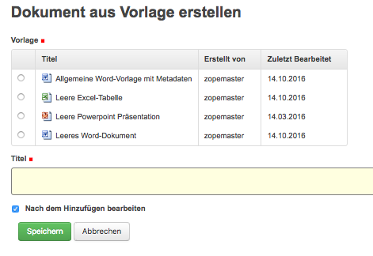
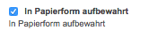
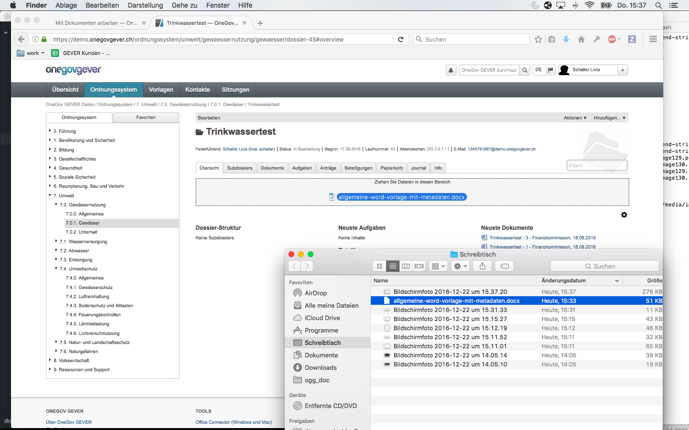

Ein neues Dokument erstellen
============================

OneGov GEVER bietet vier Möglichkeiten, ein neues Dokument zu erzeugen resp.
hinzuzufügen:

1. `Dokument mit Drag'n'Drop hinzufügen`_

2. `Ein Dokument heraufladen (importieren)`_

3. `Dokument aus Vorlage erstellen`_

4. `E-Mail als Dokument hinzufügen`_

Dokument mit Drag'n'Drop hinzufügen
~~~~~~~~~~~~~~~~~~~~~~~~~~~~~~~~~~~

Dokumente können mittels Drag & Drop in ein Dossier oder in den Eingangskorb
importiert werden. Hierzu das gewünschte Dossier öffnen und das Dokument in den
grauen Bereich ziehen. Bei Dokumenten, die mit Drag & Drop hinzugefügt werden,
wird beim Dokumentdatum automatisch das aktuelle Datum gesetzt.

|img-dokumente-6|

Ein Dokument heraufladen (importieren)
~~~~~~~~~~~~~~~~~~~~~~~~~~~~~~~~~~~~~~

Um ein Dokument hinzuzufügen und im gleichen Schritt die Metadaten anzupassen,
klicken Sie auf *Hinzufügen→Dokument*. Dabei öffnet sich die Erfassungsmaske
und Sie können alle Angaben zum Dokument erfassen sowie das gewünschte
Dokument importieren. Mehr Informationen zur Erfassungsmaske finden Sie hier.

Ein Dokument erstellen, das nur in Papierform vorhanden ist
-----------------------------------------------------------

Mit *Hinzufügen → Dokument* wird die Dokumentmaske aufgerufen und wie
unter 3.1 beschrieben ausgefüllt. Der Unterschied zu einem
elektronischen Dokument besteht lediglich darin, dass keine Datei
heraufgeladen wird.

Dokumente ohne Datei sind am Icon |image43| erkennbar. Es dient als
Stellvertreter für Dateien, die lediglich in Papierform vorhanden sind:

|img-dokumente-5|

Soll nachträglich eine elektronische Datei hinzugefügt werden – z.B.
weil man einen Brief inzwischen eingescannt hat – kann dies über
*Metadaten bearbeiten* ausgeführt werden.

Dokument aus Vorlage erstellen
~~~~~~~~~~~~~~~~~~~~~~~~~~~~~~

Über *Hinzufügen → Dokument ab Vorlage* können die Dokumentvorlagen
aufgerufen werden und daraus ein Dokument erstellt werden.

|img-dokumente-4|

Wählen Sie die gewünschte Vorlage aus und tragen Sie den Dokumenttitel
ein. Nach dem Speichern wird im Hintergrund die Dossierhülle mit den
Metadaten erstellt und danach das Dokument mit dem External Editor oder Office
Connector geöffnet.

Speichern und schliessen Sie die Datei nach dem Bearbeiten und checken
Sie die Datei ein.

E-Mail als Dokument hinzufügen
~~~~~~~~~~~~~~~~~~~~~~~~~~~~~~

Diese Variante wird unter :ref:`label-emailimportieren` detailliert beschrieben.

