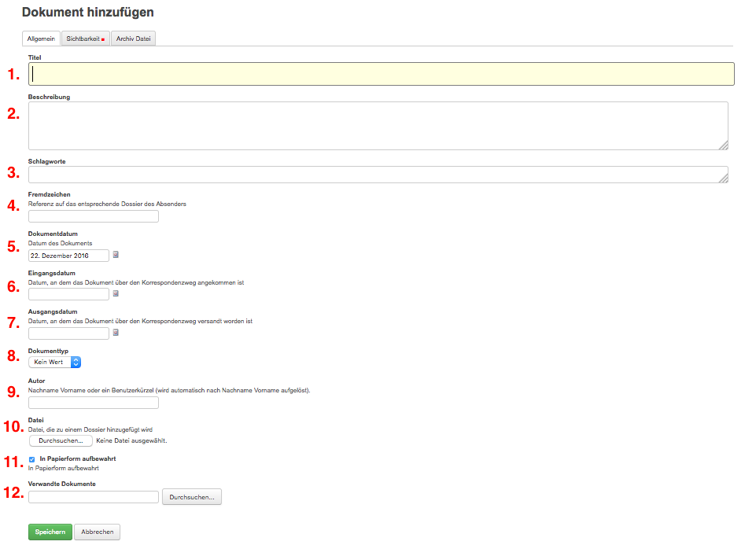
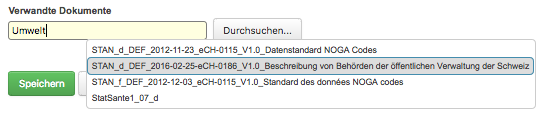

Metadaten pflegen
=================

Auf die Dokumenten-Erfassungsmaske gelangen Sie, indem Sie *Hinzufügen→
Dokument* wählen. Die Erfassungsmaske ist in die beiden Reiter
*Allgemein* und *Sichtbarkeit* gegliedert; der jeweils aktive Reiter ist
grau hinterlegt. Obligatorische Felder sind mit einem roten Quadrat
markiert

Reiter Allgemein
^^^^^^^^^^^^^^^^

1. **Titel:** Kerninformationen zum Dokument. Abkürzungen und Codes
   sollten vermieden werden, damit die Information für Dritte ebenfalls
   verständlich ist.

   *Das Titelfeld lässt bei der Eingabe zwei Varianten zu:*

   -  Der Titel wird manuell eingegeben: Die angehängte Datei übernimmt den
      eingegebenen Titel automatisch.

   -  Es wird kein Titel eingegeben: Der Titel der angehängten Datei wird
      automatisch ins Titelfeld übertragen.

   Dateiname und Titel werden immer miteinander synchronisiert, auch
   bei einer späteren Änderung des Titels.

    |img-dokumente-1|

2.  **Beschreibung:** Erläuterungen, Ergänzungen zum Dokumentinhalt

3.  **Schlagwörter:** Zusätzlich zu Titel und Beschreibung können
    Schlüsselwörter vergeben werden.

4.  **Fremdzeichen:** Aktenzeichen des Absenders

5.  **Dokumentdatum:** Datum, an dem das Dokument erstellt wurde (nicht
    zu verwechseln mit dem Datum der Erfassung, das automatisch vergeben
    wird).

6.  **Eingangsdatum:** Datum, an dem das Dokument eingetroffen ist

7.  **Ausgangsdatum:** Datum, an dem das Dokument versandt wurde

8.  **Dokumenttyp:** Bericht, Antrag, etc.

9.  **Autor:** Verfasser des Dokuments (das verwaltungsinterne
    Benutzerkürzel wird automatisch in “Name, Vorname” aufgelöst)

10. **Datei:** Mit Klick auf Durchsuchen wird der Explorer geöffnet, und
    die gewünschte Datei kann hinzugefügt werden.

11. **In Papierform aufbewahrt:** Gibt an, dass das Dokument in
    Papierform aufbewahrt wird. Pro Mandant kann eingestellt werden, ob
    der Standardwert "in Papierform aufbewahrt" gesetzt werden soll oder
    nicht.

12. **Verwandte Dokumente:** Mit diesem Feld kann auf verwandte
    Dokumente verwiesen werden.

    -  Kennt man den Dokumenttitel oder Bestandteile davon, wird der
       Text direkt ins Feld eingegeben. Darauf erscheint die in Frage
       kommende Liste, aus der das gewünschte Dokument ausgewählt werden
       kann.

    |img-dokumente-2|

    -  Kennt man den Dokumenttitel nicht, klickt man auf Hinzufügen und
       navigiert durch das Ordnungssystem.

    |img-dokumente-3|

Reiter Sichtbarkeit
^^^^^^^^^^^^^^^^^^^^

Bei den Feldern *Klassifikation*, *Datenschutzstufe* und
*Öffentlichkeitsstatus* werden jene Werte angezeigt, die bereits auf
Stufe Dossier bzw. Ordnungsposition hinterlegt sind. Bei Bedarf können
die Werte auf Dokumentstufe noch verschärft, aber nicht gelockert
werden. Beispiel: Statt "Nicht klassifiziert" kann "Vertraulich" oder
"Geheim" gewählt werden.

.. |img-dokumente-3| image:: ../img/media/img-dokumente-3.png
