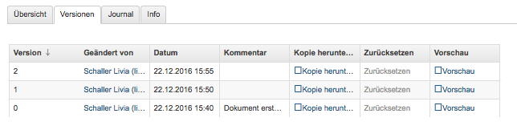
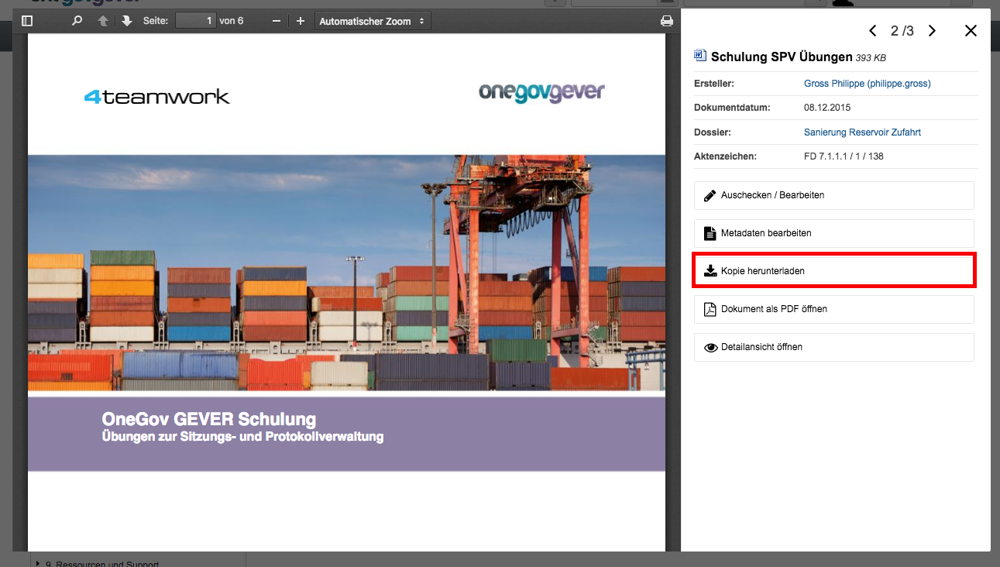
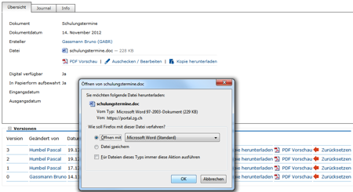

Dokumentenversionen
===================
Bei jedem Eincheck-Vorgang wird eine neue Version des Dokuments
gespeichert. Klickt man von der Eigenschaften-Maske des Dokuments aus
auf *Versionen*, werden diese Versionen mit folgenden Informationen
angezeigt: Versionsnummer, Bearbeiter/In, Zeitpunkt der Änderung (inkl.
Erstellungsdatum „Initialversion“), Kommentar (falls beim Einchecken
angegeben).

Mögliche Aktionen:

-  **Kopie herunterladen:** Mit Klick auf Datei wird die Datei im
   Originalformat (nicht in pdf) aufgerufen. Hinweis: Eine Datei kann
   von hier aus nicht direkt bearbeitet werden (schreibgeschützter
   Modus)! Sie kann aber beispielsweise heruntergeladen werden

-  **PDF Vorschau:** Mit Klick auf die PDF Vorschau wird die
   entsprechende Version im PDF-Format angezeigt. Voraussetzung: Ein
   externer PDF-Rendition-Dienst ist vorhanden und in OneGov GEVER
   entsprechend konfiguriert.

-  **Zurücksetzen:** Zurücksetzen legt eine frühere Version über die
   aktuelle. Beispiel:

Versionen im Originalformat herunterladen (ohne auszuchecken)
~~~~~~~~~~~~~~~~~~~~~~~~~~~~~~~~~~~~~~~~~~~~~~~~~~~~~~~~~~~~~

OneGov GEVER öffnet eingecheckte Dokumente stets im Lese-Modus.Will man
den Inhalt einer Datei bearbeiten, muss diese bekanntlich ausgecheckt
werden. Wenn man jedoch die Originaldatei (z.B. Word, Excel) ansehen,
auf den Arbeitsplatz speichern oder Inhalte aus der Originaldatei
herauskopieren will, kann man diese in der Datei-Übersicht (aktuelle
Version) oder in den Versionen (alle Versionen) mit "Kopie
herunterladen" downloaden.

|img-dokumente-15|

Vorgehen und Möglichkeiten beim Versionen-Download:

-  Aufklappen der Versionen über das [+]-Symbol (Dokument muss nicht
   ausgecheckt werden)

-  Anklicken der Option "Kopie herunterladen" bei der aktuellsten oder
   bei einer älteren Version (siehe Screenshot oben).

-  Je nach Web-Browser erscheint ein Dialogfenster mit folgenden
   Optionen:

   -  | Öffnen: Die Originaldatei wird schreibgeschützt im
        Standard-Programm (Word, Excel, etc.) geöffnet. Somit können
        Inhaltspassagen gelesen oder herauskopiert werden. Bei diesen
        Aktionen kann die Datei danach einfach wieder geschlossen
        werden. Ändert man jedoch etwas am Inhalt dieser
        schreibgeschützten Datei, so erscheint der übliche
        Speichern-Dialog von Microsoft Office.
      | **Achtung:** Die Datei wird in diesem Fall auf dem PC
        abgespeichert - die Änderungen werden nicht nach OneGov GEVER
        übernommen.

   -  *Speichern*: Wählen Sie diese Option, wenn Sie die Originaldatei
      auf Ihrem PC abspeichern wollen. Die Datei kann unter dem
      aktuellen Namen *[Speichern]* oder einem neuen Namen *[Speichern
      unter]* im Filesystem abgespeichert und dort für andere Zwecke
      verwendet werden. Am Dokument in OneGov GEVER ändert sich dadurch
      ebenfalls nichts.

**Im Chrome:**

|img-dokumente-16|

**Im Internet Explorer:**

|image67|

**Im Firefox:**

|image68|

Dieses Vorgehen ermöglicht die Verwendung der Originaldatei eines
GEVER-Dokuments zu anderen Zwecken (z.B. Text kopieren), ohne dass man
dazu das Dokument auschecken muss.

|img-dokumente-17|

.. |image67| image:: ../img/media/image67.png

.. |img-dokumente-17| image:: ../img/media/img-dokumente-17.png

.. disqus::
