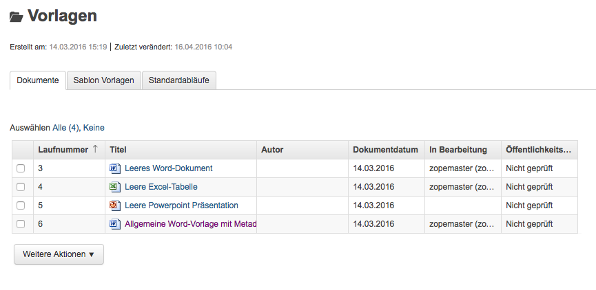
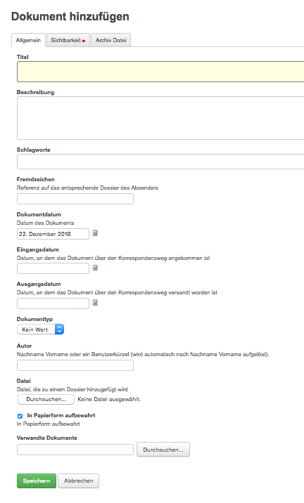

.. _label-dokumentvorlage:

Dokumentvorlagen verwalten
--------------------------

Dokumentvorlagen
~~~~~~~~~~~~~~~~

Die Anwendungskomponente *Vorlagen* befindet sich in der
GEVER-Übersichtsleiste und beinhaltet die Menüs *Dokumente* und
*Standardabläufe* (siehe auch :ref:`kapitel-standardablaeufe`).

|img-dokumentvorlagen-1|

Verwendungszweck von Dokumentvorlagen
~~~~~~~~~~~~~~~~~~~~~~~~~~~~~~~~~~~~~

Die Vorlagen in OneGov GEVER dienen als Grundlage für neu zu erstellende
Dokumente und unterscheiden sich in ihrer Funktion von den aus Microsoft
Office bekannten Vorlagen-Formaten und deren Anwendungsmöglichkeiten.
Die in OneGov GEVER abgelegten Vorlagen werden deshalb anders als die
Office-Vorlagenformate (.dot, .xlt, .pot) im normalen Office-Format
(.doc, .xls, .ppt) in OneGov GEVER gespeichert und verwendet. Beim
Erstellen eines Dokuments aus einer Vorlage wird denn auch „nur“ eine Kopie der
abgelegten Vorlage geöffnet und zur Bearbeitung als neues Dokument in
OneGov GEVER angelegt.

Eine neue Dokumentvorlage erstellen
~~~~~~~~~~~~~~~~~~~~~~~~~~~~~~~~~~~~~~

Im Bereich *Vorlagen* können über *Hinzufügen -> Dokument* analog zum
Erstellen von Dokumenten in Dossiers neue Vorlagen-Dokumente erstellt
werden. Unter *Datei* kann dazu die zuvor im eigenen Filesystem
erstellte und gespeicherte Vorlage (z.B. Office-Datei) hinaufgeladen
werden. Dabei ist bei Office-Dateien wie schon erwähnt darauf zu achten,
dass die Datei im normalen Office-Format (z.B. ".doc") heraufgeladen
wird. Nach dem Speichern ist die Vorlage in OneGov GEVER abgelegt und
kann beim Erstellen von Dokumenten aus Vorlagen ausgewählt werden.

|img-dokumentvorlagen-2|

Dokumentenvorlagen bearbeiten / löschen
~~~~~~~~~~~~~~~~~~~~~~~~~~~~~~~~~~~~~~~

Das nachträgliche Bearbeiten von Vorlagen funktioniert analog zur
Bearbeitung von normalen Dokumenten. Sie können die Metadaten
(*Metadaten bearbeiten*, z.B. Titel, Datum) sowie den Inhalt
(*Auschecken und bearbeiten*) Ihrer Vorlagen jederzeit ändern. Die
inhaltlichen Änderungen können durch das Zurücksetzen auf eine vorherige
Version jederzeit rückgängig gemacht werden.

|img-dokumentvorlagen-3|

.. |img-dokumentvorlagen-3| image:: ../img/media/img-dokumentvorlagen-3.png
