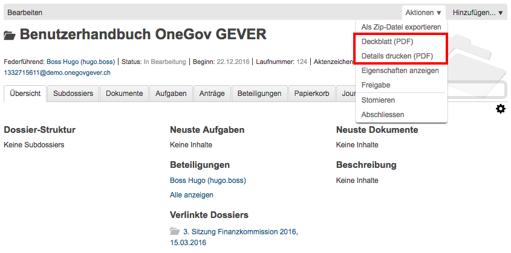
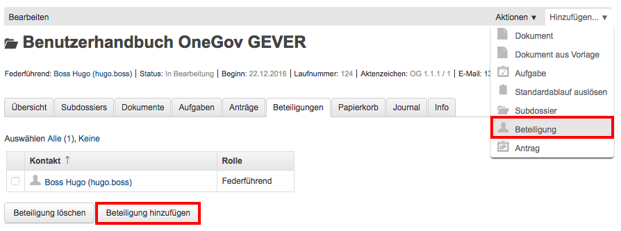
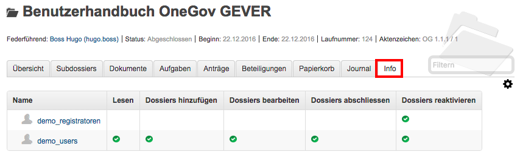
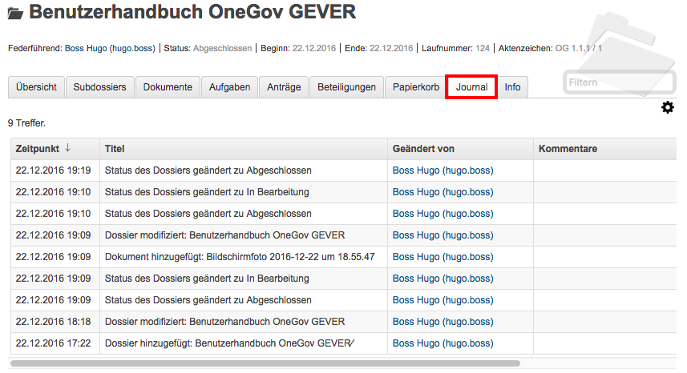

.. _label-dossier-bearbeiten:

Ein Dossier bearbeiten
----------------------

Metadaten eines Dossiers bearbeiten
~~~~~~~~~~~~~~~~~~~~~~~~~~~~~~~~~~~

Klickt man auf *Bearbeiten*, öffnet sich die Dossiermaske, und die
Eigenschaften (Metadaten des Dossiers) können bearbeitet werden.

Deckblatt oder Geschäftsdetails ausdrucken
~~~~~~~~~~~~~~~~~~~~~~~~~~~~~~~~~~~~~~~~~~

|img-dossiers-12|

Über *Aktionen* kann das Deckblatt oder die Geschäftsdetails gedruckt
werden.

Dossier-Eigenschaften anzeigen
~~~~~~~~~~~~~~~~~~~~~~~~~~~~~~

Wählt man die Aktion *Eigenschaften anzeigen*, werden sämtliche
Metadaten des Dossiers angezeigt. Referenzierte Dossiers können von hier
aus direkt ausgewählt werden.

|img-dossiers-13|

.. _label-beteiligungen:

Einem Dossier Beteiligte hinzufügen
~~~~~~~~~~~~~~~~~~~~~~~~~~~~~~~~~~~

In OneGov GEVER werden standardmässig vier Dossier-Rollen unterschieden.
Obligatorisch ist nur die Rolle „Federführung“. Weitere Rollen können
fakultativ zu Dokumentationszwecken vergeben werden.

+----------------------+--------------------------------------------------------------------------------------------------------------------------+
| **Dossier-Rolle**    | **Erläuterung**                                                                                                          |
+======================+==========================================================================================================================+
| *Federführung*       | Verantwortliche(r) SachbearbeiterIn, führt das Dossier, ist für die Vollständigkeit des Dossierinhalts verantwortlich.   |
+----------------------+--------------------------------------------------------------------------------------------------------------------------+
| *Mitwirkung*         | Interne oder externe Beteiligte, die an der Durchführung des Geschäfts aktiv beteiligt sind.                             |
+----------------------+--------------------------------------------------------------------------------------------------------------------------+
| *Schlusszeichnung*   | Besondere Form der Mitwirkung.                                                                                           |
+----------------------+--------------------------------------------------------------------------------------------------------------------------+
| *Kenntnisnahme*      | Keine aktive Beteiligung am Geschäft, erhaltene Dokumente dienen lediglich der Information.                              |
+----------------------+--------------------------------------------------------------------------------------------------------------------------+

.. note::
   - Federführend ist immer eine Person aus dem eigenen Mandanten
   - Weitere Beteiligte können aus demselben oder aus einem anderen Mandanten
     stammen. Externe Beteiligte können ebenfalls ausgewählt werden,
     vorausgesetzt sie sind unter dem Anwendungsbereich Kontakt erfasst.
   - Eine Beteiligung hat keine zusätzlichen *Zugriffsrechte* auf das Dossier
     zur Folge.

Während die :term:`Federführung` direkt in der Eingabemaske des Dossiers
eingegeben wird, werden die übrigen Beteiligungen über *Hinzufügen →
Beteiligung hinzufügen* oder über den Dossier-Reiter *Beteiligungen*
ergänzt.

|img-dossiers-14|

Zunächst wird die gewünschte Person ausgewählt und ihr danach die entsprechende
Rolle zugewiesen. Die Beteiligung wird schliesslich mit *Erstellen* erstellt.

|img-dossiers-15|

Ein Dossier abschliessen
~~~~~~~~~~~~~~~~~~~~~~~~

Die Möglichkeit, Dossiers abzuschliessen ist je nach Konfiguration allen
Benutzern zugänglich oder aber nur für speziell berechtigte Sachbearbeiter.
Im zweiten Fall erscheint diese Aktion nur den speziell berechtigten Personen.

Vor dem Abschluss müssen zudem folgende Abschlussregeln beachtet werden:

- Alle Aufgaben müssen geschlossen sein
- Alle traktandierten Anträge müssen abgeschlossen sein
- Wenn mind. ein Subdossier erstellt wurde, müssen alle Inhalte des Dossiers in Subdossiers verteilt worden sein. (Diese Regel kann bei Bedarf deaktiviert werden.)

Weiter muss das Abschlussdatum beachtet werden. Dieses muss mind. das letzte
Bearbeitungs-Datum des zuletzt bearbeiteten Dokumentes haben. Beim
Dossier-Abschluss wird dies vom System überprüft. Wurde beispielsweise
bei der Dossier-Erstellung bereits ein Datum gewählt, dass jedoch vor dem
zuletzt bearbeiteten Dokument liegt, zeigt OneGov GEVER einen Fehler an und das
Dossier kann nicht abgeschlossen werden, bis das Abschlussdatum manuell
überschrieben wurde.

Wurden alle oben genannten Abschlussregeln überprüft, kann das Dossier
schlussendlich mit der Aktion *Abschliessen* abegschlossen werden.

|img-dossiers-16|

Nach Abschluss des Dossiers wird vom System, wenn diese Option aktiviert ist,
automatisch ein Journal-PDF erstellt. Dieses enhält alle Dossier-Aktivitäten
sowie alle im Dossier erstellen Anträge und Aufgaben.

|img-dossiers-101|

|img-dossiers-102|

Ein Dossier wieder eröffnen und wieder ablegen
~~~~~~~~~~~~~~~~~~~~~~~~~~~~~~~~~~~~~~~~~~~~~~

Dossiers wieder eröffnen können (je nach Konfiguration) nur Personen mit
Sekretariatsrechten bzw. Sachbearbeiter/innen mit entsprechender Berechtigung.
Um ein Dossier wieder zu reaktivieren, wählen Sie *Aktionen → Wieder öffnen*.
Dadurch wird der Status wieder *In Bearbeitung* gesetzt, und das Dossier
kann weiterbearbeitet werden.

Nehmen Sie die gewünschten Änderungen im Dossier vor und wählen Sie
*Aktionen → Abschliessen*.

Falls sich das Ablagejahr nicht verändert hat, wählen Sie *Abschliessen
und die existierende Ablagenummer verwenden*. Andernfalls wählen Sie
*Abschliessen und Ablagenummer neu vergeben*. Einmal gelöschte
Ablagenummern stehen nicht mehr zur Verfügung.

Ein Dossier stornieren
~~~~~~~~~~~~~~~~~~~~~~

Wurde ein Dossier versehentlich eröffnet, kann es mit *Aktionen →
Stornieren* storniert werden. Stornierte Dossiers können nicht mehr
bearbeitet werden. Personen mit Sekretariatsrechten bzw.
Sachbearbeiter/innen mit entsprechender Berechtigung können (je nach
Konfiguration) stornierte Dossiers wieder aktivieren (*Aktionen → Aktivieren*).

Wer hat Zugriff auf das Dossier – der Reiter „Info“
~~~~~~~~~~~~~~~~~~~~~~~~~~~~~~~~~~~~~~~~~~~~~~~~~~~

Unter dem Reiter *Info* ist ersichtlich, welche Gruppen auf das Dossier
Zugriff haben.

Klickt man auf eine Gruppe, werden die Mitglieder angezeigt.

Die Berechtigungen werden auf Stufe Ordnungsposition vergeben und von
dort auf die korrespondierenden Dossiers vererbt.

|img-dossiers-17|

Wer hat wann, was gemacht – der Reiter „Journal“
~~~~~~~~~~~~~~~~~~~~~~~~~~~~~~~~~~~~~~~~~~~~~~~~

Unter dem Reiter *Journal* wird angezeigt, wer wann welche Veränderungen
am Dossier vorgenommen hat. Das Journal dient der :term:`Nachvollziehbarkeit`.
Es kann nicht bearbeitet werden.

|img-dossiers-18|

ZIP-Export
~~~~~~~~~~

Ein komplettes Dossier kann als ZIP-Datei verpackt und heruntergeladen werden.

1. Navigieren Sie in das Dossier, welches Sie exportieren wollen.

2. Öffnen Sie das "Aktionen" Menü und klicken auf "Als ZIP-Datei
   exportieren"

3. Wählen Sie den Speicherort für die ZIP-Datei aus.

.. note::

   Es besteht ebenfalls die Möglichkeit, eine Auswahl von Dokumenten als
   ZIP-Datei zu exportieren. Die Anleitung hierzu finden Sie unter
   :ref:`label-dokumente-zip-export`.

.. |img-dossiers-13| image:: ../img/media/img-dossiers-13.png

.. |img-dossiers-15| image:: ../img/media/img-dossiers-15.png
.. |img-dossiers-16| image:: ../img/media/img-dossiers-16.png

.. |img-dossiers-100| image:: ../img/media/img-dossiers-100.png
.. |img-dossiers-101| image:: ../img/media/img-dossiers-101.png
.. |img-dossiers-102| image:: ../img/media/img-dossiers-102.png

.. disqus::
