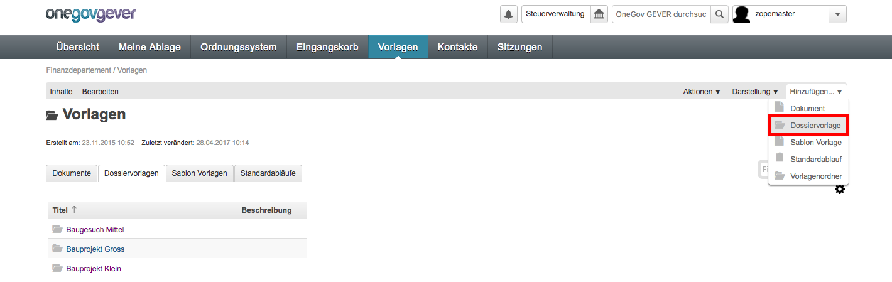
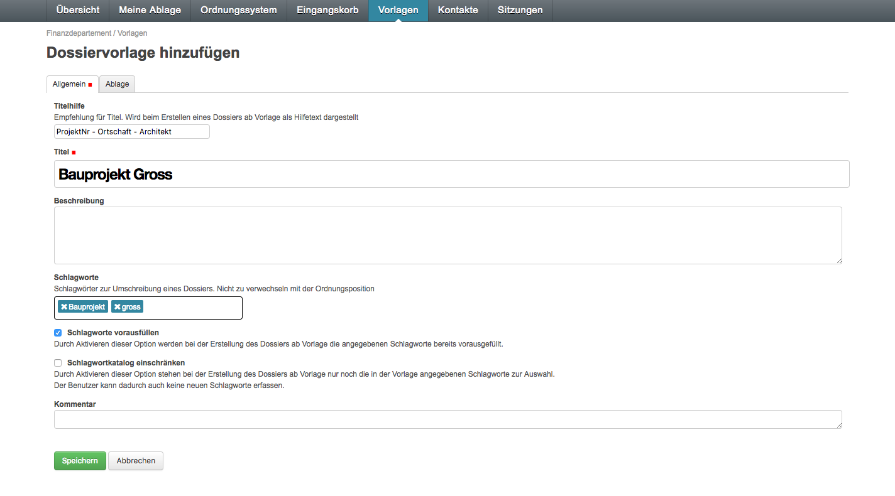
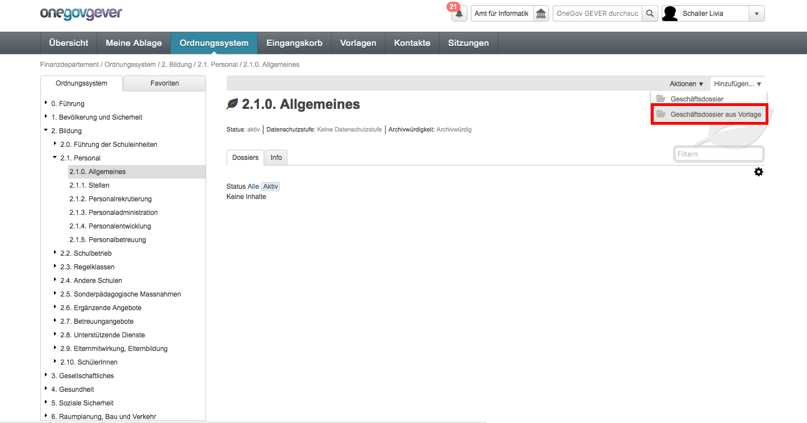
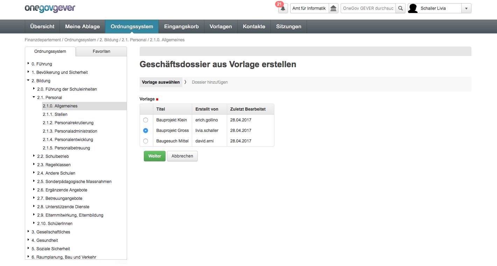
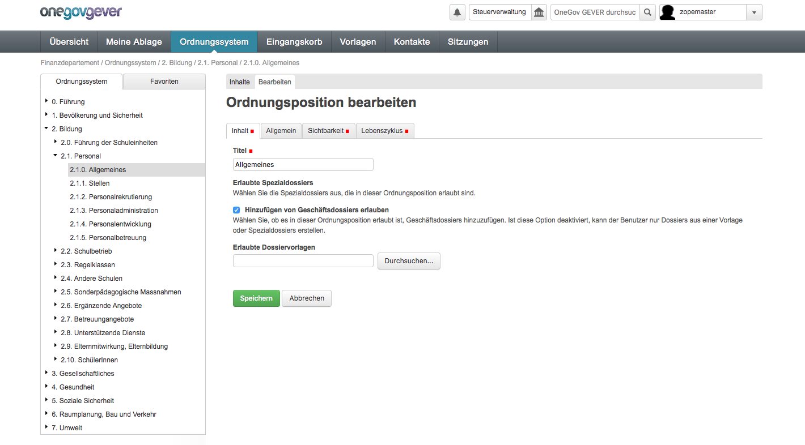
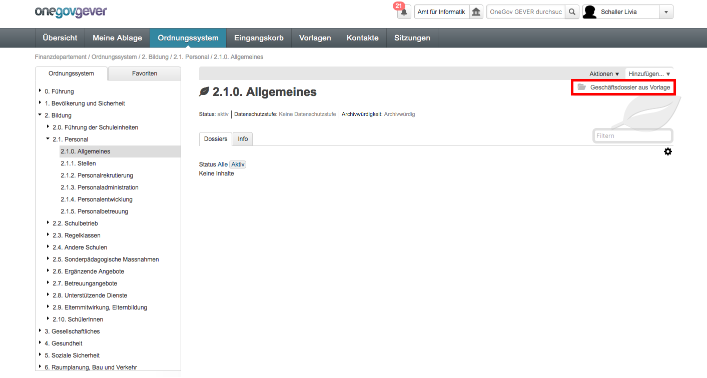

Mit Dossiervorlagen arbeiten
----------------------------

Dossiervorlagen eignen sich, um Dossiers vom gleichen Typ (z.B. Baugesuch)
jeweils gleich aufzubauen. Wichtig dabei ist, dass es sich bei der Erstellung
eines Dossiers ab Vorlage danach um ein eigenständiges Dossier handelt, welches
nicht mehr auf die Vorlage referenziert wird.

Das Feature kann ab Version 2017.2 aktiviert werden.

Erstellung Dossiervorlage
~~~~~~~~~~~~~~~~~~~~~~~~~

Unter Vorlagen findet sich der Reiter "Dossiervorlagen". Benutzer mit der
Berechtigung, Dokumentvorlagen zu erstellen, können ebenfalls Dossiervorlagen
erstellen.

|img-dossiervorlagen-1|

Eine neue Dossiervorlage kann unter "Hinzufügen" ergänzt werden.

|img-dossiervorlagen-2|

In der sich öffnenden Maske können folgende Felder abgefüllt werden:

-  *Titelhilfe:* Im Feld Titelhilfe kann eine Empfehlung für den Titel
    angegeben werden, damit alle Dossiers aus dieser Vorlage im gleichen Stil
    benannt werden.
-  *Titel:* Titel der Dossiervorlage
-  *Beschreibung:* Beschreibung des Einsatzes der Dossiervorlage
-  *Schlagwörter:* Zur Umschreibung des Dossiers können Schlagwörter gesetzt
    werden. Dabei können folgende beiden Optionen angewählt werden:
-  *Checkbox "Schlagwörter vorausfüllen":*
    Durch Aktivieren dieser Option werden bei der Erstellung des Dossiers ab
    Vorlage die angegebenen Schlagwörter bereits vorausgefüllt.
-  *Checkbox "Schlagwortkatalog einschränken"":*
    Durch Aktivieren dieser Option stehen bei der Erstellung des Dossiers ab
    Vorlage nur noch die in der Vorlage angegebenen Schlagwörter zur Auswahl.
    Der Benutzer kann dadurch auch keine neuen Schlagwörter erfassen.
-  *Kommentar:* Zusätzliche Bemerkungen können im Kommentar-Feld gemacht werden.

Zuletzt die Aktion mit "Speichern" abschliessen. Ab diesem Zeitpunkt kann die
Dossiervorlage von allen OneGov GEVER-Benutzern des Mandanten eingesetzt werden.
(Insofern keine Einschränkung definiert wurde. Siehe dazu Abschnitt
"Einschränkung der Dossiervorlage".)

.. note::
   - Wird bei der Dossiervorlage eine Titelhilfe definiert, dann wird beim Hinzufügen der Dossiervorlage der Titel NICHT übernommen.
   - Wird bei der Dossiervorlage KEINE Titelhilfe definiert, dann wird der Dossiertitel beim Hinzufügen der Dossiervorlage verwendet.

|img-dossiervorlagen-3|

Einsatz Dossiervorlage
~~~~~~~~~~~~~~~~~~~~~~

Zum Einfügen einer Dossiervorlage auf gewünschter Ordnungspositonsstufe oben
rechts auf "Hinzufügen" klicken und Geschäftsdossier aus Vorlage anwählen.

|img-dossiervorlagen-4|

Danach erscheinen die für diese Ordnungsposition zugelassenen Dossiervorlagen.
Gewünschte Dossiervorlage anklicken.

|img-dossiervorlagen-5|

Danach öffnet sich die bekannte Dossiermaske mitsamt Hinweisen auf den Titel
sowie den definierten Schlagwörter. (Im Beispiel unten wurde definiert, dass
die Schlagwörter nicht vorausgefült werden, aber nur jene welche im
Vorlagendossier definiert wurden, ausgewählt werden können.)

|img-dossiervorlagen-6|

Einschränkung der Dossiervorlage
~~~~~~~~~~~~~~~~~~~~~~~~~~~~~~~~

Benutzer welche die Rolle besitzen, neue Ordnungspositionen zu ergänzen,
können ebenfalls den Einsatz der Geschäftsdossiervorlagen einschränken. Dazu
muss auf gewünschter Ordnungspositionsstufe auf "Bearbeiten" geklickt werden.
Folgende Bearbeitungsmaske öffnet sich:

|img-dossiervorlagen-7|

Per Default ist die Checkbox "Hinzufügen von Geschäftsdossiers erlauben"
angewählt. Wird dies deaktiviert, können nur noch Dossiers aus einer Vorlage
hinzugefügt werden.

Der Abschnitt "Erlaubte Dossiervorlagen" bietet die Möglichkeit, die Anzeige
der Dossiervorlage einzuschränken. Dazu kann über "Durchsuchen" zu den
gwünschten Dossiervorlagen navigiert und diese angewählt werden.

|img-dossiervorlagen-8|
|img-dossiervorlagen-9|

Im nachstehenden Beispiel unten wird die Situation simuliert, wenn die
Checkbox "Hinzufügen von Geschäftsdossiers erlauben" deaktiviert ist und die
Anzeige der Dossiers auf Baugesuch Mitte und Bauprojekt Klein eingeschränkt
wurde.

|img-dossiervorlagen-10|
|img-dossiervorlagen-11|

.. |img-dossiervorlagen-1| image:: ../img/media/img-dossiervorlagen-1.png

.. |img-dossiervorlagen-6| image:: ../img/media/img-dossiervorlagen-6.png

.. |img-dossiervorlagen-8| image:: ../img/media/img-dossiervorlagen-8.png
.. |img-dossiervorlagen-9| image:: ../img/media/img-dossiervorlagen-9.png

.. |img-dossiervorlagen-11| image:: ../img/media/img-dossiervorlagen-11.png
