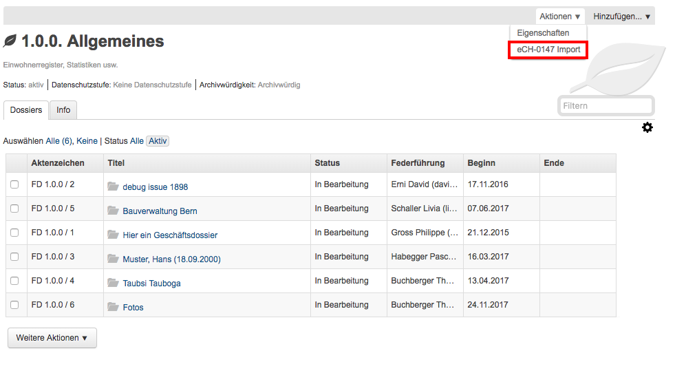

.. _label-ech-schnittstelle:

Import / Export eCH-0147 Schnittstelle
--------------------------------------

OneGov GEVER bietet den Import und Export gemäss `eCH-0147 <https://www.ech.ch/vechweb/page?p=dossier&documentNumber=eCH-0147>`_ an (basierend auf `eCH-0039 <https://www.ech.ch/vechweb/page?p=dossier&documentNumber=eCH-0039>`_).

Export
~~~~~~
Der Export kann auf zwei Stufen erfolgen:

1. Dossiers können mit den Dossier-Metadaten auf Stufe Rubrik exportiert werden (Dossiers mitsamt ihren Dokumenten in der Dossier-Auflistung)

2. Dossiers können ohne Dossier-Metadaten (nur Dokumente des Dossiers) auf Stufe Dossier exportiert werden.

Import
~~~~~~

Der Import eines Dossiers kann ebenfalls auf Stufe Rubrik sowie Stufe Dossier
durchgeführt werden.

|img-ech-schnittstelle-1|
|img-ech-schnittstelle-2|
|img-ech-schnittstelle-3|

.. |img-ech-schnittstelle-1| image:: ../img/media/img-ech-schnittstelle-1.png
.. |img-ech-schnittstelle-2| image:: ../img/media/img-ech-schnittstelle-2.png

