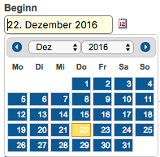
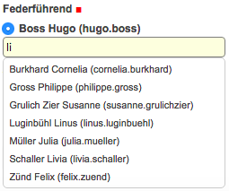
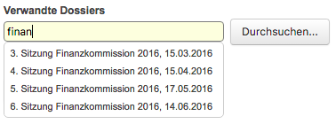
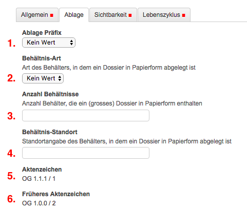
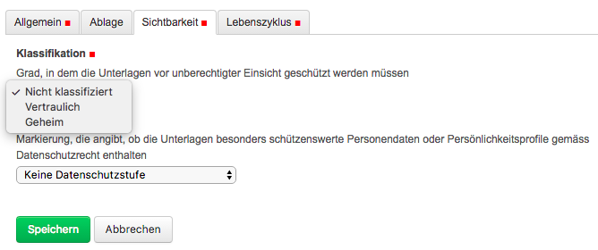

.. _label-dossier-erstellen:

Ein neues Dossier eröffnen
--------------------------

Um ein neues :term:`Dossier` zu eröffnen, klicken Sie auf die
:term:`Ordnungsposition`, unter der das Dossier erfasst werden soll, und wählen
Sie *Hinzufügen Geschäftsdossier*.

|img-dossiers-1|

.. note::
   Ein Dossier kann jeweils nur auf der untersten Gliederungsstufe des
   Ordnungssystems (sog. :term:`Rubrik`) hinzugefügt werden, z.B. unter 1.2.3,
   nicht aber unter 1.2.

   Alle Elemente in OneGov GEVER (Dokumente, Mails,
   Subdossiers, Aufgaben, usw.) müssen in ein Dossier abgelegt werden.
   Ohne ein Dossier ist die Nutzung dieser Elemente nicht möglich.

Die Erfassungsmaske ist in die vier Reiter *Allgemein*, *Ablage*,
*Sichtbarkeit*, *Lebenszyklus* gegliedert. Der jeweils aktive Reiter ist
grau hinterlegt. Obligatorische Felder sind mit einem roten Quadrat
markiert.

|img-dossiers-2|

Reiter Allgemein
~~~~~~~~~~~~~~~~

Für die Erfassung eines Geschäfts ist der Reiter *Allgemein* der
wichtigste. In der Regel genügt es, diese Felder auszufüllen, allenfalls
ist noch die Ablage zu ergänzen.

|img-dossiers-3|

Nachfolgend eine Beschreibung der verschiedenen Eingabefelder und
Reiter.

1. **Titel**: Im Titel wird der Geschäftsinhalt kurz, prägnant und
   zusammenhängend beschrieben. Der Titel enthält die Kerninformationen
   zu einem Geschäft. Er sollte so gewählt werden, dass auch eine dritte
   Person versteht, worum es geht. Abkürzungen sind deshalb zu
   vermeiden.

2. **Beschreibung:** Ausführliche Beschreibung des Geschäfts
   (fakultativ).

   Informationen, die im Titelfeld nicht Platz haben, können im Feld
   Beschreibung ergänzt werden. Die Gliederung erfolgt primär durch
   Satzzeichen. Absätze und Leerzeilen im Hinblick auf die digitale
   Archivierung bitte ganz vermeiden.

   Bei der Suche wird das Feld Beschreibung (wie die übrigen
   Textfelder) ebenfalls berücksichtigt; in der Dossierliste wird
   jedoch nur der Titel angezeigt. Die zentralen, identifizierenden
   Geschäftsinformationen müssen daher im Titelfeld enthalten sein.

3. **Schlagwörter:** Zusätzlich zu Titel und Beschreibung kann das
   Dossier mit Schlagwörter versehen werden.

4. **Beginn:** Das Beginndatum eines Geschäfts entspricht dem ersten
   Dokument eines Dossiers. Standardmässig wird in OneGov GEVER das
   aktuelle Tagesdatum vorgegeben. Das Datum kann auf zwei Arten
   angepasst werden:

    a) Mit Klick auf das Kalendersymbol öffnet sich ein elektronischer
    Kalender, mit dem das gewünschte Datum ausgewählt werden kann; das
    aktuelle bzw. gewählte Datum ist farbig markiert.

    |img-dossiers-4|

    b) Manuelle Eingabe des gewünschten Datums, z.B. 23.9.2017

5. **Ende:** Das letzte Dokument bestimmt das Enddatum eines Dossiers
   und zugleich das Jahr, in dem es abgelegt wird. Die Eingabe erfolgt
   analog zum Beginndatum.

6. **Kommentar:** Das Feld Kommentar kann für Erläuterungen zum Dossier
   oder zum Dossierverlauf verwendet werden.

7. **Externe Referenz:** Das Feld Externe Referenz kann verwendet werden, um
   Fremdschlüssel und Verknüpfungen auf Daten in Drittsystemen zu speichern.

8. **Federführend:** Federführend ist diejenige Person, die für die
   Führung des Dossiers verantwortlich ist. Federführend ist immer eine
   Person aus dem eigenen Mandanten. Standardmässig schlägt OneGov GEVER
   im Feld Federführend die angemeldete Person vor. Änderung der
   :term:`Federführung`: Im Textfeld werden mindestens zwei Buchstaben des Vor-
   oder Nachnamens oder das Kürzel eingegeben. Aus der darauf
   erscheinenden Liste wird die gewünschte Person mit Klick
   ausgewählt.

   |img-dossiers-5|

   Die Auswahlliste zeigt aus Platzgründen nur die
   ersten zehn Treffer an. Falls Sie die gewünschte Person in der Liste
   nicht finden, müssen Sie weitere Buchstaben des Namens eingeben.

9. **Verwandte Dossiers:** Mit diesem Feld kann auf verwandte Dossiers
   verwiesen werden.

   a) Kennt man den Dossiertitel oder Bestandteile davon, wird der Text
      direkt ins Feld eingegeben. Darauf erscheint die in Frage kommende
      Liste, aus der das gewünschte Dossier ausgewählt werden
      kann.

      |img-dossiers-6|

   b) Kennt man den Dossiertitel nicht, klickt man auf "hinzufügen" und
      navigiert durch das Ordnungssystem. Mehrfachauswahl ist mit der
      Ctrl-Taste möglich

      |img-dossiers-7|

   Die referenzierten Dossiers können unter den Eigenschaften eines
   Dossiers aufgerufen werden.

Reiter Ablage
~~~~~~~~~~~~~

Die Felder unter diesem Reiter beziehen sich auf die Papierablage des
Dossiers. Sie sind alle fakultativ.

|img-dossiers-8|

1. **Ablage-Präfix:** Im Pulldown-Menü kann die Ablage ausgewählt
   werden, z.B. Amt, Leitung, Direktionssekretariat, Regierungsrat

2. **Behältnisart:** Dossier, Ordner, Schachtel

3. **Anzahl Behältnisse:** Anzahl Dossiers etc.

4. **Behältnis-Standort:** Standort der Dossiers. Dieses Feld ist dann
   nützlich, wenn es für die Ablage mehrere Standorte gibt.

5. **Aktenzeichen:** Aktenzeichen des Dossiers, das sich aus dem Kürzel
   des Mandanten, der Nummer der Ordnungsposition, unter der das Dossier
   abgelegt ist, und einer fortlaufenden Dossiernummer (bezogen auf die
   Ordnungsposition) zusammensetzt.

6. **Früheres Aktenzeichen:** Wird ein Dossier von einer
   Ordnungsposition unter eine andere verschoben, wird in diesem Feld
   automatisch das frühere Aktenzeichen eingetragen. Das Feld bleibt leer,
   wenn kein früheres Aktenzeichen vorhanden ist.

Reiter Sichtbarkeit
~~~~~~~~~~~~~~~~~~~

In den angezeigten Feldern sind bereits jene Werte eingetragen, die auf
Stufe Ordnungsposition hinterlegt sind. Bei Bedarf können die Werte auf
dieser Stufe verschärft, aber nicht abgeschwächt werden.

Beispiel: In diesem konkreten Fall kann statt „Nicht klassifiziert“ der
Wert „Vertraulich“ gewählt werden. Jedoch kann der *Öffentlichkeitsstatus*
nicht auf „öffentlich“ gesetzt werden.

|img-dossiers-9|

Reiter Lebenszyklus
~~~~~~~~~~~~~~~~~~~

In den Feldern des Reiters *Lebenszyklus* werden jene Werte angezeigt,
die bei der korrespondierenden Ordnungsposition hinterlegt sind. Diese können
bei Bedarf übersteuert werden.

|img-dossiers-10|

Dossieransicht nach dem Speichern
~~~~~~~~~~~~~~~~~~~~~~~~~~~~~~~~~

|img-dossiers-11|

1. **Dossiertitel** Anzeige des im Titelfeld des Dossiers eingetragenen Textes
   (Geschäftstitel)

2. **Byline:** In der Byline befinden sich weitere zentrale
   Informationen zum Dossier.

   -  *Federführung*: Federführender Sachbearbeiter, federführende
      Sachbearbeiterin

   -  *Status*: Bei der Eröffnung eines Dossiers wird automatisch der Status
      „In Bearbeitung“ gesetzt. Weitere Status-Werte sind: „Abgeschlossen“,
      „Storniert“. Sie können bei entsprechenden Rechten über „Weitere
      Aktionen“ ausgewählt werden.

   -  *Beginn*: Beginn-Datum

   -  *Ende*: Ende-Datum (wird erst angezeigt, wenn eingetragen)

   -  *Laufnummer*: Fortlaufende Dossiernummer (unabhängig davon, ob es sich
      um ein Dossier oder um ein :term:`Subdossier` handelt)

   -  *Aktenzeichen*: Das Aktenzeichen eines Dossiers setzt sich aus
      folgenden Elementen zusammen: Kürzel Mandant, Nummer der
      Ordnungsposition, Dossierzähler unterhalb der Ordnungsposition (in
      unserem Beispiel: OG 1.1.1 / 1)

   -  *Ablagenummer*: Diese wird erst angezeigt, wenn nach Abschluss des
      Dossiers eine Ablagenummer vergeben worden ist.

   -  *E-Mail-Adresse*: Über die E-Mail-Adresse des Dossiers können beliebige
      E-Mails in OneGov GEVER importiert werden.

3. **Bearbeitungsmöglichkeiten:** Oberhalb des Dossiertitels stehen
   verschiedene Bearbeitungsmöglichkeiten und weitere Aktionen zur Verfügung.

4. **Reiter des Dossiers:** Die Inhalte des Geschäfts sind unter
   verschiedenen Dossierreitern abgelegt. Der standardmässig
   eingeblendete Reiter *Übersicht* zeigt die neusten Inhalte der Reiter
   Subdossier, Dokumente, Aufgaben und Beteiligungen an. Ausserdem
   zeigt er den Text im Feld Beschreibung an, sofern dieses Feld
   ausgefüllt wurde. Der Reiter *Journal* listet auf, wer wann welche
   Aktionen auf Stufe Dossier durchgeführt hat. Unter dem Reiter *Info*
   können die Zugriffsberechtigungen überprüft werden. Der Reiter *Anträge*
   wird nur eingeblendet, wenn das Modul "Sitzungs- und Protokollverwaltung"
   aktiviert wurde.

.. |img-dossiers-1| image:: ../img/media/img-dossiers-1.png
.. |img-dossiers-2| image:: ../img/media/img-dossiers-2.png
.. |img-dossiers-3| image:: ../img/media/img-dossiers-3.png

.. |img-dossiers-7| image:: ../img/media/img-dossiers-7.png

.. |img-dossiers-10| image:: ../img/media/img-dossiers-10.png
.. |img-dossiers-11| image:: ../img/media/img-dossiers-11.png
