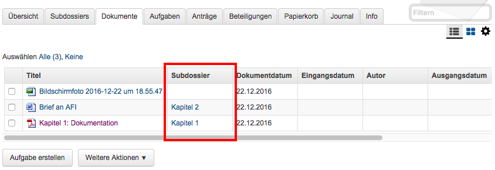
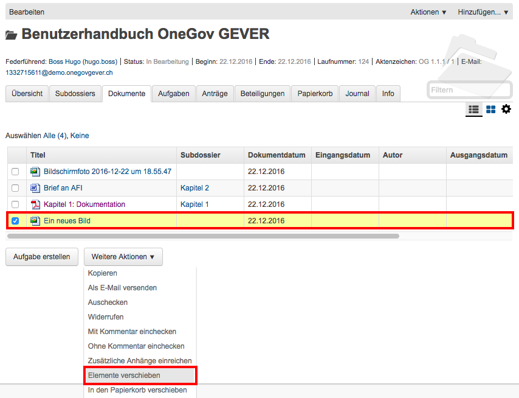

.. _label-mit-dossiers-arbeiten:

Mit Subdossiers arbeiten
------------------------

Subdossier eröffnen
~~~~~~~~~~~~~~~~~~~

Wählen Sie auf dem Hauptdossier *Hinzufügen → Subdossier*.

Die Erfassungsmasken von Haupt- und Subdossiers sind identisch (siehe
:ref:`label-dossier-erstellen`). Die federführende
Person wird automatisch vom Hauptdossier übernommen, kann aber geändert werden. Unter
einem Hauptdossier können beliebig viele Verschachtelungsstufen von Subdossiers
eröffnet werden; standardmässig ist dies jedoch auf eine Hierarchiestufe
beschränkt.

Subdossier bearbeiten
~~~~~~~~~~~~~~~~~~~~~

Die Bearbeitung eines Subdossiers ist identisch zur Bearbeitung von
Hauptdossiers (siehe :ref:`label-dossier-bearbeiten`).

Dossiers mit Subdossiers abschliessen
~~~~~~~~~~~~~~~~~~~~~~~~~~~~~~~~~~~~~

Regeln für den Abschluss von Dossiers mit Subdossiers
^^^^^^^^^^^^^^^^^^^^^^^^^^^^^^^^^^^^^^^^^^^^^^^^^^^^^

Die folgenden Bedingungen müssen erfüllt sein, damit ein Dossier mit
Subdossiers erfolgreich abgeschlossen werden kann:

1. Alle Dokumente müssen eingecheckt sein.

2. Alle Aufgaben müssen abgeschlossen sein.

3. Alle Dokumente und alle Aufgaben müssen in Subdossiers versorgt sein.

4. Alle Subdossiers erhalten automatisch das Ende-Datum des
   Hauptdossiers. Dieses richtet sich nach dem jüngsten Dokument in den
   Subdossiers. Falls ein Subdossier ein anderes Ende-Datum haben soll,
   muss dieses manuell unter *Bearbeiten* eingetragen werden.

Verschieben von Elementen aus dem Hauptdossier in Subdossiers
^^^^^^^^^^^^^^^^^^^^^^^^^^^^^^^^^^^^^^^^^^^^^^^^^^^^^^^^^^^^^

Ob Dokumente (bzw. Aufgaben) in Subdossiers versorgt sind oder nicht,
ist auf der Ebene des Hauptdossiers unter dem Reiter Dokumente (bzw.
Aufgaben) ersichtlich:

|img-subdossiers-1|

In der Auflistung der Dokumente wird angezeigt, welchem
Subdossier sie zugeordnet sind. Fehlt eine Angabe, so liegt das Dokument
noch in keinem Subdossier.

Verschieben von Dokumenten in ein Subdossier
^^^^^^^^^^^^^^^^^^^^^^^^^^^^^^^^^^^^^^^^^^^^

Markieren Sie das entsprechende Dokument (bzw. mehrere
Dokumente) und wählen Sie *Weitere Aktionen → Elemente
verschieben*.

|img-subdossiers-2|

Geben Sie im Textfeld den Titel des Zieldossiers ein (oder navigieren
Sie mit dem Knopf *Hinzufügen* im Ordnungssystem). Mit dem Knopf
*Verschieben* wird das Dokument in das gewählte Subdossier gelegt.

|img-subdossiers-3|

Analog können so auch Aufgaben oder sogar ganze Dossiers verschoben werden.

Abschliessen und Ablegen
~~~~~~~~~~~~~~~~~~~~~~~~

Automatisches Abschliessen aller Subdossiers
^^^^^^^^^^^^^^^^^^^^^^^^^^^^^^^^^^^^^^^^^^^^

Wählen Sie auf der Stufe Hauptdossier die Aktion
*Abschliessen* und gehen Sie anschliessend vor, wie beim Abschluss eines
Dossiers ohne Subdossiers. Die Subdossiers werden automatisch auch
abgeschlossen. Sowohl das Hauptdossier als auch alle Subdossiers
erhalten dabei das Datum des jüngsten Dokuments der Subdossiers.

Manuelles Abschliessen der Subdossiers
^^^^^^^^^^^^^^^^^^^^^^^^^^^^^^^^^^^^^^

Die Subdossiers können auch einzeln abgeschlossen werden. Setzen Sie
dazu das Ende-Datum manuell ein. Beim Abschliessen des
Hauptdossiers bleiben die manuell gesetzten Daten der
Subdossiers erhalten, das Hauptdossier erhält das Ende-Datum des
jüngsten Dokuments der Subdossiers.

Aufbau der Ablagenummer bei Dossiers mit Subdossiers
^^^^^^^^^^^^^^^^^^^^^^^^^^^^^^^^^^^^^^^^^^^^^^^^^^^^

Hauptdossier: ``SKA ARCH-Amt-2011-5``

Subdossier 1: ``SKA ARCH-Amt-2011-5.1``

Subdossier 2: ``SKA ARCH-Amt-2011-5.2``

Ein Subdossier wieder öffnen
~~~~~~~~~~~~~~~~~~~~~~~~~~~~

Wenn ein :term:`Subdossier` wiedereröffnet werden soll, muss zuerst das
Hauptdossier wieder offen sein. Anschliessend kann das Subdossier
bearbeitet werden.

