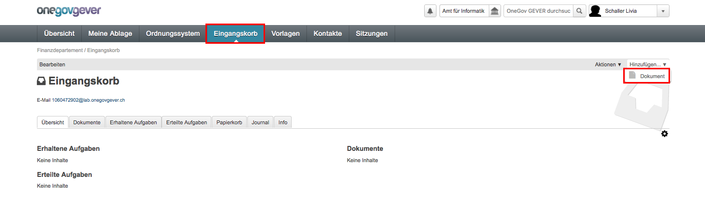
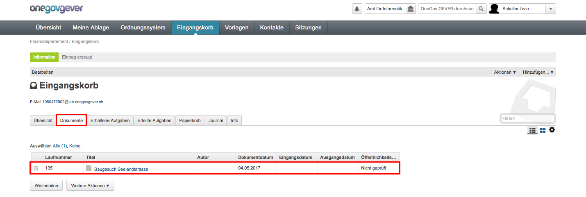
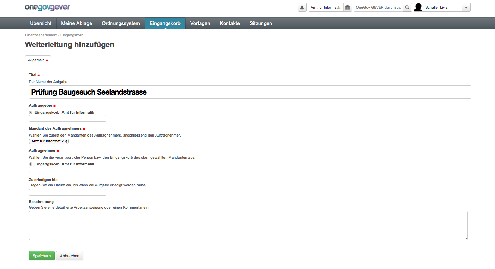
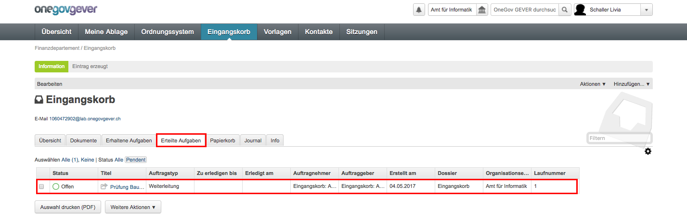
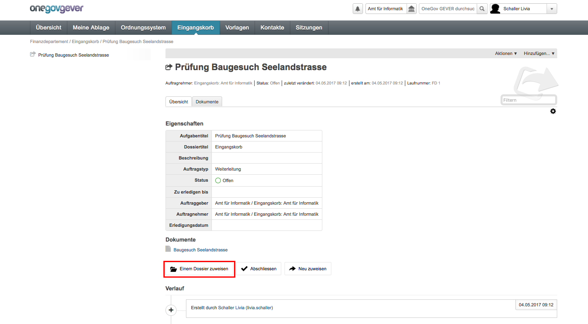
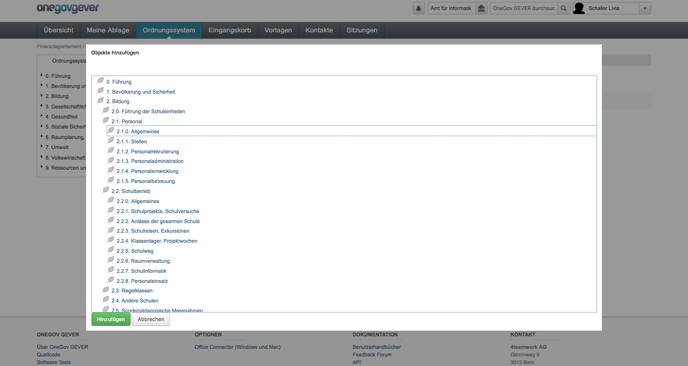
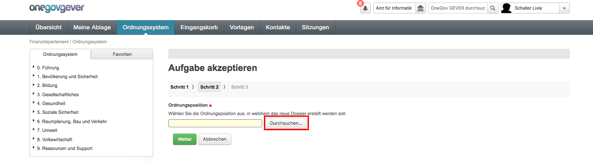
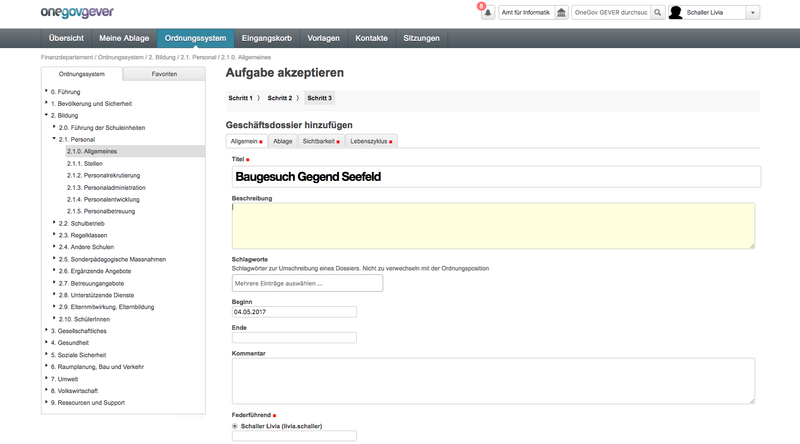
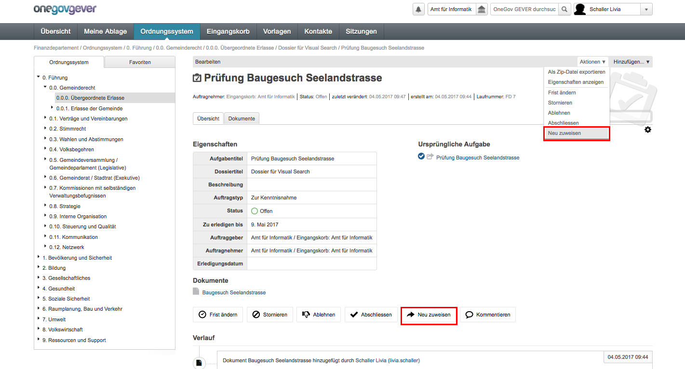
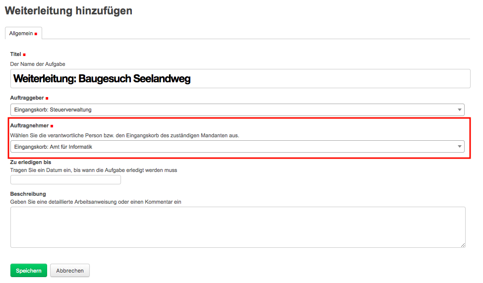

.. _label-eingangskorb:

Nutzung Eingangskorb
====================

Funktion Eingangskorb
---------------------

Posteingänge, die auf Stufe Amt/Direktion nachgewiesen werden sollen,
werden im Eingangskorb erfasst und von dort aus entweder einem
Sachbearbeiter zugewiesen oder an einen anderen (den zuständigen)
Mandanten weitergeleitet.

.. note::
   Für die Erfassung von Posteingängen sind besondere Rechte notwendig;
   standardmässig sind diese den Personen mit der Rolle *Sekretariat* oder
   *Leitung* zugewiesen.

Einen Posteingang erfassen
--------------------------

Als erstes wird die zu erfassende Unterlage importiert. Handelt es sich
um ein Dokument, wird es mit *Hinzufügen → Dokument* hinaufgeladen.

|img-eingangskorb-1|

Handelt es sich um eine E-Mail, wird das Dokument über die
E-Mail-Adresse des Eingangskorbs importiert.

Die Dokumente erscheinen nun unter dem Reiter :guilabel:`Dokumente`.

|img-eingangskorb-2|

Posteingang weiterleiten
------------------------

Kreuzen Sie unter dem Reiter :guilabel:`Dokumente` das erfasste Dokument an und
wählen Sie :menuselection:`Weiterleiten`.

|img-eingangskorb-3|

Hierauf öffnet sich folgende Maske, in welcher der Titel, der Verantwortliche,
die Frist und weitere Angaben erfasst werden können. Obligatorisch sind nur rot
gekennzeichnete Felder. Kennt man das Zieldossier, ist es am einfachsten, wenn
man zunächst den Eingangskorb als Verantwortlichen belässt.

  |img-eingangskorb-4|

Nach dem Speichern erscheint der Posteingang unter dem Reiter
:guilabel:`Erteilte Aufgaben`.

  |img-eingangskorb-5|

Anstelle der Weiterleitung kann mit dem Dokument auch folgende Aktionen
durchgeführt werden: Kopieren, Als E-Mail versenden, Auswahl exportieren,
In den Papierkorb verschieben, Als Zip-Datei exportieren.

  |img-eingangskorb-6|

Posteingang einem Dossier zuweisen
----------------------------------

Durch die Weiterleitung wurde aus dem Posteingang eine Aufgabe generiert. Nun
kann diese zusätzlich einem neuen oder einem bestehenden Dossier zugewiesen
werden. Durch Klick auf den Titel öffnet sich eine neue Maske, auf welcher die
Dossierzuweisung durchgeführt werden kann. Dafür kann unten links auf
"Einem Dossier zuweisen" geklickt werden.

|img-eingangskorb-7|

Posteingang einem bestehenden Dossier zuweisen
""""""""""""""""""""""""""""""""""""""""""""""

Nach Klick auf "einem Dossier zuweisen" gelangt man auf die nächste Übersicht,
wo die Zuweisung auf ein bestehendes Dossier vorgenommen werden kann. Danach
kann das Ordnungssystem durchsucht werden, damit auf das korrekte Dossier
navigiert werden kann.

|img-eingangskorb-8|
|img-eingangskorb-9|
|img-eingangskorb-10|
|img-eingangskorb-11|

Nach dem Speichern wird eine Aufgabenmaske aufgerufen, die mit den
notwendigen Angaben (Auftraggeber, Auftragnehmer, Termin) ergänzt werden
kann.

|img-eingangskorb-12|

Die gespeicherte Aufgabe wird im entsprechenden Dossier sowie in der
Anwendungskomponente Übersicht dargestellt und kann weiterverarbeitet
werden.

|img-eingangskorb-13|

Einem neuen Dossier zuweisen
""""""""""""""""""""""""""""

Haben Sie die Zuweisung an ein neues Dossier gewählt, können Sie im
nächsten Schritt die Ordnungsposition auswählen, unter der das neue
Dossier erstellt werden soll. Klicken Sie dann auf *Weiter*.

|img-eingangskorb-14|
|img-eingangskorb-15|
|img-eingangskorb-16|
|img-eingangskorb-17|

Nun wird ein Dossierformular geöffnet. Ändern Sie den Titel und passen Sie die
weiteren Angaben an. Schliessen Sie den Vorgang mit Speichern ab.

|img-eingangskorb-18|

Nun öffnet sich ein Aufgabenformular, bei welchem Sie weitere Aktionen wie
"neu zuweisen" und "abschliessen" vornehmen können.

|img-eingangskorb-19|

Posteingänge abschliessen
~~~~~~~~~~~~~~~~~~~~~~~~~

Ist ein Posteingang nicht dossierrelevant, kann er direkt abgeschlossen
werden. Er wird darauf automatisch in den Jahresordner gelegt.

|img-eingangskorb-22|
|img-eingangskorb-23|

Posteingänge neu zuweisen
~~~~~~~~~~~~~~~~~~~~~~~~~

Mit der Aktion *neu zuweisen* können Sie den Posteingang einer anderen
Person zuweisen.

|img-eingangskorb-20|
|img-eingangskorb-21|

Der Posteingang wird darauf im Reiter *Übersicht → Meine Aufgaben*
angezeigt und kann wie eine normale Aufgabe weiterbearbeitet werden.

Mandantenübergreifende Posteingänge
-----------------------------------

Den Posteingang erfassen
""""""""""""""""""""""""

Lesen Sie hierzu den folgenden Beitrag `Einen Posteingang erfassen`_. Dieser Vorgang
bleibt auch bei einer mandantenübergreifenden Erfassung gleich.

Den Posteingang weiterleiten
""""""""""""""""""""""""""""

Kreuzen Sie den zu weiterleitenden Posteingang an und wählen Sie *Weiterleiten.*

|img-eingangskorb-24|

Erfassen Sie in der Weiterleitungsmaske nebst dem Titel, den Zielmandanten und
den Eingangskorb des Zielmandanten.

|img-eingangskorb-25|

.. note::
  Weiterleitungen werden immer an den Eingangskorb adressiert!

Nach dem Speichern erscheint der Posteingang beim Sender unter dem
Reiter *Weiterleitung*. Beim Empfänger erscheint der Posteingang unter
dem Reiter *Eingang*.

Einen Posteingang aus einem anderen Mandanten bearbeiten
""""""""""""""""""""""""""""""""""""""""""""""""""""""""

Ein Posteingang aus einem anderen Mandanten bearbeiten deckt sich vom
Funktionsumfang mit dem Kapitel *Mandantenübergreifende Zusammenarbeit*. Ziehen
Sie daher bitte das Kapitel :ref:`label-mü_zusammenarbeit` bei.

.. |img-eingangskorb-3| image:: img/media/img-eingangskorb-3.png

.. |img-eingangskorb-6| image:: img/media/img-eingangskorb-6.png

.. |img-eingangskorb-8| image:: img/media/img-eingangskorb-8.png
.. |img-eingangskorb-9| image:: img/media/img-eingangskorb-9.png

.. |img-eingangskorb-11| image:: img/media/img-eingangskorb-11.png
.. |img-eingangskorb-12| image:: img/media/img-eingangskorb-12.png
.. |img-eingangskorb-13| image:: img/media/img-eingangskorb-13.png
.. |img-eingangskorb-14| image:: img/media/img-eingangskorb-14.png

.. |img-eingangskorb-16| image:: img/media/img-eingangskorb-16.png
.. |img-eingangskorb-17| image:: img/media/img-eingangskorb-17.png

.. |img-eingangskorb-19| image:: img/media/img-eingangskorb-19.png

.. |img-eingangskorb-21| image:: img/media/img-eingangskorb-21.png
.. |img-eingangskorb-22| image:: img/media/img-eingangskorb-22.png
.. |img-eingangskorb-23| image:: img/media/img-eingangskorb-23.png
.. |img-eingangskorb-24| image:: img/media/img-eingangskorb-24.png

.. disqus::
