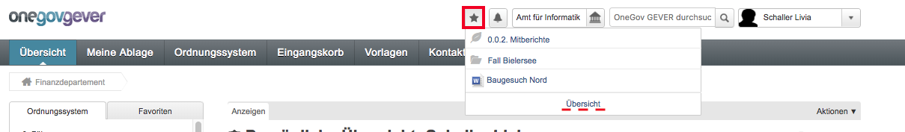
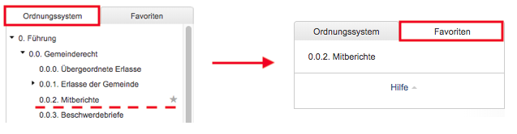

Favoriten
=========

Mit dem `OGIP 32 <https://my.teamraum.com/workspaces/onegov-gever-innovation-session/ogip/?overlay=cfd18fa5c8b14a9eb28ad98a9787425e#documents>`_ wurde das Setzen von Favoriten umgesetzt.
Ein Favorit kann bei allen Objekten auf allen Stufen (Ordnungsposition, Dossier,
Dokument und Aufgabe) gesetzt werden. Bei Inhalten der Sitzungs- und
Protokollverwaltung ist das Setzen eines Favoriten nicht möglich.

Ein Favorit kann über das *Stern-Symbol* jeweils rechts des Titels gesetzt
werden. Ordnungspositionen können im Ordnungssystembaum ebenfalls rechts
neben der Bezeichnung angewählt werden.

Favorit hinzufügen:
|img-favoriten-2|

In der Servicenavigation werden bei Klick auf das *Stern-Symbol* alle
ausgewählten Favoriten angezeigt und dadurch ein Schnellzugriff auf die
jeweiligen Objekte ermöglicht.

|img-favoriten-1|

Bei Klick auf *Übersicht* gelangt der Benutzende auf die Übersicht aller
Favoriten.

|img-favoriten-4|

1. Die Reihenfolge kann mittels dem Drei-Balken-Symbol beliebig angepasst werden.
2. Der Titel des Favoriten kann mit dem Stift-Symbol angepasst werden. Dabei wird aber nur der Favorit umbenannt, die Metadaten des Dokumentes werden dadurch also nicht verändert.
3. Der Favorit kann mit Klick auf den Papierkorb wieder gelöscht werden. Der Benutzende kann dies auch erzielen, indem er auf dem Favoriten-Dossier (resp. -Dokument und Ordnungsposition) nochmals auf das Stern-Symbol klickt.

Auf die Ordnungsposition-Favoriten kann zusätzlich im Tab *Favoriten* im
Ordnungssystembaum zugegriffen werden.

|img-favoriten-3|

.. |img-favoriten-2| image:: img/media/img-favoriten-2.png

.. |img-favoriten-4| image:: img/media/img-favoriten-4.png
