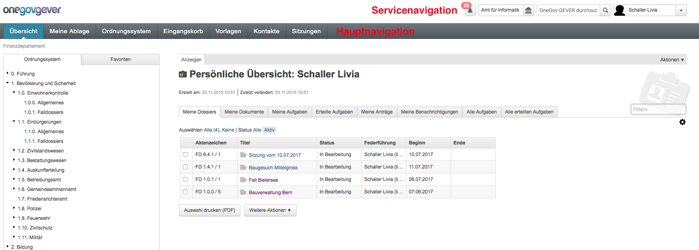
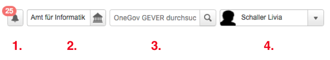

Grundlagen
==========

Login
-----
Beim ersten Login gelangen Sie auf die untenstehende Login-Maske. Dort können
Sie sich mit Ihrem Login anmelden. Damit Sie diesen Ablauf nur beim ersten Mal
durchführen müssen, wählen Sie die Checkbox "Eingeloggt bleiben" an. Bestätigen
Sie die Aktion mit "Anmelden".

Wenn Sie Ihr Passwort vergessen haben, können Sie es sich ganz eifach über
"Passwort vergessen?" neu setzten lassen. Es wird dann eine automatische E-Mail
an Sie gesendet, mittels welchem Sie sich ein neues Passwort definieren können.

|img-grundlagen-18|

Portal
------
Nach erfolgreichem Login gelangen Sie auf die Übersicht unten. Dort sind diverse
Informationen zu entnehmen und Aktionen zu betätigen:

|img-grundlagen-19|

1. Anmeldeverlauf: Dort sehen Sie Ihre letzten Aktivitäten mitsamt Browser- und IP-Informationen.

2. Zwei-Faktor-Authentifizierung: Dort können Sie entnehmen, ob Ihre Installation doppelt geschützt ist. Bei mehr Informationen dazu, können Sie gerne Kontakt mit uns aufnehmen.

3. Mandanten: Dort finden Sie alle Mandanten Ihrer Organisation aufgelistet. Um die Arbeit in OneGov GEVER aufzunehmen, wählen Sie den gwünschten Mandanten an.

4. Aufgaben: Hier finden Sie eine mandantenübergreifende Übersicht über alle Ihre Aufgaben.

Übersicht
---------
Nachdem Sie im Portal den gwünschten Mandanten ausgewählt haben, gelangen Sie
auf die Übersicht unten. Von da haben Sie verschiedene Möglichkeiten, sich
weiter in OneGov GEVER zu bewegen.

1. `Servicenavigation <https://docs.onegovgever.ch/user-manual/grundlagen/#servicenavigation>`_

2. `Hauptnavigation <https://docs.onegovgever.ch/user-manual/grundlagen/#hauptnavigation>`_

|img-grundlagen-15|

Servicenavigation
-----------------
Die Servicenavigation besteht aus dem Benachrichtigungsmelder,
der Mandantenauswahl, der Schnellsuche sowie den Profileinstellungen.

|img-grundlagen-16|

1. Der Benachrichtigungsmelder zeigt mittels roter Blase an, wenn eine Benachrichtung an den Benutzer gemacht wurde. Bei Klick darauf kann diese angeschaut werden.

2. Bei der Mandantenauswahl kann, falls Ihre Organisation mehrere Mandanten besitzt, zwischen diesen gewählt werden.

3. Bei der Schnellsuche kann nach einem Dossier, Dokument etc. gesucht werden. Mehr zur `Suche <https://docs.onegovgever.ch/user-manual/suchen/>`_ finden Sie in diesem Beitrag.

4. Bei den Profileinstellungen kann sich der Benutzer entweder abmelden oder auf sein persönliches Portal wechseln.

Hauptnavigation
---------------
Durch Klick auf einen Navigationspunkt in der Hauptnavigation gelangen Sie
direkt auf die Hauptfunktionen von OneGov GEVER.

Der Navigationspunkt Eingangskorb ist bei einigen Installationen ausgeblendet,
da dieser nicht für alle relevant ist. Der Navigationspunkt Sitzungen ist ein
Zusatzmodul und daher auch nicht für alle ersichtlich.

|img-grundlagen-17|

1. Übersicht: Dies ist die Default-Ansicht beim Login und zeigt alle persönlichen Dossiers, Dokumente, Aufgaben etc. des Benutzers.

2. Unter dem Reiter `Meine Ablage <https://docs.onegovgever.ch/user-manual/meine_ablage/>`_ wird jedem Benutzer eine Möglichkeit geboten, wichtige persönliche Dokumente in einem privaten Bereich in OneGov GEVER ablegen und verwalten zu können.

3. Ordnungssystembaum: Via Ordnungssystembaum kann auf eine Rubrik navigiert werden, wo dann Dossiers erstellt und Dokumente abgelegt werden können.

4. Im Reiter `Eingangskorb <https://docs.onegovgever.ch/user-manual/posteingang/>`_ können Posteingänge erfasst und weitergeleitet werden.

5. Im `Vorlagen-Reiter <https://docs.onegovgever.ch/user-manual/dokumente/verwalten/>`_  finden Sie alle hinterlegten Vorlagen und können neue hinzufügen.

6. Der Reiter `Kontakte <https://docs.onegovgever.ch/user-manual/kontakte/>`_ enthält verwaltungsexterne Personen (Subreiter Lokal) und das zentrale Adressverzeichnis aller Mitarbeitenden der Verwaltung (Subreiter Benutzer).

7. Im Reiter `Sitzungen <https://docs.onegovgever.ch/user-manual/sitzungs-und-protokollverwaltung/>`_ finden Sie die Sitzungs- und Protokollverwaltung (SPV)

Klickpfad
---------
Dank der klickbaren Breadcrumb (Klickpfad) kann ganz einfach zwischen
Navigationsposition, Dossier und Dokument navigiert werden. Bei der
Navigationsposition kann wie auf dem zweiten Bild ersichtlich zusätzlich auf die
verschieden darüber liegenden Navigationsstufen navigiert werden.

|img-grundlagen-20|
|img-grundlagen-21|

.. |img-grundlagen-17| image:: img/media/img-grundlagen-17.png
.. |img-grundlagen-18| image:: img/media/img-grundlagen-18.png
.. |img-grundlagen-19| image:: img/media/img-grundlagen-19.png
.. |img-grundlagen-20| image:: img/media/img-grundlagen-20.png
.. |img-grundlagen-21| image:: img/media/img-grundlagen-21.png

.. disqus::
