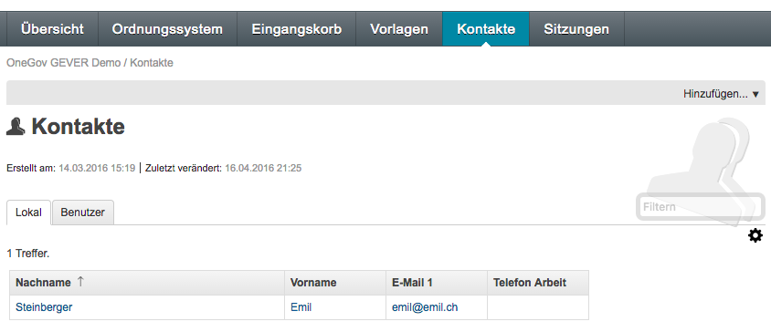
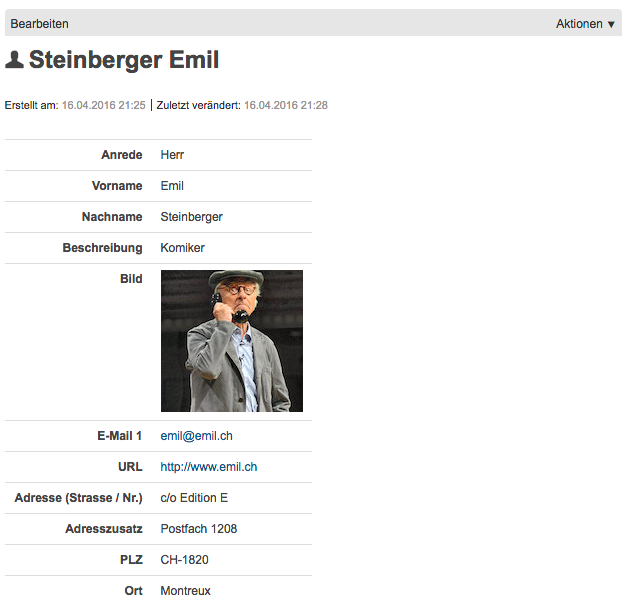

.. _label-kontakte:
.. _kapitel-kontakte:

Kontakte
========

Der Reiter *Kontakte* enthält verwaltungsexterne Personen (Subreiter
*Lokal*) und das zentrale Adressverzeichnis aller Mitarbeitenden der
Verwaltung (Subreiter *Benutzer*).

|img-kontakte-1|

Reiter Lokal
------------

Unter dem Reiter *Kontakte* können verwaltungsexterne Personen
erfasst und verwaltet werden.

Einen neuen Kontakt erfassen
^^^^^^^^^^^^^^^^^^^^^^^^^^^^

1. Wählen Sie *Hinzufügen → Kontakt*

Die Informationen sind über die Reiter *Persönliche Angaben*,
*Internet*, *Telefon* und *Adresse* verteilt.
Obligatorisch sind jedoch nur die Felder Vor- und Nachname, die übrigen
Felder können nach Bedarf ausgefüllt werden.

|img-kontakte-2|

.. note::
   Bei der URL ist der vollständige Eintrag (inkl. http://) erforderlich

Anzeige und Bearbeiten von Kontakten
^^^^^^^^^^^^^^^^^^^^^^^^^^^^^^^^^^^^

In der Listendarstellung werden standardmässig *Nachname*,
*Vorname*, *E-Mail 1* und *Telefon Arbeit* dargestellt.

Klickt man auf einen Kontakt, werden nur diejenigen Felder angezeigt,
die tatsächlich ausgefüllt worden sind:

|img-kontakte-3|

Sollen die Angaben bearbeitet werden, wählen Sie *Bearbeiten*.

Reiter Benutzer
---------------

Das :term:`OGDS` enthält das zentrale Adressverzeichnis der aktiven und der
inaktiven Mitarbeitenden der gesamten Installation von OneGov GEVER. Dieses
Verzeichnis kann mit dem Filter durchsucht, aber nicht bearbeitet werden.

Das zentrale Adressverzeichnis wird normalerweise mehrmals täglich
automatisch mit den Daten aus dem Active Directory synchronisiert (falls
vorhanden). Aus diesem Grund sollten die im Adressverzeichnis
enthaltenen Daten aktuell sein.

Verwendung von Kontakten
------------------------

Erfasste Kontakte können über die normale Suche innerhalb von OneGov GEVER
gefunden werden. Ausserdem stehen sie beim Erfassen von Beteiligungen innerhalb
von Dossiers zur Verfügung (siehe :ref:`label-beteiligungen`).

.. |img-kontakte-2| image:: img/media/img-kontakte-2.png

