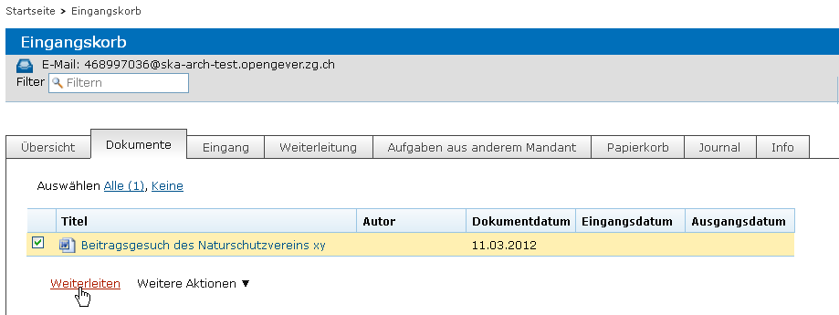
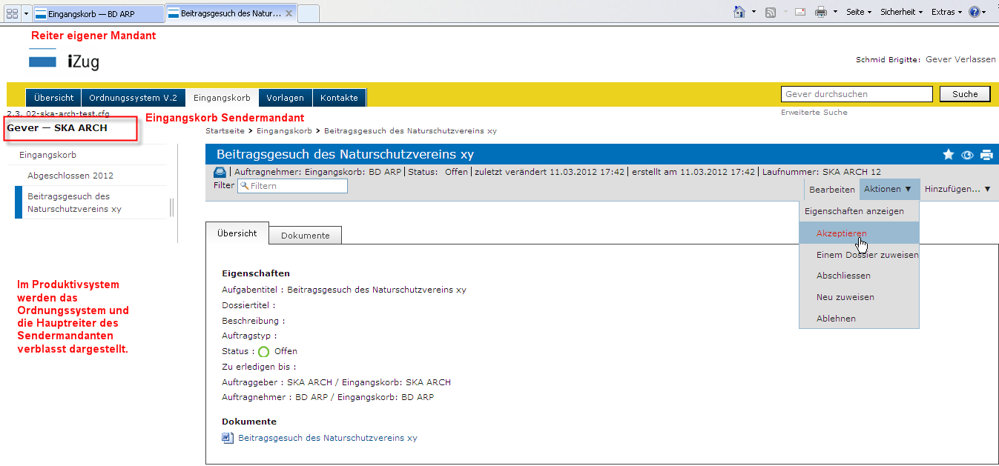
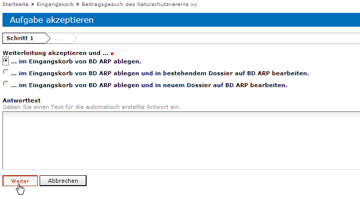
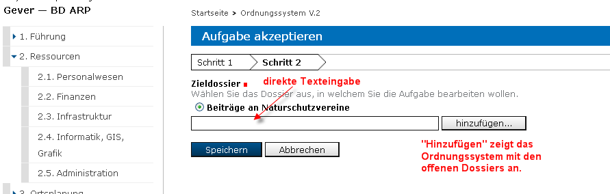
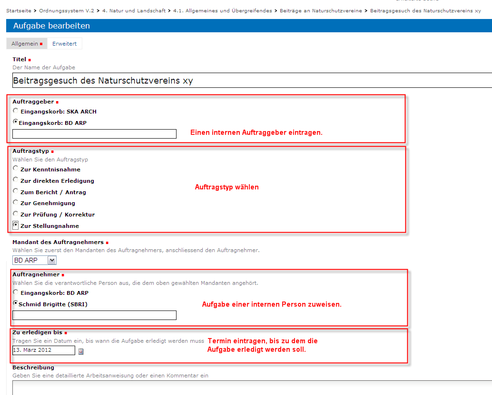
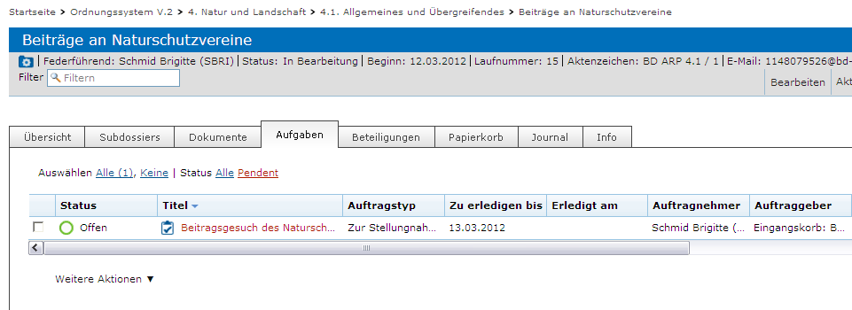
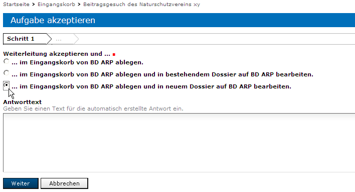
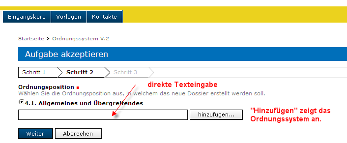
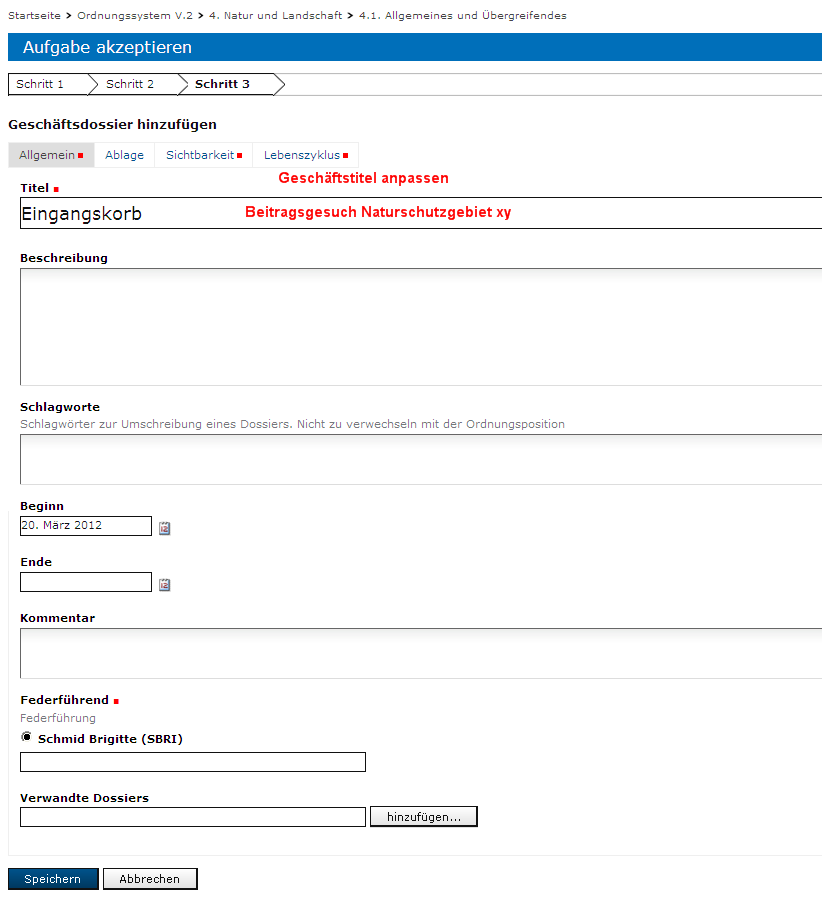
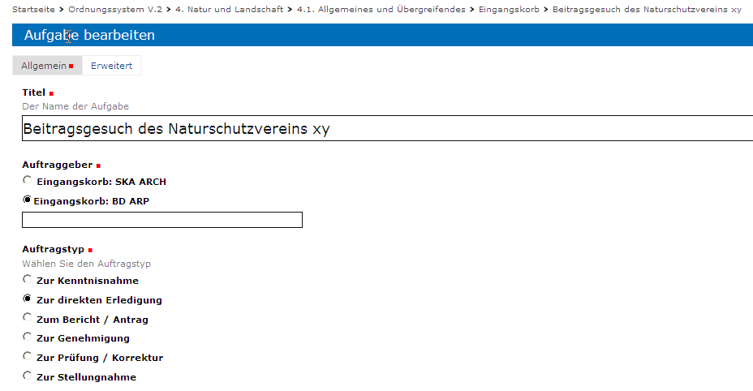

Posteingänge erfassen und weiterleiten
======================================

Funktion Eingangskorb
---------------------

Posteingänge, die auf Stufe Amt/Direktion nachgewiesen werden sollen,
werden im Eingangskorb erfasst und von dort aus entweder einem
Sachbearbeiter zugewiesen oder an einen anderen (den zuständigen)
Mandanten weitergeleitet.

.. note::
   Für die Erfassung von Posteingängen sind besondere Rechte notwendig;
   standardmässig sind diese den Personen mit der Rolle *Sekretariat* oder
   *Leitung* zugewiesen.

Einen Posteingang erfassen
--------------------------

Als erstes wird die zu erfassende Unterlage importiert. Handelt es sich
um ein Dokument, wird es mit *Hinzufügen → Dokument* hinaufgeladen.

|img-eingangskorb-1|

Handelt es sich um eine E-Mail, wird das Dokument über die
E-Mail-Adresse des Eingangskorbs importiert.

Die Dokumente erscheinen nun unter dem Reiter :guilabel:`Dokumente`.

|img-eingangskorb-2|

Posteingang weiterleiten
------------------------

Kreuzen Sie unter dem Reiter :guilabel:`Dokumente` das erfasste Dokument an und
wählen Sie :menuselection:`Weiterleiten`.

|img-eingangskorb-3|

Hierauf öffnet sich folgende Maske, in welcher der Titel, der Verantwortliche,
die Frist und weitere Angaben erfasst werden können. Obligatorisch sind nur rot
gekennzeichnete Felder. Kennt man das Zieldossier, ist es am einfachsten, wenn
man zunächst den Eingangskorb als Verantwortlichen belässt.

  |img-eingangskorb-4|

Nach dem Speichern erscheint der Posteingang unter dem Reiter
:guilabel:`Erteilte Aufgaben`.

  |img-eingangskorb-5|

Anstelle der Weiterleitung kann mit dem Dokument auch folgende Aktionen
durchgeführt werden: Kopieren, Als E-Mail versenden, Auswahl exportieren,
In den Papierkorb verschieben, Als Zip-Datei exportieren.

  |img-eingangskorb-6|

Posteingang einem Dossier zuweisen
----------------------------------

Durch die Weiterleitung wurde aus dem Posteingang eine Aufgabe generiert. Nun
kann diese zusätzlich einem neuen oder einem bestehenden Dossier zugewiesen
werden. Durch Klick auf den Titel öffnet sich eine neue Maske, auf welcher die
Dossierzuweisung durchgeführt werden kann. Dafür kann unten links auf
"Einem Dossier zuweisen" geklickt werden.

|img-eingangskorb-7|

Posteingang einem bestehenden Dossier zuweisen
""""""""""""""""""""""""""""""""""""""""""""""

Nach Klick auf "einem Dossier zuweisen" gelangt man auf die nächste Übersicht,
wo die Zuweisung auf ein bestehendes Dossier vorgenommen werden kann. Danach
kann das Ordnungssystem durchsucht werden, damit auf das korrekte Dossier
navigiert werden kann.

|img-eingangskorb-8|
|img-eingangskorb-9|
|img-eingangskorb-10|
|img-eingangskorb-11|

Nach dem Speichern wird eine Aufgabenmaske aufgerufen, die mit den
notwendigen Angaben (Auftraggeber, Auftragnehmer, Termin) ergänzt werden
kann.

|img-eingangskorb-12|

Die gespeicherte Aufgabe wird im entsprechenden Dossier sowie in der
Anwendungskomponente Übersicht dargestellt und kann weiterverarbeitet
werden.

|img-eingangskorb-13|

Einem neuen Dossier zuweisen
""""""""""""""""""""""""""""

Haben Sie die Zuweisung an ein neues Dossier gewählt, können Sie im
nächsten Schritt die Ordnungsposition auswählen, unter der das neue
Dossier erstellt werden soll. Klicken Sie dann auf *Weiter*.

|img-eingangskorb-14|
|img-eingangskorb-15|
|img-eingangskorb-16|
|img-eingangskorb-17|

Nun wird ein Dossierformular geöffnet. Ändern Sie den Titel und passen Sie die
weiteren Angaben an. Schliessen Sie den Vorgang mit Speichern ab.

|img-eingangskorb-18|

Nun öffnet sich ein Aufgabenformular, bei welchem Sie weitere Aktionen wie
"neu zuweisen" und "abschliessen" vornehmen können.

|img-eingangskorb-19|

Posteingänge abschliessen
~~~~~~~~~~~~~~~~~~~~~~~~~

Ist ein Posteingang nicht dossierrelevant, kann er direkt abgeschlossen
werden. Er wird darauf automatisch in den Jahresordner gelegt.

|img-eingangskorb-22|
|img-eingangskorb-23|

Posteingänge neu zuweisen
~~~~~~~~~~~~~~~~~~~~~~~~~

Mit der Aktion *neu zuweisen* können Sie den Posteingang einer anderen
Person zuweisen.

|img-eingangskorb-20|
|img-eingangskorb-21|

Der Posteingang wird darauf im Reiter *Übersicht → Meine Aufgaben*
angezeigt und kann wie eine normale Aufgabe weiterbearbeitet werden.

Mandantenübergreifende Posteingänge
-----------------------------------

Den Posteingang erfassen
""""""""""""""""""""""""

Siehe hierzu Abschnitt 9.2.

Den Posteingang weiterleiten
""""""""""""""""""""""""""""

Kreuzen Sie den Posteingang an und wählen Sie *Weiterleiten.*

Erfassen Sie in der Weiterleitungsmaske nebst dem Titel den
Zielmandanten und den Eingangskorb des Zielmandanten.

.. note::
  Weiterleitungen werden immer an den Eingangskorb adressiert!

|image244|

|image245|

|image247|

Nach dem Speichern erscheint der Posteingang beim Sender unter dem
Reiter *Weiterleitung*. Beim Empfänger erscheint der Posteingang unter
dem Reiter *Eingang*.

Einen Posteingang aus einem anderen Mandanten bearbeiten
--------------------------------------------------------

Posteingang akzeptieren
"""""""""""""""""""""""

Noch nicht verarbeitete Posteingänge aus anderen Mandanten erscheinen im
Eingangskorb unter dem Reiter *Eingang* (die neusten Elemente auch im
Reiter *Übersicht*).

|image248|

Durch Klicken auf die Weiterleitung wird man auf den Eingangskorb des
Sendermandanten weitergeleitet, indem sich im Browser ein neuer Reiter
öffnet.

|image249|

Nach Klick auf die Aktion *Akzeptieren* bietet Ihnen OneGov GEVER drei
Möglichkeiten an, wie Sie die Weiterleitung bearbeiten können:

1. Im Eingangskorb Ihres Mandanten ablegen.

2. Im Eingangskorb Ihres Mandanten ablegen und in einem bestehenden
   Dossier bearbeiten.

3. Im Eingangskorb Ihres Mandanten ablegen und in einem neuen Dossier
   bearbeiten.

|image250|

    Unabhängig davon, welche Variante Sie wählen, wird beim Akzeptieren
    die Weiterleitung in den eigenen Eingangskorb kopiert und
    gleichzeitig im Eingangskorb des Sendermandanten abgeschlossen.

-  Wenn Sie die Weiterleitung ablehnen – weil Ihr Mandant nicht
   zuständig ist – wird sie beim Sendermandanten im Status *offen*
   belassen.

Posteingang durch Sekretariat weiterverarbeiten
"""""""""""""""""""""""""""""""""""""""""""""""

Weiterleitung im Eingangskorb ablegen
"""""""""""""""""""""""""""""""""""""

Wählen Sie *…im Eingangskorb von xxx ablegen* und klicken Sie *Weiter*.
Die Weiterleitung wird dadurch in den Eingangskorb Ihres Mandanten
kopiert und im Eingangskorb des Sendermandanten automatisch
abgeschlossen.

Sie haben nun 3 Möglichkeiten zur weiteren Bearbeitung:

1. ***Abschliessen*:** Weiterleitungen können direkt im Eingangskorb
   abgeschlossen werden, wenn sie nicht dossierrelevant sind.

2. ***Einem Dossier zuweisen:*** (empfohlener Weg, siehe unten)

3. ***Neu zuweisen*:** Sie können die Weiterleitung einem Sachbearbeiter
   zuweisen, wenn nicht bekannt ist, welchem Dossier ein Posteingang
   zugeordnet werden soll. Die personalisierte Weiterleitung ist
   einerseits im Eingangskorb unter dem Reiter *Weiterleitungen*
   sichtbar, andererseits beim zuständigen Sachbearbeiter unter *Meine
   Aufgaben*.

|image251|

Weiterleitung im Eingangskorb ablegen und in bestehendem Dossier weiterbearbeiten
"""""""""""""""""""""""""""""""""""""""""""""""""""""""""""""""""""""""""""""""""

Klicken Sie beim Akzeptieren der Weiterleitung auf die Option *…im
Eingangskorb von Mandant x ablegen und in bestehendem Dossier von
Mandant x bearbeiten* und klicken Sie *Weiter*.

|image252|

Wählen Sie das Zieldossier durch direkte Texteingabe oder klicken Sie
auf den Button *hinzufügen*, um das Dossier aus dem Ordnungssystem
auszuwählen.

|image253|

Nach dem Speichern öffnet sich eine Aufgabenmaske, in der folgende
Angaben mutiert oder ergänzt werden müssen:

-  *Auftraggeber*: Wählen Sie einen internen Auftraggeber, da die
   Weiterleitung nun vom eigenen Mandanten zur Bearbeitung übernommen
   worden ist.

-  *Auftragnehmer*: Weisen Sie die Aufgabe einem internen Mitarbeitenden
   zur Bearbeitung zu.

-  *Termin*: Setzen Sie den Termin, bis wann die Aufgabe erledigt sein
   soll.

   |image254|

Mit dem Speichern wird die Aufgabe im Zieldossier abgelegt. Der
verantwortliche Mitarbeiter findet die Aufgabe im entsprechenden Dossier
und unter dem Hauptreiter Übersicht / Meine Aufgaben.

Mit dem Akzeptieren und Speichern werden die Weiterleitungen sowohl beim
Sender als auch beim Empfänger abgeschlossen und in den entsprechenden
Jahresordner im Eingangskorb abgelegt.

|image255|

|image256|

Weiterleitung im Eingangskorb ablegen und in neuem Dossier weiterbearbeiten
"""""""""""""""""""""""""""""""""""""""""""""""""""""""""""""""""""""""""""

Klicken Sie beim Akzeptieren der Weiterleitung auf die Option *…im
Eingangskorb von Mandant x ablegen und ein neuem Dossier von Mandant x
bearbeiten* und klicken Sie *Weiter*.

|image257|

Im nächsten Schritt können Sie die Ordnungsposition auswählen, entweder
durch direkte Texteingabe oder durch Auswahl der Ordnungsposition mit
*Hinzufügen*. Klicken Sie danach *Weiter*.

|image258|

-  Nun öffnet sich eine Geschäftsmaske. Standardmässig wird bei einer
   Weiterleitung der Titel "Eingangskorb" angegeben (da die
   Weiterleitung dem Eingangskorb zugeordnet ist). Passen Sie den Titel
   und die übrigen Informationen nach Bedarf an.

|image259|

Nach dem Speichern öffnet sich eine Aufgabenmaske, in der Sie die
entsprechenden Informationen ergänzen bzw. anpassen können (Auftragsart,
Auftraggeber, Termin etc.).

|image260|

Mit dem Speichern wird die Aufgabe im neuen Dossier abgelegt. Der
verantwortliche Mitarbeiter findet die Aufgabe im entsprechenden Dossier
und unter dem Hauptreiter *Übersicht / Meine Aufgaben*. Gleichzeitig
wird die Weiterleitung beim Sender- und beim Empfängermandanten
abgeschlossen und im Eingangskorb unter dem jeweiligen Jahresordner
abgelegt.

.. |img-eingangskorb-1| image:: img/media/img-eingangskorb-1.png
.. |img-eingangskorb-2| image:: img/media/img-eingangskorb-2.png
.. |img-eingangskorb-3| image:: img/media/img-eingangskorb-3.png
.. |img-eingangskorb-4| image:: img/media/img-eingangskorb-4.png
.. |img-eingangskorb-5| image:: img/media/img-eingangskorb-5.png
.. |img-eingangskorb-6| image:: img/media/img-eingangskorb-6.png
.. |img-eingangskorb-7| image:: img/media/img-eingangskorb-7.png
.. |img-eingangskorb-8| image:: img/media/img-eingangskorb-8.png
.. |img-eingangskorb-9| image:: img/media/img-eingangskorb-9.png
.. |img-eingangskorb-10| image:: img/media/img-eingangskorb-10.png
.. |img-eingangskorb-11| image:: img/media/img-eingangskorb-11.png
.. |img-eingangskorb-12| image:: img/media/img-eingangskorb-12.png
.. |img-eingangskorb-13| image:: img/media/img-eingangskorb-13.png
.. |img-eingangskorb-14| image:: img/media/img-eingangskorb-14.png
.. |img-eingangskorb-15| image:: img/media/img-eingangskorb-15.png
.. |img-eingangskorb-16| image:: img/media/img-eingangskorb-16.png
.. |img-eingangskorb-17| image:: img/media/img-eingangskorb-17.png
.. |img-eingangskorb-18| image:: img/media/img-eingangskorb-18.png
.. |img-eingangskorb-19| image:: img/media/img-eingangskorb-19.png
.. |img-eingangskorb-20| image:: img/media/img-eingangskorb-20.png
.. |img-eingangskorb-21| image:: img/media/img-eingangskorb-21.png
.. |img-eingangskorb-22| image:: img/media/img-eingangskorb-22.png
.. |img-eingangskorb-23| image:: img/media/img-eingangskorb-23.png

.. |image247| image:: img/media/image228.png
.. |image248| image:: img/media/image229.png

.. |image250| image:: img/media/image231.png

.. |image252| image:: img/media/image233.png

.. |image256| image:: img/media/image237.png

.. disqus::
