Sitzungs- und Protokollverwaltung
=================================

Einstieg
---------

Damit die Sitzungs- und Protokollverwaltung sinnvoll getestet werden kann,
müssen gewisse Vorarbeiten gemacht werden, u.a. neue Kommissionen/Gremien und
Sitzungen erstellen. Diese Arbeiten werden im Folgenden beschrieben.

|img-sitzungs-und-protokollverwaltung-1|

Kommission / Gremium erfassen
-----------------------------

Eine neue Kommission kann im Bereich *Sitzungen* erstellt werden.

1. Pro Kommission kann eine eigene Berechtigungsgruppe festgelegt werden, die
   diese Kommission verwaltet und einsehen kann.

2. Zusätzlich muss auch eine Ablageposition im Ordnungssystem definiert werden.
   Dort wird dann automatisch ein neues Sitzungsdossier erstellt, in welches
   alle Sitzungsunterlagen und -protokolle abgelegt werden.

3. Mittels Klick auf „Weiter“ erscheint die zweite Maske.

|img-sitzungs-und-protokollverwaltung-2|

4. Das System erstellt für jede Kommission automatisch eine initiale Periode,
   welche nur noch gespeichert werden muss.

|img-sitzungs-und-protokollverwaltung-3|

Sitzung einrichten
~~~~~~~~~~~~~~~~~~

Sobald die Kommission erstellt wurde, können nun die einzelnen Sitzungen
erfasst werden. Für jede definierte Sitzung wird vom System automatisch
ein entsprechendes Sitzungsdossier erstellt (unterhalb der auf Stufe Kommission
definierten Ordnungsposition).

1. Um eine Sitzung hinzufügen zu können, wird in die entsprechende Kommission
   navigiert und unter *Hinzufügen* eine neue Sitzung erstellt.

|img-sitzungs-und-protokollverwaltung-4|

2. Das System schlägt automatisch einen Titel (aus dem Nameen der
   Kommission und Datum) vor. Dieser kann einfach übernommen oder bei
   Bedarf angepasst werden. Das Startdatum wird automatisch gesetzt, ein
   Enddatum muss nicht zwingend erfasst werden. Mittels „Weiter“ öffnet sich
   eine weitere Maske.

|img-sitzungs-und-protokollverwaltung-5|

3. Es öffnet sich die Maske des Sitzungsdossiers:

   a. Beim Beschrieb des Sitzungsdossier schlägt das System wiederum einen
      Titel vor, welcher bei Bedarf manuell angepasst werden kann.

   b. Als Orientierung öffnet das System auf der linken Seite automatisch die
      Ordnungsposition, in welcher das Sitzungsprotokoll dann auch
      abgespeichert wurde.

   c. Auswahl der federführenden Person muss zwingend vorgenommen werden.

   d. Mit „Speichern“ den Vorgang abschliessen.

|img-sitzungs-und-protokollverwaltung-6|

Mitglieder und Mitgliedschaften erfassen
~~~~~~~~~~~~~~~~~~~~~~~~~~~~~~~~~~~~~~~~

Bei Bedarf können neue Kontakte/Mitglieder direkt unter dem Hauptreiter
*Sitzungen* erfasst werden. Innerhalb einer Kommission kann dann die Zuordnung
zwischen Mitglied/Kontakt und Kommission gemacht werden. Im Moment besteht keine
Verknüpfung zwischen dem OGDS (lokale Kontakte) und den Kontakten der
Sitzungs- und Protokollverwaltung.

Geschäfte als Antrag an Kommission einreichen
~~~~~~~~~~~~~~~~~~~~~~~~~~~~~~~~~~~~~~~~~~~~~
Soll ein Geschäft in einer Kommission behandelt werden, muss im entsprechenden
Geschäftsdossier ein neuer Antrag erstellt werden. Normalerweise geschieht dies
durch den zuständigen Sachbearbeiter/in des Geschäftsdossiers
(federführende Person).

|img-sitzungs-und-protokollverwaltung-7|

1. Im neuen Antrag die erforderlichen Informationen eintragen:

  a. **Titel des Antrags**: Vom System wird standardmässig der Titel des Dossiers
     vorgeschlagen. Dieser kann aber ergänzt oder angepasst werden.

  b. **Auswahl der Kommission**, welche das Geschäft behandeln soll.

2. Nun können die relevanten Informationen für den Antrag eingetragen werden.
   Die Standard-Vorlage ist folgendermassen gegliedert:

   a. **Rechtsgrundlage**: Beschrieb der rechtlichen Grundlage, worauf der
      Antrag abgestützt ist.

   b. **Ausgangslage**: Herleitung des Antrages, IST-Situation.

   c. **Antrag**: Konkreter Beschrieb des Antrages mit allen relevanten
      Informationen.

   d. **Erwägungen**: Beschrieb zusätzlicher Informationen und/oder
      weiterführenden Überlegungen, welche für Entscheidungsträger zum
      Beschluss des Antrages relevant sind.

   e. **Beschlussentwurf**: Beschrieb wie Beschluss gemäss Partei, welche
      den Antrag eingereicht hat, lauten soll.

   f. **Veröffentlichung in**: Angabe, wo Beschluss kommuniziert werden soll
      (z.B. Pressemitteilung, Website, Zeitung, intern etc.).

   g. **Zu eröffnen an**: Auflistung aller an Antrag beteiligten Stellen und
      Personen, welche primär über den Beschluss informiert werden müssen.

   h. **Kopie z.K.**: Auflistung aller sekundär zu informierenden Stellen und
      Personen.

4. **Anhänge**: Wenn zusätzlich zu den Informationen noch weitere relevante
   Dokumente dem Antrag beigelegt werden möchten, können diese unter Anhänge
   ausgesucht werden.

5. Mittels „Speichern“ wird der Vorgang abgeschlossen.

|img-sitzungs-und-protokollverwaltung-8|
|img-sitzungs-und-protokollverwaltung-9|

6. Durch die Erstellung eines Antrags kann dieser noch erweitert oder angepasst
   werden. Sind alle nötigen Informationen erfasst, muss der Antrag durch den
   Antragsteller eingereicht werden. Der Antrag erscheint anschliessend in der
   Sitzungsverwaltung der jeweiligen Kommission. Ab diesem Zeitpunkt kann der
   Antrag nicht mehr bearbeitet werden.

|img-sitzungs-und-protokollverwaltung-10|

Sitzung planen
--------------

Wurden die Sitzungen in der entsprechenden Kommission erstellt, kann mit der
Planung einer Sitzung begonnen werden.

Traktanden erstellen
~~~~~~~~~~~~~~~~~~~~

1. In der Mitte neben Traktanden auf das „+“ klicken, damit sich die Maske
   öffnet.

2. Alle eingereichten Anträge erscheinen in der Übersicht. Mittels Klick auf
   „Traktandieren“ können diese der Sitzung hinzugefügt werden. Oberhalb der
   Liste besteht zusätzlich die Möglichkeit, nach Anträgen zu filtern.

3. Für eine bessere Strukturierung der Traktandenliste ist es auch möglich,
   Abschnitte zu definieren.

4. Mittels dem Feld „Freitext“ können zusätzliche (ad-hoc) Traktanden ergänzt
   werden.

|img-sitzungs-und-protokollverwaltung-11|

Traktanden bearbeiten
~~~~~~~~~~~~~~~~~~~~~

|img-sitzungs-und-protokollverwaltung-12|

1. Titel anpassen von Traktanden und Abschnitten

2. Entfernen eines Traktandums bzw. Abschnitts. (Bei Anträgen erscheinen diese
   wieder in der Auflistung von nicht traktandierten Anträgen zu dieser
   Kommission).

3. Abschliessen eines Antrags. Traktanden, die an einen Antrag gebunden sind
   können hier einzeln abgeschlossen werden.

4. Anzeigen der Antragdetails (Anhänge und Protokollauszüge)

Protokoll vorbereiten
~~~~~~~~~~~~~~~~~~~~~

Die Sitzungs- und Protokollverwaltung von OneGov GEVER unterscheidet nicht
zwischen einem Vorprotokoll und Protokoll. Es werden stattdessen einfach
automatisch neuere Versionen des gleichen Protokolls (Dokument) erzeugt.

|img-sitzungs-und-protokollverwaltung-13|

1. Sitzung bearbeiten

2. Status ändern (durchführen, abschliessen)

3. Protokoll generieren

4. Protokollauszüge erstellen

Die (Vor-)Protokollierung einer Sitzung geschieht in der webbasierten
Protokollansicht einer Sitzung. Diese erreicht man über den Link *Bearbeiten*
auf der Sitzungsansicht.

1. Auf der linken Seite wird der Ablauf der Sitzung gemäss Traktandenliste
   abgebildet.

2. Wird das „+“-Zeichen bei Sitzungsangaben geöffnet, können Details zur
   Sitzung wie Vorsitz, Protokollführung, Teilnehmende etc. ergänzt werden.

3. In der Protokollansicht stehen für jedes Traktandum alle Felder
   (Rechtsgrundlage, Ausgangslage etc.) für die direkte Bearbeitung zur
   Verfügung. Während der Sitzung kann so das Protokoll pro Traktandum laufend
   ergänzt werden.

|img-sitzungs-und-protokollverwaltung-14|

Protokoll schreiben
-------------------

Auf den Einsatz eines WYSIWYG-Editors wurde bewusst verzichtet, da die Texte im
Protokoll nur minimal formatiert werden sollen. Basierend auf den erfassten
Texten erzeugt die Sitzungs- und Protokollverwaltung automatisch ein
Worddokument als Protokoll. Dazu werden in OneGov GEVER vorbereitete
Protokollvorlagen als Worddokumente hinterlegt, die dann als Basis für die
generierten Protokolle dienen. Auf diese Weise kann ein einheitliches Design
(CI/CD) von Protokollen und Pro-tokollauszügen gewährleistet werden.

Das Protokoll zu einer Sitzung wird direkt im Webbrowser erfasst analog unter
Punkt 3.2 beschrieben (Protokoll vorbereiten).

Protokoll erzeugen und aktualisieren
~~~~~~~~~~~~~~~~~~~~~~~~~~~~~~~~~~~~

1. Sobald ein Traktandum einer Sitzung abgeschlossen ist, wechselt der Status
   der Sitzung auf „Durchgeführt". Ab diesem Zeitpunkt können keine neuen
   Traktanden mehr hinzugefügt werden sowie kann die Reihenfolge nicht mehr
   angepasst werden.

2. Zugleich kann ab da ein Protokoll zur Sitzung generiert werden. Das
   generierte Protokoll wird automatisch im hinterlegten Sitzungsdossier
   abgelegt. Das Word-Protokoll kann immer wieder aktualisiert werden. Dabei
   wird standardmässig vom bestehenden Protokoll eine neue Dokumentversion
   mit den aktuellen Sitzungsinformationen erzeugt. Das Word-Protokoll kann mit
   einem Klick auf den Download-Link direkt heruntergeladen werden.

3. Mittels Klick auf das „+“-Zeichen erscheint eine weitere Maske, in welcher
   Abschnitte (oder auch das gesamte) Protokoll in eine beliebige
   Ordnungsposition gespeichert werden kann.

|img-sitzungs-und-protokollverwaltung-15|

Die erzeugten Worddokumente werden als normale Dokumente in OneGov GEVER
abgelegt. Bei Bedarf können diese nachträglich direkt in Word bearbeitet werden.
Diese Möglichkeit sollte jedoch nur sehr überlegt genutzt werden, da bei einer
späteren Erzeugung des Protokolls aus der Sitzungs- und Protokollverwaltung eine
neue Version erstellt wird und die im Worddokument gemachten Anpassungen nicht
übernommen werden.

Protokollauszüge generieren
~~~~~~~~~~~~~~~~~~~~~~~~~~~

Nachdem die Sitzung stattgefunden hat, kann das während der Sitzung durch den
Protokollführer erstellte Protokoll noch nachbearbeitet oder korrigiert werden.
Sind die Arbeiten am Protokoll beendet, kann die Sitzung geschlossen werden.

Dabei wird automatisch für jeden in der Sitzung behandelten Antrag ein
Protokollauszug erstellt und ins jeweilige Dossier zurückgeschrieben. Jeder
Antragsteller hat damit Zugriff auf den Beschluss der Kommission zu seinem
Geschäft.

|img-sitzungs-und-protokollverwaltung-16|
|img-sitzungs-und-protokollverwaltung-17|

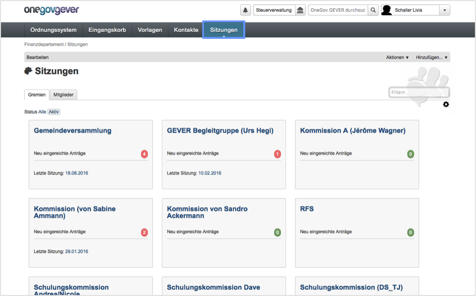
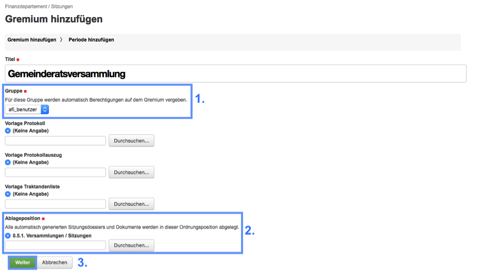
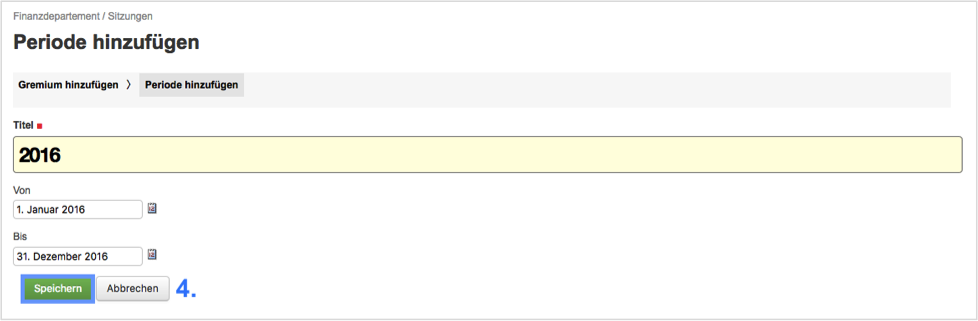
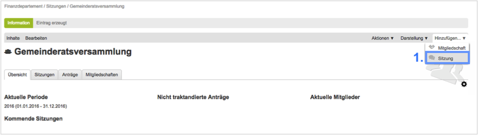
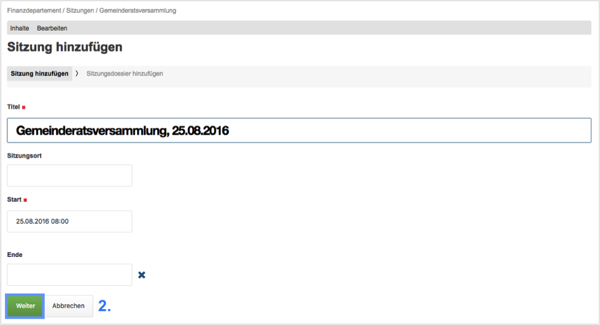
.. |img-sitzungs-und-protokollverwaltung-6| image:: img/media/img-sitzungs-und-protokollverwaltung-6.png
.. |img-sitzungs-und-protokollverwaltung-7| image:: img/media/img-sitzungs-und-protokollverwaltung-7.png
.. |img-sitzungs-und-protokollverwaltung-8| image:: img/media/img-sitzungs-und-protokollverwaltung-8.png
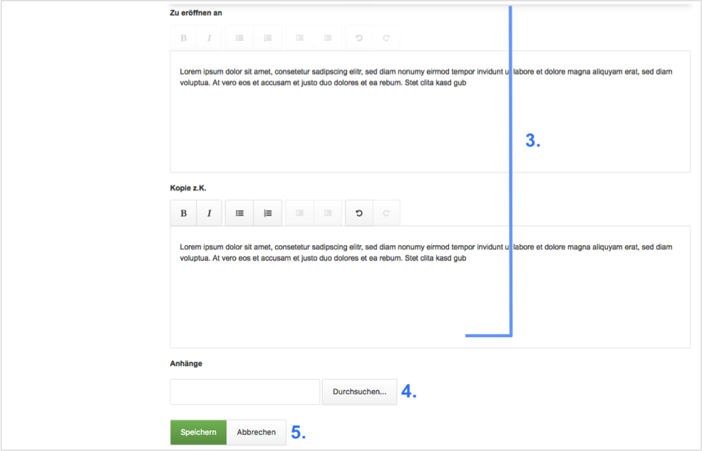
.. |img-sitzungs-und-protokollverwaltung-10| image:: img/media/img-sitzungs-und-protokollverwaltung-10.png
.. |img-sitzungs-und-protokollverwaltung-11| image:: img/media/img-sitzungs-und-protokollverwaltung-11.png
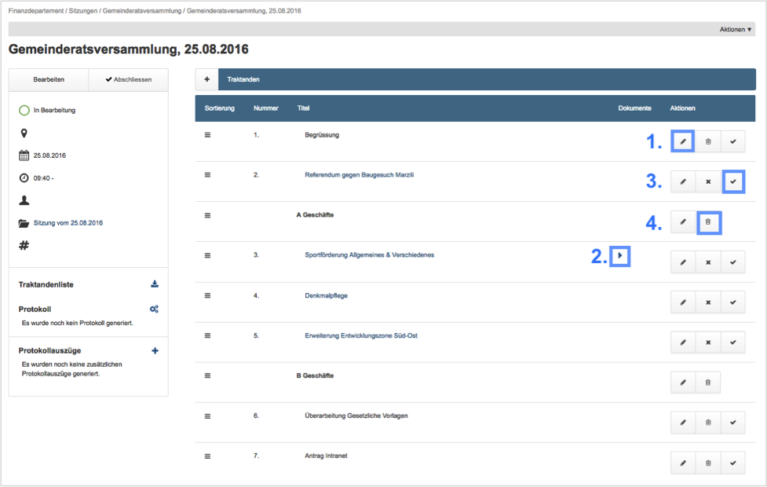
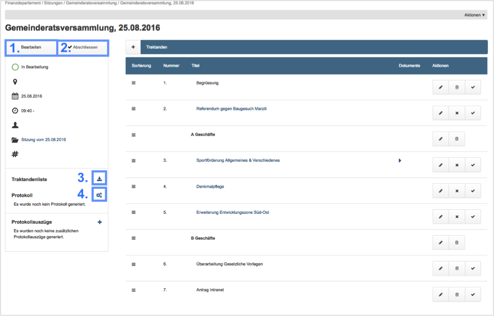
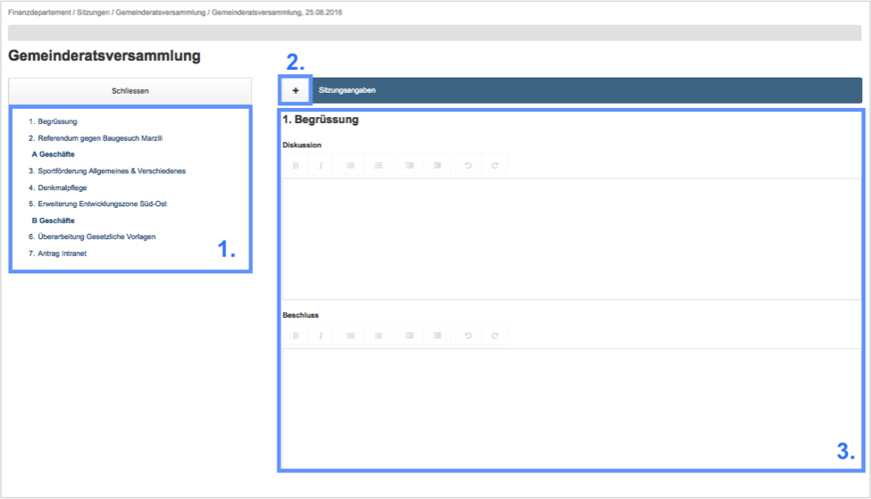
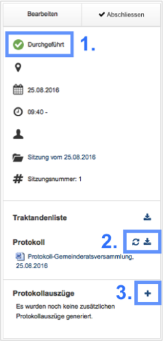
.. |img-sitzungs-und-protokollverwaltung-16| image:: img/media/img-sitzungs-und-protokollverwaltung-16.png
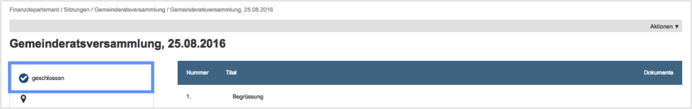

.. disqus::
