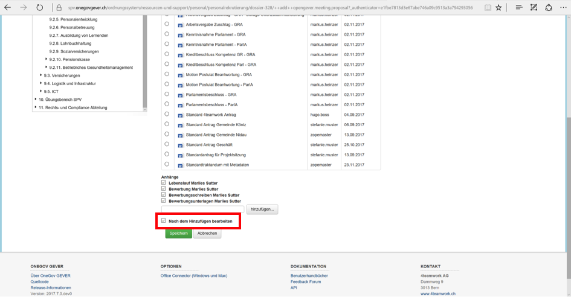
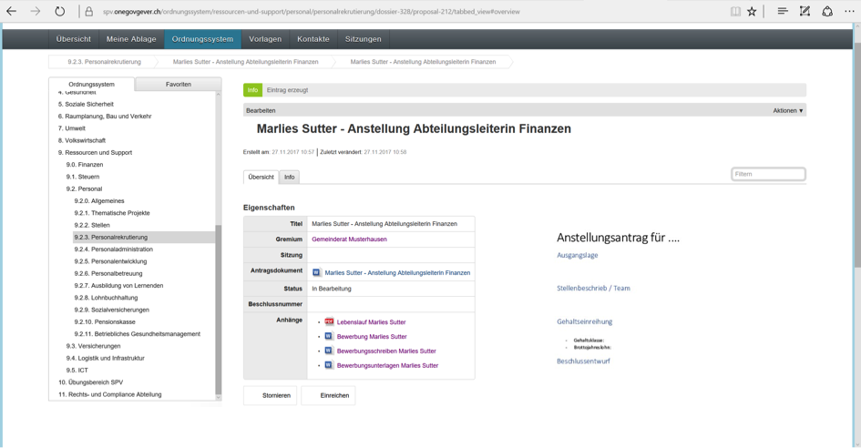
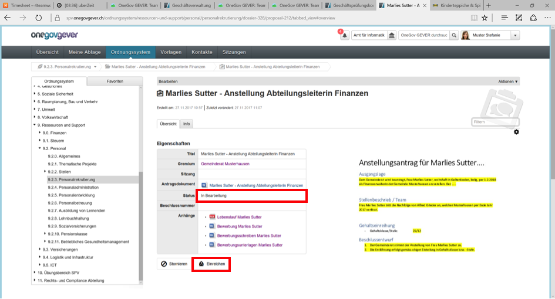
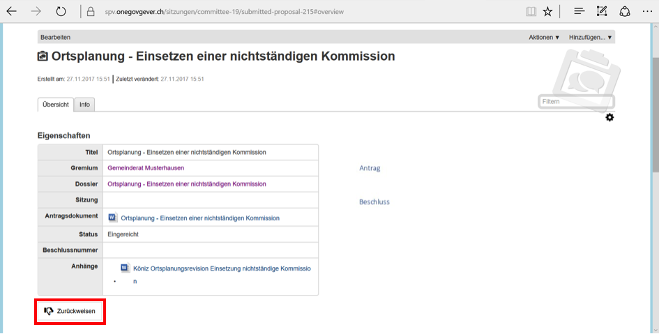

Antrag erfassen
---------------

Damit die GEVER-Userin Stefanie Muster die Anträge den vorgesehenen Sitzungen
zuweisen kann, wechselt sie in das entsprechende Geschäftsdossier in OneGov
GEVER. Im vorliegenden Fall soll die Anstellung von Frau Marlies Sutter,
Abteilungsleiterin Finanzen, für die nächste Sitzung des Gemeinderates
traktandiert werden.

**Antrag erstellen**

Alle notwendigen Dokumente und Informationen sind im Geschäftsdossier erfasst.
Zum Erfassen eines Antrags gibt es zwei Möglichkeiten:

-   Unter «Hinzufügen» kann der Antrag an den Gemeinderat Musterhausen erfasst
    werden. (Dieser Weg wird weiter untern im Detail beschrieben)

|img-spvupdate-8|

-   Im Dokumenten-Tab eines Dossiers findet sich zuunterst der Button
    "Antrag erstellen". Dieser Weg bietet den Vorteil, dass Dokumente, welche
    dem Antrag angehängt werden möchten, direkt in der Auflistung angewählt
    werden können.

|img-spvupdate-41|

**Antrag ausfüllen**

Unter «Antrag hinzufügen» werden der Titel des Traktandums, das betreffende
Gremium, die passende Antragsvorlage und die dazugehörigen Anhänge bearbeitet
bzw. ausgewählt.

|img-spvupdate-9|

|img-spvupdate-10|

Das Feld „Antragssteller“ enthält standardmässig den aktuellen Benutzenden.
Es besteht auch die Möglichkeit, einen anderen Benutzenden des aktuellen
Mandantden auszuwählen. Damit ist es möglich, Anträge im Namen anderer
Benutzenden zu erstellen. Dabei ist zu beachten, dass nur jener Benutzende,
welcher im Feld „Antragssteller“ hinterlegt ist, die :ref:`label-antrags-benachrichtigungen` erhält.

Wenn die Option «Nach dem Hinzufügen bearbeiten» angewählt bleibt
(Standardeinstellung), wird das Dokument zur weiteren Bearbeitung in Word
geöffnet.

|img-spvupdate-11|

Nach dem Speichern sehen Sie diese Ansicht. Nun wird der eigentliche Antrag
an den Gemeinderat bearbeitet (das Dokument ist bereits ausgecheckt). Ein Antrag
kann danach storniert, eingereicht aber auch kommentiert werden.

|img-spvupdate-12|

Die Bearbeitung erfolgt in Word wie bei einem üblichen GEVER-Dokument. Beim
Bearbeitungsbeispiel wurden die gelb markierten Passagen bearbeitet. Nach
Fertigstellung des Antrags muss das Dokument wie üblich gespeichert und wieder
eingecheckt werden.

|img-spvupdate-13|
|img-spvupdate-14|

Nun wird der Antrag traktandiert über «Einreichen». Der Status des Antrags
ändert sich von «in Bearbeitung in «Eingereicht».

|img-spvupdate-15|

Mit diesem Vorgehen werden die ordentlichen, vorgängig bekannten Geschäfte für
die betreffende Sitzung traktandiert oder storniert. Merke: Vor dem Einreichen
alle Dokumente einchecken.

Wenn alle vorgängig bekannten Anträge traktandiert sind, wird die Sitzung im
Bereich «Sitzungen» weiterbearbeitet. Konkret liegen drei eingereichte Anträge
für den Gemeinderat Musterhausen vor.

|img-spvupdate-16|

Die anstehende Sitzung muss nun geöffnet und die Traktanden hinzugefügt werden.
Eingereichte Anträge werden nicht automatisch auf eine konkrete Sitzung
traktandiert. Die eingereichten Anträge werden in der konkreten Sitzung
traktandiert.

|img-spvupdate-17|

Sobald die Anträge traktandiert sind, sind diese in der Übersicht des Gremiums
nicht mehr ersichtlich.

|img-spvupdate-18|

Anträge, welche nicht den Vorgaben entsprechen können zurückgewiesen werden.
Sie können die Rückweisung in einem separaten Feld kommentieren.

|img-spvupdate-19|

.. |img-spvupdate-8| image:: ../img/media/img-spvupdate-8.png
.. |img-spvupdate-9| image:: ../img/media/img-spvupdate-9.png
.. |img-spvupdate-10| image:: ../img/media/img-spvupdate-10.png

.. |img-spvupdate-13| image:: ../img/media/img-spvupdate-13.png
.. |img-spvupdate-14| image:: ../img/media/img-spvupdate-14.png

.. |img-spvupdate-16| image:: ../img/media/img-spvupdate-16.png
.. |img-spvupdate-17| image:: ../img/media/img-spvupdate-17.png
.. |img-spvupdate-18| image:: ../img/media/img-spvupdate-18.png

.. |img-spvupdate-41| image:: ../img/media/img-spvupdate-41.png

.. disqus::
